# factorio-ai-resources

A repository for designing and maintaining Factorio blueprints together with an AI (Claude Code): ratio
calculation, blueprint-string generation, validation, preview images and bilingual (Korean/English) docs in one flow.

[한국어](README.md)

## Layout

| Path | Contents |
|---|---|
| [`skills/factorio-blueprint/`](skills/factorio-blueprint/SKILL.md) | Claude Code skill: ratio calculator (`calc.py`), blueprint builder/encoder/validator (`blueprint.py`), layout pattern docs, game data |
| [`blueprints/`](blueprints/README.md) | One folder per blueprint: string, generator, Korean/English docs, preview images |
| [`docs/`](docs/) | [Main bus 6+2 guide](docs/guides/main-bus-6x2.en.md), [upgrade-in-place rules](docs/guides/upgrade-in-place.en.md), [demo-resources analysis](docs/demo-analysis/README.en.md), [recent optimized builds](docs/references/optimized-builds.en.md) |
| `lib/` | Generator code shared by several blueprints (refined-concrete module, rail city-block station kit) |
| `tools/` | `build.py` (validate, previews, docs, catalog), `render_fbe.py` (game-sprite previews), `render_preview.py` (schematic fallback), `new_blueprint.py`, `attach_image.py` |
| `third_party/` | Inputs not redistributed here (rail book, …) — [details](third_party/README.md) |
| `scripts/install-skills.sh` | Installs the skills into `~/.claude/skills` |

## Quick start

```sh
git clone https://github.com/shinkeonkim/factorio-ai-resources.git
cd factorio-ai-resources
scripts/install-skills.sh          # symlink install (--copy to copy instead)
python3 -m venv .venv && .venv/bin/pip install -r tools/requirements.txt
.venv/bin/python -m playwright install chromium   # headless browser for game-sprite previews

.venv/bin/python tools/build.py    # validate everything, render previews, refresh docs
pbcopy < blueprints/refined-concrete-60/blueprint.txt   # then "Import string" in game
```

Add a blueprint:

```sh
python3 tools/new_blueprint.py my-factory --title-ko "내 공장" --title-en "My factory" --tags production
# edit blueprints/my-factory/generate.py, then
python3 blueprints/my-factory/generate.py
python3 tools/build.py my-factory
```

Attach an in-game screenshot (goes into the gallery):

```sh
python3 tools/attach_image.py my-factory ~/Desktop/shot.png --caption-ko "게임 안 모습" --caption-en "In game"
```

## Blueprint catalog

<!-- CATALOG:START (generated by tools/build.py, do not edit) -->

| Preview | Blueprint | Summary | Size | Inputs |
|---|---|---|---|---|
| 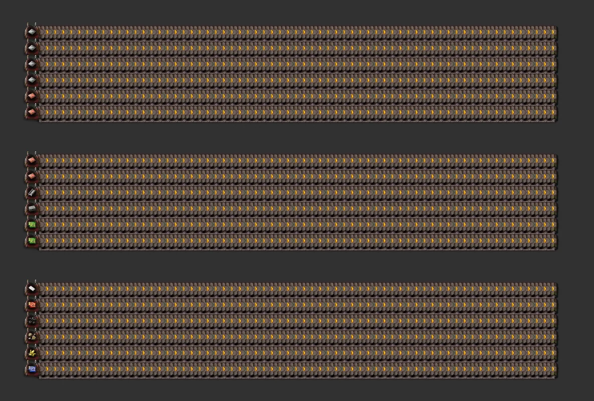 | [Main bus 6+2 segment](blueprints/main-bus-6x2-segment/README.en.md)<br>`main-bus` `kit` `upgradeable` | House bus segment (33 tiles): iron 6 | copper 6 | circuits 2·2·2 | steel 2, plastic 2, stone, brick | coal, sulfur, battery, engine, e-engine, LDS | 6 fluid lines; 2 empty rows between groups. | 35×46 | iron-plate 900/min, iron-plate 900/min, iron-plate 900/min, iron-plate 900/min, iron-plate 900/min, iron-plate 900/min, copper-plate 900/min, copper-plate 900/min, copper-plate 900/min, copper-plate 900/min, copper-plate 900/min, copper-plate 900/min, electronic-circuit 900/min, electronic-circuit 900/min, advanced-circuit 900/min, advanced-circuit 900/min, processing-unit 900/min, processing-unit 900/min, steel-plate 900/min, steel-plate 900/min, plastic-bar 900/min, plastic-bar 900/min, stone 900/min, stone-brick 900/min, coal 900/min, sulfur 900/min, battery 900/min, engine-unit 900/min, electric-engine-unit 900/min, low-density-structure 900/min, petroleum-gas 60,000/min, light-oil 60,000/min, heavy-oil 60,000/min, lubricant 60,000/min, sulfuric-acid 60,000/min, water 60,000/min |
| 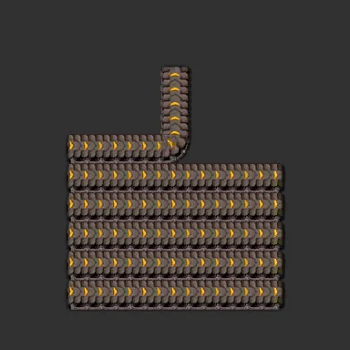 | [Main bus 6+2 tap pieces](blueprints/main-bus-6x2-tap/README.en.md)<br>`main-bus` `kit` `upgradeable` | Takes one lane north: belt lanes 0-5 × full/half (12) + fluid lines 0-5 (6). | 7×8 | - |
| 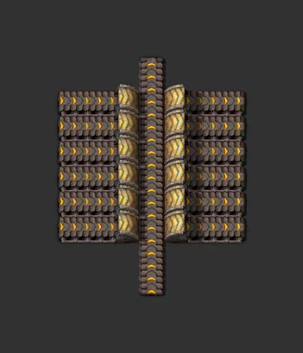 | [Main bus 6+2 crossing piece](blueprints/main-bus-6x2-crossing/README.en.md)<br>`main-bus` `kit` `upgradeable` | Lets a branch from a lower group pass north through a 6-lane group (all six lanes dive one column). | 7×9 | - |
|  | [Refined concrete 60/min](blueprints/refined-concrete-60/README.en.md)<br>`production` `refined-concrete` | Small factory turning stone, iron ore and water into 60 refined concrete/min. All I/O on the west edge. | 38×20 | water 1,800/min, iron-ore 66/min, stone 120/min |
| 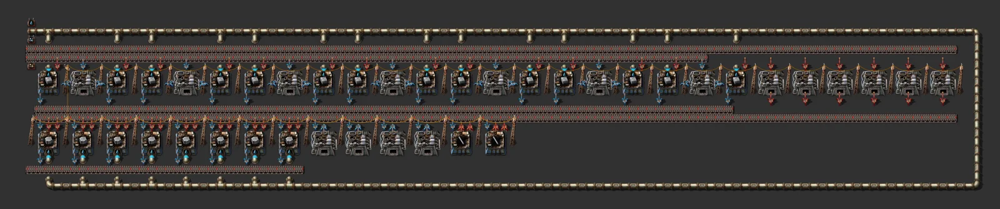 | [Refined concrete 240/min](blueprints/refined-concrete-240/README.en.md)<br>`production` `refined-concrete` | The 60/min design stretched into a 240/min module (24 assemblers, 17 furnaces). | 111×20 | water 8,700/min, iron-ore 264/min, stone 480/min |
| 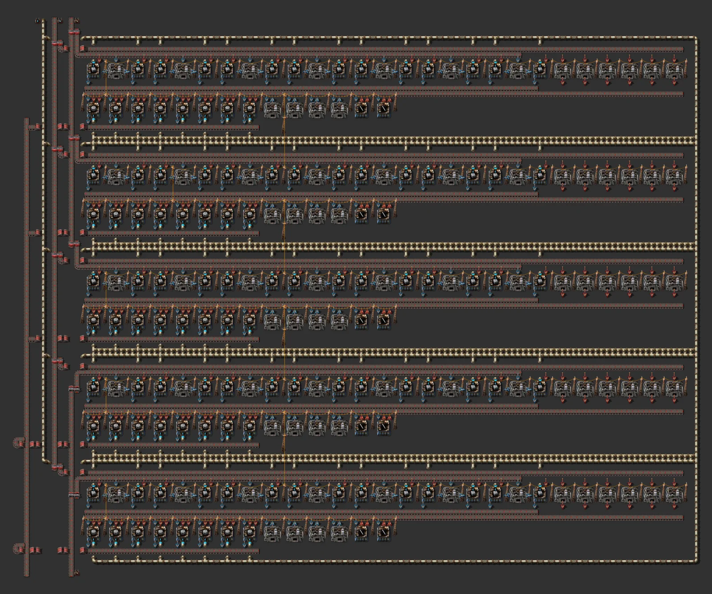 | [Refined concrete 1200/min](blueprints/refined-concrete-1200/README.en.md)<br>`production` `refined-concrete` `large` | Five stacked 240/min modules plus a west-side manifold for inputs and output. | 123×100 | stone 1,440/min, iron-ore 1,320/min, water 43,500/min, stone 960/min |
| 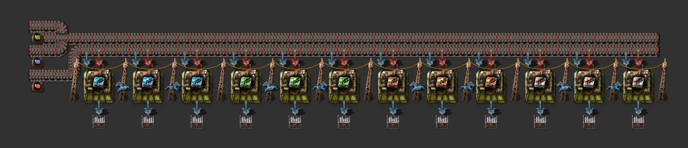 | [Module mall (tier 1-2, 4 kinds)](blueprints/module-mall-t1-t2/README.en.md)<br>`mall` `modules` | Speed, efficiency, productivity and quality modules tier 1-2 from bus circuits into chests. | 52×9 | electronic-circuit 200/min, processing-unit 50/min, advanced-circuit 250/min |
|  | [Rail ramp & support factory](blueprints/rail-ramp-support/README.en.md)<br>`mall` `rail` `elevated-rails` | Small factory making rail ramps and rail supports from iron ore, stone and refined concrete (steel-limited). | 46×15 | iron-ore 225/min, stone 4/min, refined-concrete 160/min |
| 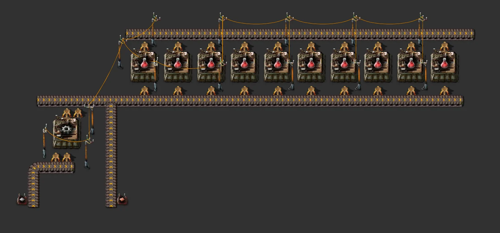 | [Red science (upgradeable tile)](blueprints/science-red-upgradeable/README.en.md)<br>`science` `upgradeable` `main-bus` | 10 science + 1 gear assembler; same layout 60 → 90 → 150/min; fed by two 6+2 bus taps (iron, copper). | 41×16 | iron-plate 300/min, copper-plate 150/min |
|  | [Green science (upgradeable tile)](blueprints/science-green-upgradeable/README.en.md)<br>`science` `upgradeable` `main-bus` | 12 science + 4 intermediate assemblers; same layout 60 → 90 → 150/min; three bus taps (iron ×2, green circuits). | 53×16 | iron-plate 450/min, electronic-circuit 150/min, iron-plate 225/min |
| 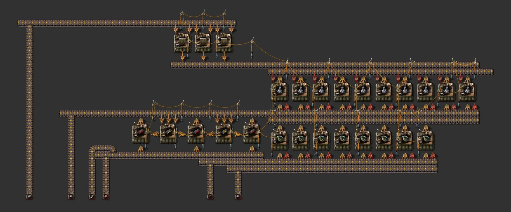 | [Military science (upgradeable tile)](blueprints/science-military-upgradeable/README.en.md)<br>`science` `upgradeable` `main-bus` | 10 science + 3 wall, 3 piercing, 2 magazine and 8 grenade assemblers; same layout 60 → 90 → 150/min; six bus taps (bricks, iron ×2, copper, steel, coal). | 68×26 | stone-brick 750/min, iron-plate 600/min, copper-plate 150/min, steel-plate 38/min, coal 750/min, iron-plate 375/min |
| 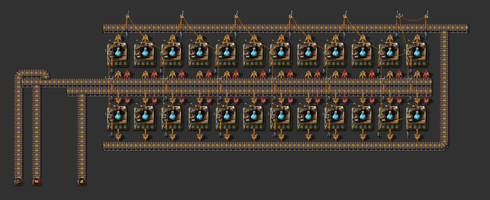 | [Chemical science (upgradeable tile)](blueprints/science-blue-upgradeable/README.en.md)<br>`science` `upgradeable` `main-bus` | 24 science assemblers in two rows; same layout 60 → 90 → 150/min; three bus taps (engines, red circuits, sulfur). | 50×18 | advanced-circuit 225/min, engine-unit 150/min, sulfur 75/min |
| 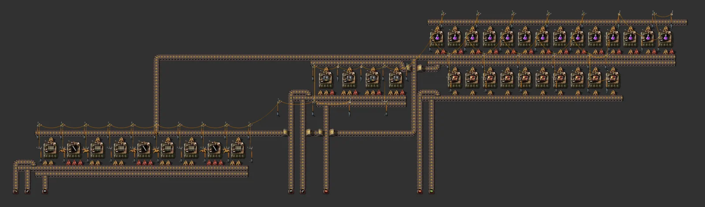 | [Production science (upgradeable tile)](blueprints/science-purple-upgradeable/README.en.md)<br>`science` `upgradeable` `main-bus` | 14 science + 6 rail, 3 stick, 4 electric-furnace and 10 productivity-module assemblers; same layout 60 → 90 → 150/min; nine bus taps. | 115×30 | steel-plate 500/min, stone-brick 500/min, advanced-circuit 250/min, electronic-circuit 250/min, advanced-circuit 250/min, steel-plate 750/min, stone 750/min, iron-plate 375/min |
| 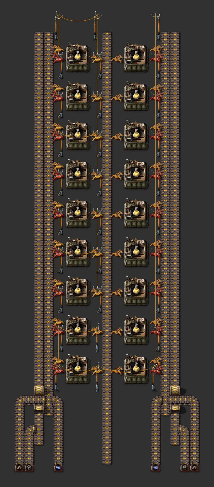 | [Utility science (upgradeable tile)](blueprints/science-yellow-upgradeable/README.en.md)<br>`science` `upgradeable` `main-bus` | 14 science + 14 robot-frame assemblers (1:1, direct insertion); same layout 60 → 90 → 150/min; six bus taps. | 69×18 | processing-unit 100/min, low-density-structure 150/min, electronic-circuit 150/min, steel-plate 50/min, battery 100/min, electric-engine-unit 50/min |
| 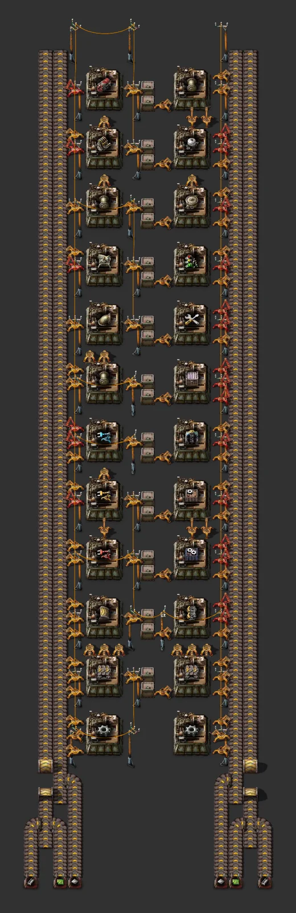 | [Upgradeable mall (Daiso redesign)](blueprints/mall-upgradeable/README.en.md)<br>`mall` `upgradeable` `main-bus` | Two 20-cell streets (logistics & mining / power, fluids & trains); same layout yellow→red→blue, chests iron→passive provider; 2-3 bus taps. | 51×18 | iron-plate 450/min, steel-plate 450/min, electronic-circuit 450/min |
| 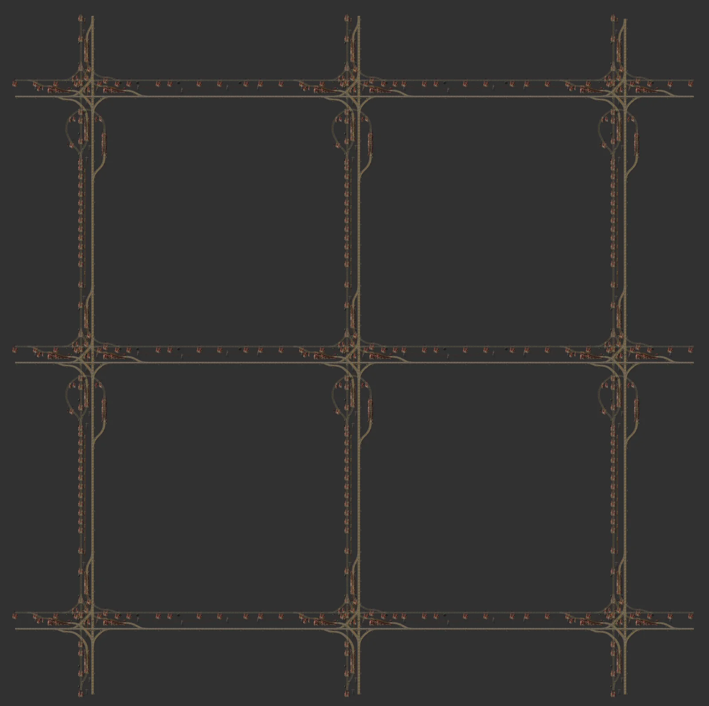 | [Big rail block 2×2 (empty interior)](blueprints/rail-city-block-2x2/README.en.md)<br>`rail` `city-block` | One block the size of 2×2 1×1 blocks: intersections only at the four corners, straight edges, a large empty interior. | 466×465 | - |
|  | [Big rail block 3×3 (empty interior)](blueprints/rail-city-block-3x3/README.en.md)<br>`rail` `city-block` | One block the size of 3×3 1×1 blocks: intersections only at the four corners, straight edges, a large empty interior. | 648×647 | - |
| 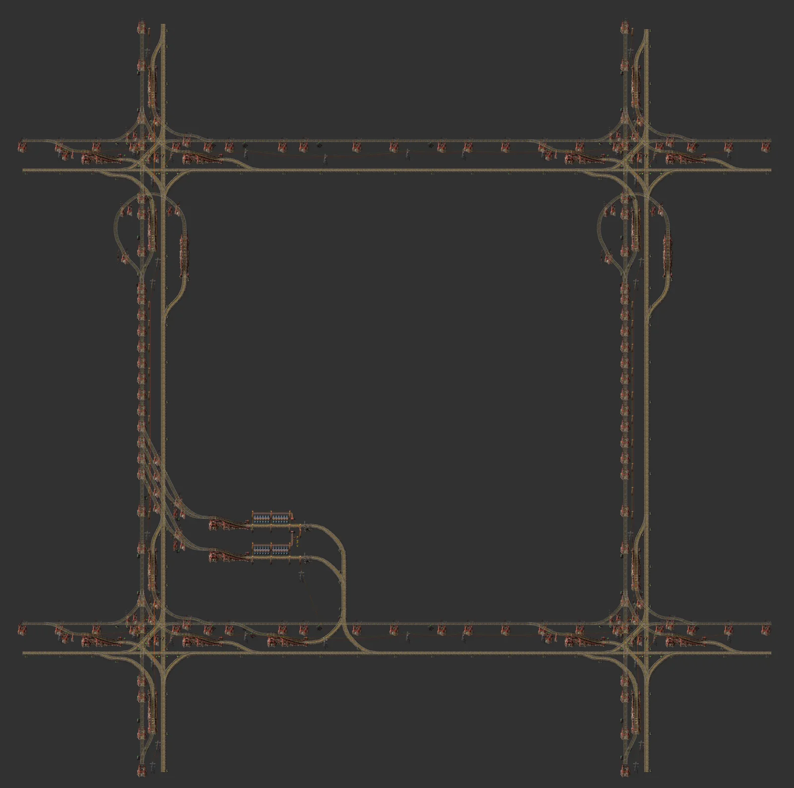 | [Rail buffer station block](blueprints/rail-buffer-station/README.en.md)<br>`rail` `city-block` `station` `buffer` | One item: north stop unloads into 24 chests, south stop loads; train limits follow the stock. | 284×283 | iron-plate ≤900/min |
|  | [Rail mining provider block](blueprints/rail-mining-station/README.en.md)<br>`rail` `city-block` `station` `mining` | 64 electric drills inside the block feeding a loading station. | 284×283 | - |
| 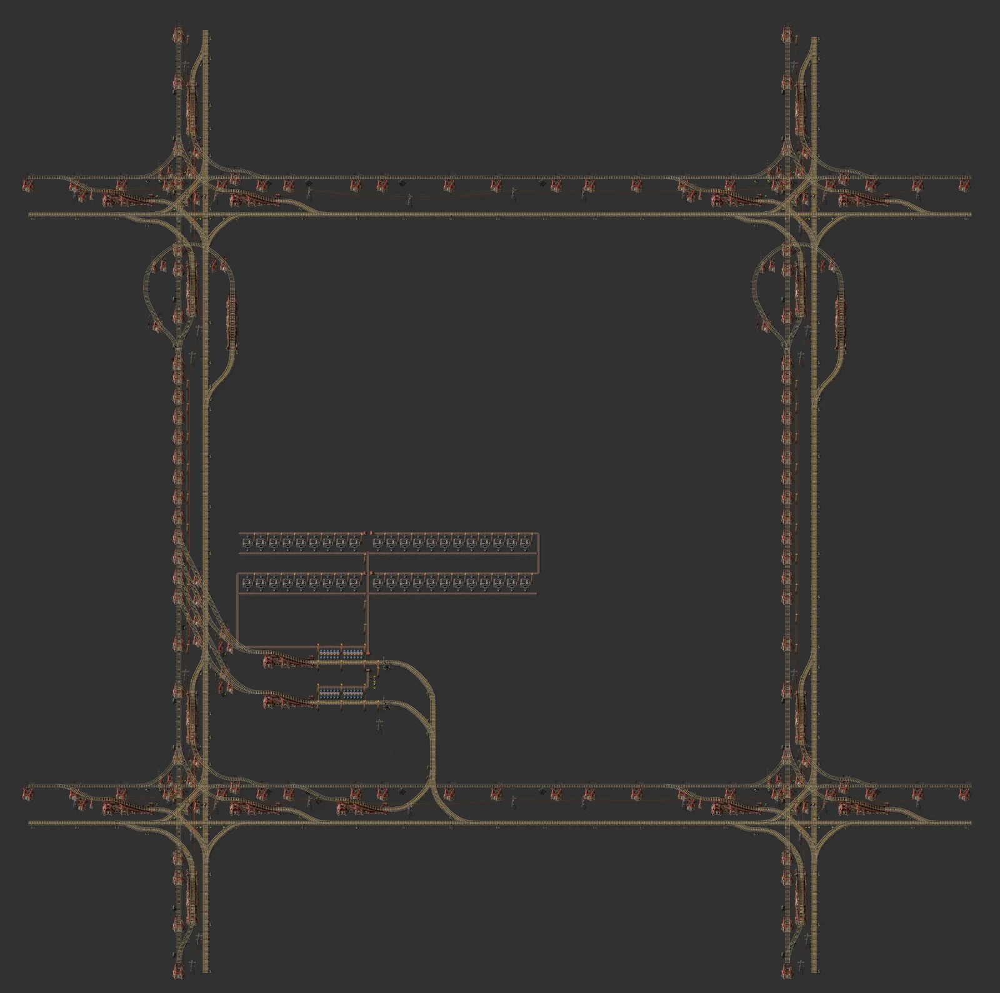 | [Rail smelter provider block](blueprints/rail-smelter-station/README.en.md)<br>`rail` `city-block` `station` `smelting` | North stop unloads ore, 42 electric furnaces smelt it, south stop loads plates. | 284×283 | iron-ore ~900/min |

<!-- CATALOG:END -->

## Preview images

`tools/build.py` opens [Factorio Blueprint Editor](https://fbe.factorygamefan.com) (FactoryGameFan's fork, 2.0 + Space Age)
in headless Chromium and renders each blueprint with the real game sprites; big rail blocks also get a
`detail.webp` cropped to the non-rail part. Without Playwright or network access it falls back to the
schematic renderer (or pick it explicitly with `--renderer schematic`).

## Conventions

- Factories take inputs from a **horizontal main bus (6-lane groups + 2 empty rows)** and are built to **upgrade in place early → mid → late** ([rules](docs/guides/upgrade-in-place.en.md)). Water is made on site with Waterfill.
- Every external input is labelled with a **constant combinator** (signal = item/fluid to supply, count = required per minute). The input tables in the docs are generated from these markers.
- The `AUTO` sections of each `README.md` / `README.en.md` and this catalog are rewritten by `tools/build.py`; hand-written text goes outside them.
- CI (GitHub Actions) regenerates and validates every blueprint and checks that the docs are up to date.

## License

MIT — see [NOTICE.md](NOTICE.md) for third-party material. Factorio is a trademark of Wube Software; this project is not affiliated with Wube.
