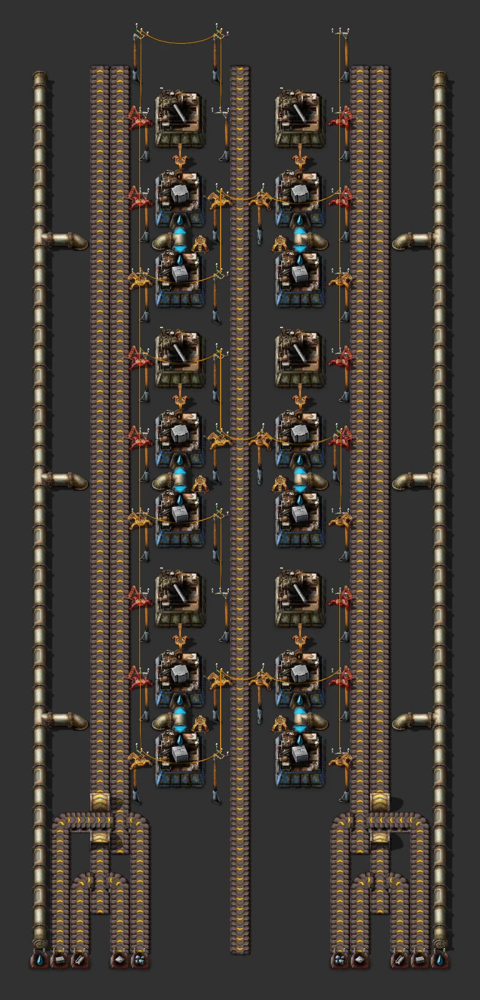
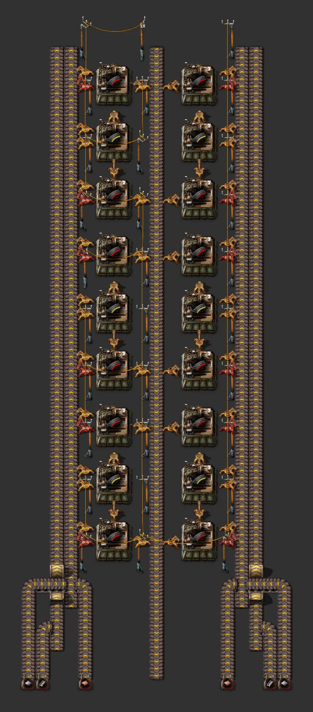
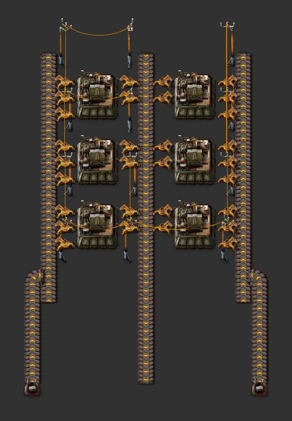
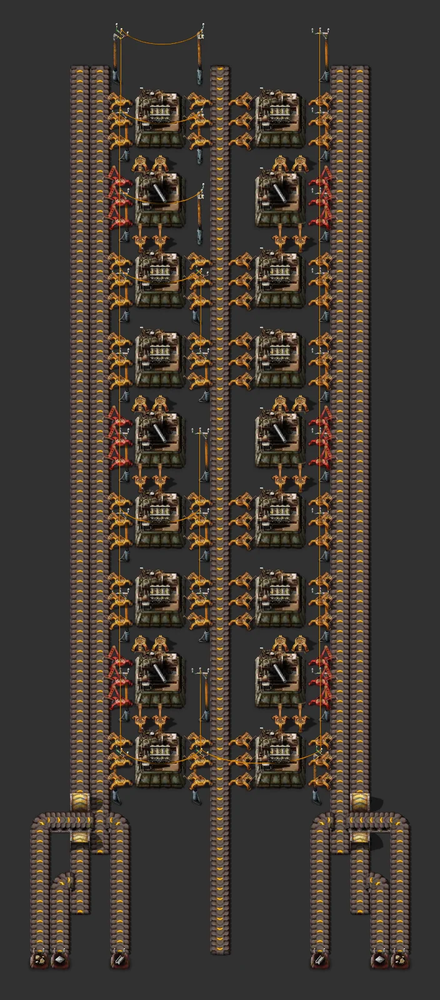
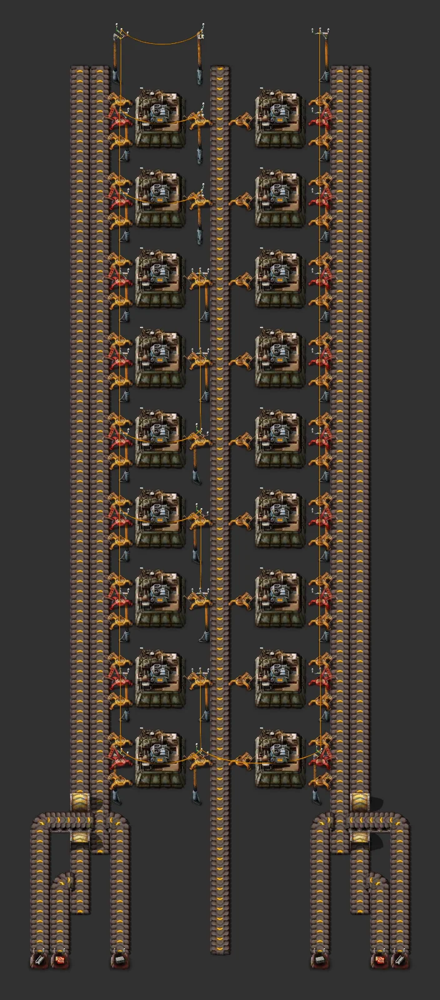
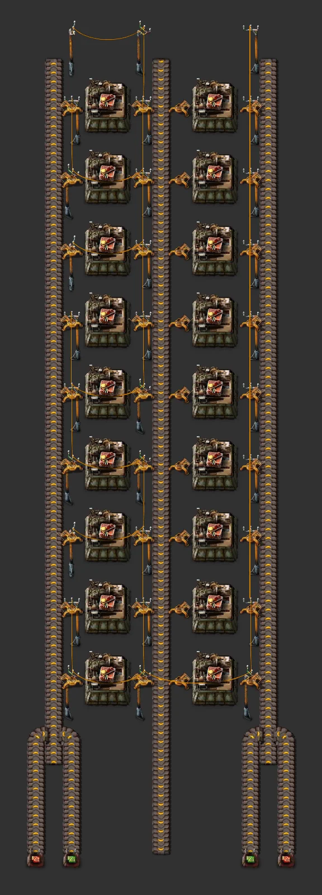
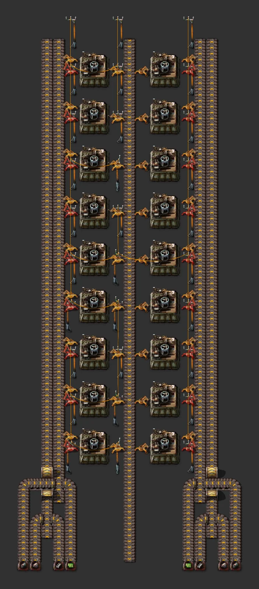

# factorio-ai-resources

A repository for designing and maintaining Factorio blueprints together with an AI (Claude Code): ratio
calculation, blueprint-string generation, validation, preview images and bilingual (Korean/English) docs in one flow.

[한국어](README.md)

## Layout

| Path | Contents |
|---|---|
| [`skills/factorio-blueprint/`](skills/factorio-blueprint/SKILL.md) | Claude Code skill: ratio calculator (`calc.py`), blueprint builder/encoder/validator (`blueprint.py`), layout pattern docs, game data |
| [`blueprints/`](blueprints/README.md) | One folder per blueprint: string, generator, Korean/English docs, preview images |
| [`docs/`](docs/) | [Main bus 6+2 guide](docs/guides/main-bus-6x2.en.md), [upgrade-in-place rules](docs/guides/upgrade-in-place.en.md), [demo-resources analysis](docs/demo-analysis/README.en.md), [recent optimized builds](docs/references/optimized-builds.en.md) |
| `lib/` | Generator code shared by several blueprints (refined-concrete module, rail city-block station kit) |
| `tools/` | `build.py` (validate, previews, docs, catalog), `render_fbe.py` (game-sprite previews), `render_preview.py` (schematic fallback), `new_blueprint.py`, `attach_image.py` |
| `third_party/` | Inputs not redistributed here (rail book, …) — [details](third_party/README.md) |
| `scripts/install-skills.sh` | Installs the skills into `~/.claude/skills` |

## Quick start

```sh
git clone https://github.com/shinkeonkim/factorio-ai-resources.git
cd factorio-ai-resources
scripts/install-skills.sh          # symlink install (--copy to copy instead)
python3 -m venv .venv && .venv/bin/pip install -r tools/requirements.txt
.venv/bin/python -m playwright install chromium   # headless browser for game-sprite previews

.venv/bin/python tools/build.py    # validate everything, render previews, refresh docs
pbcopy < blueprints/refined-concrete-60/blueprint.txt   # then "Import string" in game
```

Add a blueprint:

```sh
python3 tools/new_blueprint.py my-factory --title-ko "내 공장" --title-en "My factory" --tags production
# edit blueprints/my-factory/generate.py, then
python3 blueprints/my-factory/generate.py
python3 tools/build.py my-factory
```

Attach an in-game screenshot (goes into the gallery):

```sh
python3 tools/attach_image.py my-factory ~/Desktop/shot.png --caption-ko "게임 안 모습" --caption-en "In game"
```

## Blueprint catalog

<!-- CATALOG:START (generated by tools/build.py, do not edit) -->

| Preview | Blueprint | Summary | Size | Inputs |
|---|---|---|---|---|
|  | [Main bus 6+2 segment](blueprints/main-bus-6x2-segment/README.en.md)<br>`main-bus` `kit` `upgradeable` | House bus segment (33 tiles): iron 6 | copper 6 | circuits 2·2·2 | steel 2, plastic 2, stone, brick | coal, sulfur, battery, engine, e-engine, LDS | 6 fluid lines; 2 empty rows between groups. | 35×46 | iron-plate 900/min, iron-plate 900/min, iron-plate 900/min, iron-plate 900/min, iron-plate 900/min, iron-plate 900/min, copper-plate 900/min, copper-plate 900/min, copper-plate 900/min, copper-plate 900/min, copper-plate 900/min, copper-plate 900/min, electronic-circuit 900/min, electronic-circuit 900/min, advanced-circuit 900/min, advanced-circuit 900/min, processing-unit 900/min, processing-unit 900/min, steel-plate 900/min, steel-plate 900/min, plastic-bar 900/min, plastic-bar 900/min, stone 900/min, stone-brick 900/min, coal 900/min, sulfur 900/min, battery 900/min, engine-unit 900/min, electric-engine-unit 900/min, low-density-structure 900/min, petroleum-gas 60,000/min, light-oil 60,000/min, heavy-oil 60,000/min, lubricant 60,000/min, sulfuric-acid 60,000/min, water 60,000/min |
|  | [Main bus 6+2 tap pieces](blueprints/main-bus-6x2-tap/README.en.md)<br>`main-bus` `kit` `upgradeable` | Takes one lane north: belt lanes 0-5 × full/half (12) + fluid lines 0-5 (6). | 7×8 | - |
|  | [Main bus 6+2 crossing piece](blueprints/main-bus-6x2-crossing/README.en.md)<br>`main-bus` `kit` `upgradeable` | Lets a branch from a lower group pass north through a 6-lane group (all six lanes dive one column). | 7×9 | - |
|  | [Refined concrete (stackable cell)](blueprints/refined-concrete/README.en.md)<br>`concrete` `stackable` `upgradeable` | 21×12 cell stacked northwards; inputs stone brick, iron ore, steel plate, iron plate; same layout yellow→red→blue. | 21×45 | water 1,125/min, water 1,125/min, iron-ore 8/min, stone-brick 38/min, steel-plate 4/min, iron-plate 15/min, iron-ore 8/min, stone-brick 38/min, steel-plate 4/min, iron-plate 15/min |
|  | [Concrete (stackable cell)](blueprints/cell-concrete/README.en.md)<br>`concrete` `stackable` `upgradeable` | 21×8 cell stacked northwards; inputs stone brick, iron ore; same layout yellow→red→blue. | 21×33 | water 1,500/min, water 1,500/min, iron-ore 15/min, stone-brick 75/min, iron-ore 15/min, stone-brick 75/min |
|  | [Rail ramps & supports (stackable cell)](blueprints/rail-ramp-support/README.en.md)<br>`rail` `space-age` `stackable` `upgradeable` | 15×8 chest cell: supports and ramps on both sides into centre chests. Inputs refined concrete, steel and rails; each extra cell adds chests. | 19×17 | refined-concrete 450/min, steel-plate 450/min, rail 450/min, refined-concrete 450/min, steel-plate 450/min, rail 450/min |
|  | [Red science (stackable cell)](blueprints/science-red-upgradeable/README.en.md)<br>`science` `stackable` `upgradeable` | 13×12 cell stacked northwards; inputs iron plate, copper plate; same layout yellow→red→blue. | 15×45 | copper-plate 30/min, iron-plate 60/min, copper-plate 30/min, iron-plate 60/min |
|  | [Green science (stackable cell)](blueprints/science-green-upgradeable/README.en.md)<br>`science` `stackable` `upgradeable` | 15×20 cell stacked northwards; inputs iron plate, electronic circuit; same layout yellow→red→blue. | 15×69 | iron-plate 113/min, electronic-circuit 25/min, iron-plate 113/min, electronic-circuit 25/min |
|  | [Military science (stackable cell)](blueprints/science-military-upgradeable/README.en.md)<br>`science` `stackable` `upgradeable` | 15×12 cell stacked northwards; inputs piercing rounds magazine, grenade, stone wall; same layout yellow→red→blue. | 19×45 | grenade 22/min, piercing-rounds-magazine 22/min, stone-wall 45/min, grenade 22/min, piercing-rounds-magazine 22/min, stone-wall 45/min |
|  | [Chemical science (stackable cell)](blueprints/science-blue-upgradeable/README.en.md)<br>`science` `stackable` `upgradeable` | 15×12 cell stacked northwards; inputs engine unit, advanced circuit, sulfur; same layout yellow→red→blue. | 19×45 | advanced-circuit 28/min, engine-unit 19/min, sulfur 9/min, advanced-circuit 28/min, engine-unit 19/min, sulfur 9/min |
|  | [Production science (stackable cell)](blueprints/science-purple-upgradeable/README.en.md)<br>`science` `stackable` `upgradeable` | 15×12 cell stacked northwards; inputs rail, electric furnace, productivity module; same layout yellow→red→blue. | 19×45 | electric-furnace 11/min, rail 321/min, productivity-module 11/min, electric-furnace 11/min, rail 321/min, productivity-module 11/min |
|  | [Utility science (stackable cell)](blueprints/science-yellow-upgradeable/README.en.md)<br>`science` `stackable` `upgradeable` | 15×12 cell stacked northwards; inputs low density structure, processing unit, flying robot frame; same layout yellow→red→blue. | 19×45 | processing-unit 21/min, low-density-structure 32/min, flying-robot-frame 11/min, processing-unit 21/min, low-density-structure 32/min, flying-robot-frame 11/min |
|  | [Piercing rounds (stackable cell)](blueprints/cell-piercing-rounds/README.en.md)<br>`intermediate` `stackable` `upgradeable` | 15×12 cell stacked northwards; inputs iron plate, copper plate, steel plate; same layout yellow→red→blue. | 19×45 | copper-plate 50/min, iron-plate 200/min, steel-plate 25/min, copper-plate 50/min, iron-plate 200/min, steel-plate 25/min |
|  | [Grenades (stackable cell)](blueprints/cell-grenade/README.en.md)<br>`intermediate` `stackable` `upgradeable` | 13×12 cell stacked northwards; inputs coal, iron plate; same layout yellow→red→blue. | 15×45 | iron-plate 141/min, coal 281/min, iron-plate 141/min, coal 281/min |
|  | [Stone walls (stackable cell)](blueprints/cell-stone-wall/README.en.md)<br>`intermediate` `stackable` `upgradeable` | 13×4 cell stacked northwards; inputs stone brick; same layout yellow→red→blue. | 15×21 | stone-brick 416/min, stone-brick 416/min |
|  | [Rails (stackable cell)](blueprints/cell-rail/README.en.md)<br>`intermediate` `stackable` `upgradeable` | 15×12 cell stacked northwards; inputs stone, steel plate, iron plate; same layout yellow→red→blue. | 19×45 | steel-plate 300/min, stone 300/min, iron-plate 150/min, steel-plate 300/min, stone 300/min, iron-plate 150/min |
|  | [Electric furnaces (stackable cell)](blueprints/cell-electric-furnace/README.en.md)<br>`intermediate` `stackable` `upgradeable` | 15×12 cell stacked northwards; inputs steel plate, stone brick, advanced circuit; same layout yellow→red→blue. | 19×45 | stone-brick 416/min, steel-plate 416/min, advanced-circuit 208/min, stone-brick 416/min, steel-plate 416/min, advanced-circuit 208/min |
|  | [Big rail block 2×2 (empty interior)](blueprints/rail-city-block-2x2/README.en.md)<br>`rail` `city-block` | One block the size of 2×2 1×1 blocks: intersections only at the four corners, straight edges, a large empty interior. | 466×465 | - |
|  | [Productivity modules (stackable cell)](blueprints/cell-productivity-module/README.en.md)<br>`intermediate` `stackable` `upgradeable` | 13×12 cell stacked northwards; inputs advanced circuit, electronic circuit; same layout yellow→red→blue. | 15×45 | electronic-circuit 75/min, advanced-circuit 75/min, electronic-circuit 75/min, advanced-circuit 75/min |
|  | [Big rail block 3×3 (empty interior)](blueprints/rail-city-block-3x3/README.en.md)<br>`rail` `city-block` | One block the size of 3×3 1×1 blocks: intersections only at the four corners, straight edges, a large empty interior. | 648×647 | - |
|  | [Flying robot frames (stackable cell)](blueprints/cell-robot-frame/README.en.md)<br>`intermediate` `stackable` `upgradeable` | 15×12 cell stacked northwards; inputs battery, electronic circuit, electric engine unit, steel plate; same layout yellow→red→blue. | 19×45 | electronic-circuit 34/min, battery 22/min, electric-engine-unit 11/min, steel-plate 11/min, electronic-circuit 34/min, battery 22/min, electric-engine-unit 11/min, steel-plate 11/min |
|  | [Upgradeable mall (stackable cells)](blueprints/mall-upgradeable/README.en.md)<br>`mall` `stackable` `upgradeable` | Four 15-wide cell types (belts, inserters/assemblers, pipes/logistics, trains/fluids; 24 items) stacked northwards. Inputs iron, steel, green circuits; the bottom cell makes the gears. | 17×57 | iron-plate 450/min, steel-plate 450/min, electronic-circuit 450/min, iron-plate 450/min, steel-plate 450/min, electronic-circuit 450/min |
|  | [Rail buffer station block](blueprints/rail-buffer-station/README.en.md)<br>`rail` `city-block` `station` `buffer` | One item: north stop unloads into 24 chests, south stop loads; train limits follow the stock. | 284×283 | iron-plate ≤900/min |
|  | [Module mall tier 1-2 (stackable cells)](blueprints/module-mall-t1-t2/README.en.md)<br>`mall` `stackable` `upgradeable` | Two 15-wide cell types (speed & efficiency / productivity & quality) stacked northwards; tier-1 modules go straight into the tier-2 machine above. Inputs green, red and blue circuits. | 19×25 | electronic-circuit 450/min, advanced-circuit 450/min, processing-unit 450/min, electronic-circuit 450/min, advanced-circuit 450/min, processing-unit 450/min |
|  | [Rail mining provider block](blueprints/rail-mining-station/README.en.md)<br>`rail` `city-block` `station` `mining` | 64 electric drills inside the block feeding a loading station. | 284×283 | - |
|  | [Rail smelter provider block](blueprints/rail-smelter-station/README.en.md)<br>`rail` `city-block` `station` `smelting` | North stop unloads ore, 42 electric furnaces smelt it, south stop loads plates. | 284×283 | iron-ore ~900/min |
|  | [Vulcanus all-in-one base](blueprints/planet-vulcanus/README.en.md)<br>`planet` `vulcanus` `space-age` `all-in-one` `stackable` | Vulcanus base in one rectangle: islands that make their own molten metals (castings, metallurgic science, mall) → 360 metallurgic science/min, tungsten, a mall (foundries, big drills, turbo belts), self-restarting 372 MW power, a south ore gate, rocket and landing pad. Robot-fed cells, a stock limit on every output. | 221×192 | calcite 412/min, coal 2,400/min, tungsten-ore 1,860/min, tungsten-ore 1,860/min |
|  | [Fulgora all-in-one base](blueprints/planet-fulgora/README.en.md)<br>`planet` `fulgora` `space-age` `all-in-one` `stackable` | Fulgora base in one rectangle wrapped in a band of lightning collectors and accumulators: 160 scrap/s → two scrap shelves (recycling, sorting, overflow voids) → holmium, electrolyte, superconductors, supercapacitors → about 100 electromagnetic science/min, secondary recycling, an EM-plant mall, rocket. Robots between blocks. | 234×193 | - |
|  | [Gleba all-in-one base](blueprints/planet-gleba/README.en.md)<br>`planet` `gleba` `space-age` `all-in-one` `stackable` `robots` | Gleba base in one rectangle inside stone walls with laser and gun turrets, all robot-fed: fruit processing → bioflux, nutrients, pentapod eggs → about 600 agricultural science/min, iron bacteria → magazines, carbon fiber, rocket fuel from jelly, heating-tower power burning spoilage, rocket and landing pad. | 145×98 | - |
|  | [Aquilo all-in-one base](blueprints/planet-aquilo/README.en.md)<br>`planet` `aquilo` `space-age` `all-in-one` `stackable` `robots` `heating` | Aquilo base in one rectangle with heat pipe woven between every building: ammonia ocean → ammonia, ice, water, lithium, the fluoroketone loop → about 96 cryogenic science/min, ammonia rocket fuel, ice platforms, fusion power cells, heating-tower power that also keeps everything warm, rocket and landing pad. Generation checks that every building that freezes has heat pipe within one tile. | 287×211 | - |

<!-- CATALOG:END -->

## Preview images

`tools/build.py` opens [Factorio Blueprint Editor](https://fbe.factorygamefan.com) (FactoryGameFan's fork, 2.0 + Space Age)
in headless Chromium and renders each blueprint with the real game sprites; big rail blocks also get a
`detail.webp` cropped to the non-rail part. Without Playwright or network access it falls back to the
schematic renderer (or pick it explicitly with `--renderer schematic`).

## Conventions

- Factories take inputs from a **horizontal main bus (6-lane groups + 2 empty rows)** and are built to **upgrade in place early → mid → late** ([rules](docs/guides/upgrade-in-place.en.md)). Water is made on site with Waterfill.
- Every external input is labelled with a **constant combinator** (signal = item/fluid to supply, count = required per minute). The input tables in the docs are generated from these markers.
- The `AUTO` sections of each `README.md` / `README.en.md` and this catalog are rewritten by `tools/build.py`; hand-written text goes outside them.
- CI (GitHub Actions) regenerates and validates every blueprint and checks that the docs are up to date.

## License

MIT — see [NOTICE.md](NOTICE.md) for third-party material. Factorio is a trademark of Wube Software; this project is not affiliated with Wube.
