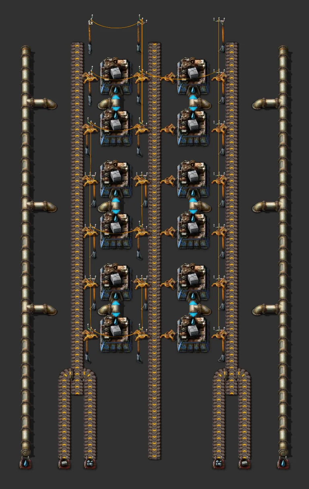

# Concrete (stackable cell)

> 21×8 cell stacked northwards; inputs stone brick, iron ore; same layout yellow→red→blue.

[한국어](README.md)

<!-- AUTO:START (generated by tools/build.py, do not edit) -->



<sub>Images rendered with [Factorio Blueprint Editor](https://fbe.factorygamefan.com) (game graphics © Wube Software)</sub>

| Item | Value |
|---|---|
| Game | Factorio 2.0 (base) |
| Size | 21×33 tiles |
| Entities | 265 |
| Main machines | `assembling-machine-2` ×12 (concrete 12) |
| Validation | OK |

### Inputs

_constant-combinator markers inside the blueprint (count = required per minute, position = tile offset from the blueprint's top-left)_

| Signal | Per minute | Position |
|---|---:|---|
| `water` (fluid) | 1,500 | (0, 32) |
| `water` (fluid) | 1,500 | (20, 32) |
| `iron-ore` | 15 | (5, 32) |
| `stone-brick` | 75 | (3, 32) |
| `iron-ore` | 15 | (15, 32) |
| `stone-brick` | 75 | (17, 32) |

### Outputs

| Item | Per minute | Position |
|---|---:|---|
| `concrete` | - | centre belt, leaves south under the cap |

### Stacking

One cell = **21×8** (width×height). A copy pasted directly north (8 rows up) continues every belt; the cell files snap to a 21×8 grid, so drag to place several. The cap (base piece) goes once at the bottom.

| Stage | Output per cell (/min) | Max cells | Input per cell, one side (/min) | Notes |
|---|---:|---:|---|---|
| early (yellow, AM1, basic) | 180.0 | 5 | `iron-ore` 9, `stone-brick` 45 |  |
| mid (red, AM2, fast) | 180.0 | 10 | `iron-ore` 9, `stone-brick` 45 |  |
| late (blue, AM3, bulk) | 300.0 | 9 | `iron-ore` 15, `stone-brick` 75 |  |

_Max cells = how many cells one lane of that tier's belt can feed (busiest input lane or the product lane). Each side has its own inputs, so every input needs one bus tap per side._

### Roadmap

| Stage | When / research needed | What to do |
|---|---|---|
| 0. Research | `concrete` (red·green), `automation-2` (red·green) | Concrete research unlocks both concrete and refined concrete; fluid recipes need assembling machine 2. |
| 1. Start | `logistics` (red), `steam-power` (on first craft) | Cap + one cell. Bricks, steel and iron plates from the bus, iron ore from an ore line, water from Waterfill + an offshore pump under the cap (one per side). Add cells northwards for more. |
| 2. Mid | `logistics-2` (red·green), `fast-inserter` (red), `electric-energy-distribution-1` (red·green) | Red belts, fast inserters, medium poles (assemblers are AM2 already). |
| 3. Late | `logistics-3` (red·green·blue·purple), `automation-3` (red·green·blue·purple), `bulk-inserter` (red·green) | Blue belts, AM3, bulk inserters: about 1.7× concrete per cell. |

**Build next**

- [Refined concrete (stackable cell)](../refined-concrete/README.en.md) — concrete into refined concrete

### Files

| File | Description |
|---|---|
| [`blueprint.txt`](blueprint.txt) | cap + 3 cells, early (example / preview) |
| [`variants/cell-early.txt`](variants/cell-early.txt) | cell — early (yellow, AM1, basic) |
| [`variants/cell-mid.txt`](variants/cell-mid.txt) | cell — mid (red, AM2, fast) |
| [`variants/cell-late.txt`](variants/cell-late.txt) | cell — late (blue, AM3, bulk) |
| [`variants/cap-early.txt`](variants/cap-early.txt) | cap (base piece) — early (yellow, AM1, basic) |
| [`variants/cap-mid.txt`](variants/cap-mid.txt) | cap (base piece) — mid (red, AM2, fast) |
| [`variants/cap-late.txt`](variants/cap-late.txt) | cap (base piece) — late (blue, AM3, bulk) |

Copy the string to the clipboard, then in game: Blueprint library → Import string:

```sh
pbcopy < blueprints/cell-concrete/blueprint.txt   # macOS
xclip -selection clipboard < blueprints/cell-concrete/blueprint.txt   # Linux
```

### Regenerate

```sh
python3 blueprints/cell-concrete/generate.py
python3 tools/build.py cell-concrete
```

<!-- AUTO:END -->

## Layout

- Inner belt (normal inserters): far lane stone brick, near lane iron ore
- Centre belt (flows south): concrete

Machine column (south → north, both halves):
1. concrete → centre belt
2. concrete → centre belt

- Inputs run north along both edges, the product runs south (toward the bus) down the middle. Every line enters at the bottom edge and leaves at the top edge, so the next cell simply continues it.
- Cap: bus taps come in at the markers on the bottom edge and are side-loaded onto their lanes. Marker counts are **late-tier demand per cell and side (per minute)**.
- Every fourth row is a gap row with poles and the hand-over inserters between machines.
- **Water**: the outermost column on each side is a water main that runs through every cell. In the gap row between the north-facing concrete machine and the south-facing refined-concrete machine a pipe-to-ground pair passes under the belts and feeds both. Place Waterfill water + an offshore pump at the cap's marker (one per side). AM1 cannot craft fluid recipes, so the early tier uses AM2 too.

## Upgrading

Swap belts, assemblers, inserters and poles with the upgrade planner (same footprints). The only underground is the cap's 1-tile hop, and long-handed inserters only take the low-rate items from the outer belt. Per-tier output and stack limits are in the stacking table above.

## Credits

Stackable-cell form modelled on the Nilaus green-circuit module from the user's demo (Base-In-A-Book).
