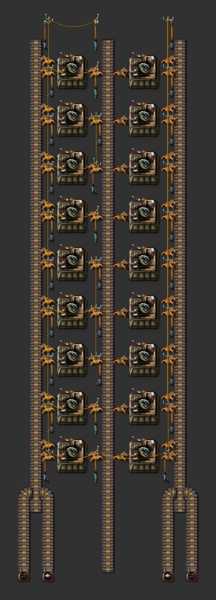

# 수류탄 (쌓는 셀)

> 13×12 셀을 북쪽으로 쌓아 늘립니다. 입력 석탄, 철판; 같은 배치로 노랑→빨강→파랑.

[English](README.en.md)

<!-- AUTO:START (tools/build.py가 생성하는 구역입니다. 직접 수정하지 마세요) -->



<sub>이미지: [Factorio Blueprint Editor](https://fbe.factorygamefan.com)로 렌더링 (게임 그래픽 © Wube Software)</sub>

| 항목 | 값 |
|---|---|
| 게임 | Factorio 2.0 (base) |
| 크기 | 15×45 타일 |
| 엔티티 | 256 |
| 주요 설비 | `assembling-machine-1` ×18 (grenade 18) |
| 검사 | 통과 |

### 입력

_블루프린트 안의 일정 신호 조합기 표시 (값 = 분당 필요량, 위치 = 블루프린트 왼쪽 위 기준 타일 좌표)_

| 신호 | 분당 | 위치 |
|---|---:|---|
| `iron-plate` | 141 | (2, 44) |
| `coal` | 281 | (0, 44) |
| `iron-plate` | 141 | (12, 44) |
| `coal` | 281 | (14, 44) |

### 출력

| 아이템 | 분당 | 위치 |
|---|---:|---|
| `grenade` | - | 가운데 벨트, 캡 아래로 나감 |

### 쌓기

셀 하나 = **13×12** (가로×세로). 같은 셀을 바로 북쪽(12칸 위)에 붙이면 벨트가 그대로 이어집니다. 셀 파일은 13×12 격자에 맞춰 붙으니 드래그로 여러 개를 놓으세요. 캡(시작 조각)은 맨 아래 한 번만 놓습니다.

| 단계 | 셀당 출력 (분당) | 최대 셀 수 | 셀당 입력, 한쪽 (분당) | 비고 |
|---|---:|---:|---|---|
| 초반 (노랑·조립기 1·일반) | 22.5 | 4 | `coal` 112, `iron-plate` 56 |  |
| 중반 (빨강·조립기 2·고속) | 33.8 | 5 | `coal` 169, `iron-plate` 84 |  |
| 후반 (파랑·조립기 3·벌크) | 56.2 | 4 | `coal` 281, `iron-plate` 141 |  |

_최대 셀 수 = 그 단계 벨트의 레인 하나로 버틸 수 있는 셀 수(가장 바쁜 입력 레인이나 출력 레인 기준). 양쪽이 따로 입력을 받으므로 버스 분기는 한쪽마다 하나씩 필요합니다._

### 로드맵

| 단계 | 시기 / 필요한 연구 | 할 일 |
|---|---|---|
| 0. 준비 | `military-2` (빨강·초록) | 버스에서 분기할 입력: 석탄, 철판. 캡 아래쪽 표시 조합기 자리마다(한쪽에 하나씩) 분기를 하나씩 엽니다. |
| 1. 시작 (초반) | `automation` (빨강), `logistics` (빨강) | 캡 1개 + 셀 1개를 노랑 벨트·조립기 1로 놓습니다. 더 필요하면 셀 파일을 북쪽으로 드래그해 붙입니다. 쌓기 표의 최대 셀 수를 넘으면 입력 레인이 모자랍니다. |
| 2. 중반 | `logistics-2` (빨강·초록), `automation-2` (빨강·초록), `fast-inserter` (빨강), `electric-energy-distribution-1` (빨강·초록) | 업그레이드 플래너로 빨강 벨트·조립기 2·고속 인서터·중형 전봇대. 셀당 출력이 1.5배, 최대 셀 수도 늘어납니다. 버스 분기도 빨강으로. |
| 3. 후반 | `logistics-3` (빨강·초록·파랑·보라), `automation-3` (빨강·초록·파랑·보라), `bulk-inserter` (빨강·초록) | 파랑 벨트·조립기 3·벌크 인서터. 셀당 출력이 초반의 2.5배입니다. 모듈을 꽂으면 입력이 표시 값보다 늘어납니다. |

**다음에 지을 것**

- [군사 과학 (쌓는 셀)](../science-military-upgradeable/README.md) — 이 셀의 출력을 쓰는 과학

### 파일

| 파일 | 설명 |
|---|---|
| [`blueprint.txt`](blueprint.txt) | 캡 + 셀 3개, 초반 (예시·미리보기) |
| [`variants/cell-early.txt`](variants/cell-early.txt) | 셀 — 초반 (노랑·조립기 1·일반) |
| [`variants/cell-mid.txt`](variants/cell-mid.txt) | 셀 — 중반 (빨강·조립기 2·고속) |
| [`variants/cell-late.txt`](variants/cell-late.txt) | 셀 — 후반 (파랑·조립기 3·벌크) |
| [`variants/cap-early.txt`](variants/cap-early.txt) | 캡(시작 조각) — 초반 (노랑·조립기 1·일반) |
| [`variants/cap-mid.txt`](variants/cap-mid.txt) | 캡(시작 조각) — 중반 (빨강·조립기 2·고속) |
| [`variants/cap-late.txt`](variants/cap-late.txt) | 캡(시작 조각) — 후반 (파랑·조립기 3·벌크) |

문자열을 클립보드에 복사한 뒤 게임에서 블루프린트 라이브러리 → 문자열 가져오기:

```sh
pbcopy < blueprints/cell-grenade/blueprint.txt   # macOS
xclip -selection clipboard < blueprints/cell-grenade/blueprint.txt   # Linux
```

### 다시 생성

```sh
python3 blueprints/cell-grenade/generate.py
python3 tools/build.py cell-grenade
```

<!-- AUTO:END -->

## 구조

- 안쪽 벨트 (일반 인서터): 바깥쪽 레인 석탄, 안쪽 레인 철판
- 가운데 벨트 (남쪽으로): 수류탄

기계 열 (남 → 북, 양쪽 대칭):
1. 수류탄 → 가운데 벨트
2. 수류탄 → 가운데 벨트
3. 수류탄 → 가운데 벨트

- 입력은 셀 양쪽 가장자리를 따라 북쪽으로, 제품은 가운데로 남쪽(버스 쪽)으로 흐릅니다. 모든 줄이 셀의 아래쪽 가장자리로 들어와 위쪽 가장자리로 나가서, 같은 셀을 위에 붙이면 그대로 이어집니다.
- 캡: 버스 분기가 아래쪽 표시 조합기 자리로 들어오면 옆에서 밀어 넣어(사이드로드) 정해진 레인에 올립니다. 표시 값은 **셀 하나, 한쪽 기준 후반 수요(분당)** 입니다.
- 셀 사이 빈 줄(4칸마다)에 전봇대와, 옆 기계로 바로 넘기는 인서터가 들어갑니다.

## 쓰는 곳

[군사 과학 (쌓는 셀)](../science-military-upgradeable/README.md)의 입력입니다. 가운데 벨트를 그 캡으로 보내거나 버스에 올리세요.

## 업그레이드

업그레이드 플래너로 벨트·조립기·인서터·전봇대만 바꾸면 됩니다(같은 크기). 지하 벨트는 캡의 1칸짜리뿐이고, 롱암은 바깥 벨트의 저속 입력에만 씁니다. 단계별 출력과 최대 셀 수는 위 쌓기 표를 보세요.

## 출처

쌓는 셀 형태: 사용자 데모의 Nilaus 초록칩 모듈(Base-In-A-Book)을 기준으로 삼았습니다.
