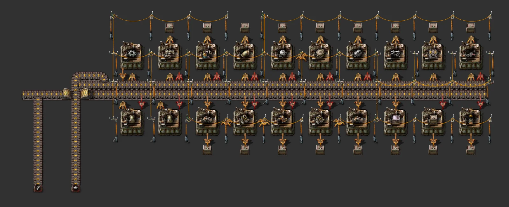

# 업그레이드형 몰 (다이소 재설계)

> 셀 20개짜리 거리 두 종류(물류·채굴 / 전력·유체·기차). 같은 배치로 노랑→빨강→파랑, 상자는 철→패시브 공급. 버스 분기 2-3줄.

[English](README.en.md)

<!-- AUTO:START (tools/build.py가 생성하는 구역입니다. 직접 수정하지 마세요) -->

**물류·채굴 거리, 초반 (노랑·조립기 1·일반)**


**전력·유체·기차 거리, 초반**



<sub>이미지: [Factorio Blueprint Editor](https://fbe.factorygamefan.com)로 렌더링 (게임 그래픽 © Wube Software)</sub>

| 항목 | 값 |
|---|---|
| 게임 | Factorio 2.0 (base) |
| 크기 | 51×18 타일 |
| 엔티티 | 270 |
| 주요 설비 | `assembling-machine-1` ×20 (iron-gear-wheel 2, underground-belt 1, transport-belt 1, splitter 1, long-handed-inserter 1, inserter 1, fast-inserter 1, pipe-to-ground 1, pipe 1, repair-pack 1, steel-chest 1, assembling-machine-2 1, assembling-machine-1 1, electric-mining-drill 1, radar 1, rail-signal 1, rail-chain-signal 1, iron-chest 1, firearm-magazine 1)<br>`iron-chest` ×18 |
| 검사 | 통과 |

### 입력

_블루프린트 안의 일정 신호 조합기 표시 (값 = 분당 필요량, 위치 = 블루프린트 왼쪽 위 기준 타일 좌표)_

| 신호 | 분당 | 위치 |
|---|---:|---|
| `iron-plate` | 450 | (6, 17) |
| `steel-plate` | 450 | (2, 17) |
| `electronic-circuit` | 450 | (0, 17) |

### 출력

| 아이템 | 분당 | 위치 |
|---|---:|---|
| `(chests)` | - | 북쪽 줄 y=-2, 남쪽 줄 y=11의 상자 (2칸 제한) |

### 로드맵

| 단계 | 시기 / 필요한 연구 | 할 일 |
|---|---|---|
| 1. 물류 거리 (초반) | `logistics` (빨강), `electric-mining-drill` (빨강), `steel-processing` (빨강) | 철·초록 회로·강철 분기 3개로 기본 파일을 짓습니다. 벨트·인서터·조립기·채굴기가 상자에 쌓입니다. 아직 연구 안 된 칸은 멈춰 있다가 연구되면 저절로 돕니다. |
| 2. 전력·유체·기차 거리 | `engine` (빨강·초록), `fluid-handling` (빨강·초록), `railway` (빨강·초록), `fluid-wagon` (빨강·초록) | 철·강철 분기 2개로 두 번째 거리를 놓습니다. 엔진·펌프는 연구 전엔 멈춰 있습니다. |
| 3. 중반 | `logistics-2` (빨강·초록), `automation-2` (빨강·초록), `fast-inserter` (빨강), `electric-energy-distribution-1` (빨강·초록) | 업그레이드 플래너: 빨강 벨트·조립기 2·고속 인서터·중형 전봇대. 조립기 2 칸은 조립기 2를 만드는 데도 쓰입니다(조립기 1 → 2를 옆 칸에서 넘김). |
| 4. 후반 / 봇 | `logistics-3` (빨강·초록·파랑·보라), `automation-3` (빨강·초록·파랑·보라), `bulk-inserter` (빨강·초록), `construction-robotics` (빨강·초록·파랑) | 파랑 벨트·조립기 3·벌크 인서터, 상자는 패시브 공급 상자로 바꾸면 건설 로봇이 몰에서 바로 가져갑니다. |

**다음에 지을 것**

- [모듈 몰 (1·2단계, 4종)](../module-mall-t1-t2/README.md) — 모듈 몰
- [빨강 과학 (쌓는 셀)](../science-red-upgradeable/README.md) — 몰이 만든 건물로 지을 첫 공장

### 파일

| 파일 | 설명 |
|---|---|
| [`blueprint.txt`](blueprint.txt) | 물류·채굴 거리, 초반 (노랑·조립기 1·일반) |
| [`variants/logistics-mid.txt`](variants/logistics-mid.txt) | 물류·채굴 거리, 중반 |
| [`variants/logistics-late.txt`](variants/logistics-late.txt) | 물류·채굴 거리, 후반 |
| [`variants/power-fluids-trains-early.txt`](variants/power-fluids-trains-early.txt) | 전력·유체·기차 거리, 초반 |
| [`variants/power-fluids-trains-mid.txt`](variants/power-fluids-trains-mid.txt) | 전력·유체·기차 거리, 중반 |
| [`variants/power-fluids-trains-late.txt`](variants/power-fluids-trains-late.txt) | 전력·유체·기차 거리, 후반 |

문자열을 클립보드에 복사한 뒤 게임에서 블루프린트 라이브러리 → 문자열 가져오기:

```sh
pbcopy < blueprints/mall-upgradeable/blueprint.txt   # macOS
xclip -selection clipboard < blueprints/mall-upgradeable/blueprint.txt   # Linux
```

### 다시 생성

```sh
python3 blueprints/mall-upgradeable/generate.py
python3 tools/build.py mall-upgradeable
```

<!-- AUTO:END -->

## 구조

거리 하나 = 조립기 두 줄이 가운데 벨트 두 개(레인 4개)를 같이 씁니다. 셀은 4칸 간격(조립기 3칸 + 빈 칸 1)입니다.

```
y=-2   상자 (북쪽 줄)
y=-1   출력 인서터
y=0..2 북쪽 줄 조립기         빈 칸: 위아래 전봇대, 가운데에 옆 셀로 넘기는 인서터
y=3    인서터: 가까운 벨트(x+1), 먼 벨트 롱암(x+2), 피더 출력(x)
y=4    벨트 [레인 N | 레인 S]
y=5    벨트 [레인 N | 레인 S]
y=6    인서터 (남쪽 줄)
y=7..9 남쪽 줄 조립기
y=10   출력 인서터
y=11   상자
```

- **피더 셀**: 버스에 없는 중간재(톱니, 파이프)를 만들어 상자 대신 거리 벨트에 놓습니다.
  - 북쪽 피더는 y=4 남쪽 레인, 남쪽 피더는 y=5 북쪽 레인을 채웁니다.
  - 서쪽 끝에 있어서 만든 것이 모든 셀 앞을 지나갑니다.
- **넘기기**: 빈 칸 가운데 인서터가 셀의 결과물을 옆 셀에 바로 넣습니다.
  - 예: 벨트 → 지하 벨트·분배기, 인서터 → 롱암·고속 인서터, 조립기 1 → 조립기 2, 엔진 → 펌프·자동차, 저장 탱크 → 유체 화차.
- 셀마다 재료가 레인이나 옆 셀에서 다 오는지 `lib/mall.py`의 `check()`가 생성할 때 검사합니다.

### 물류·채굴 거리 (기본 파일)

- 레인: y=4 [철 | 톱니(피더)], y=5 [초록 회로 | 강철]
- 북쪽 줄: 톱니 피더 ×2, 지하 벨트, 벨트, 분배기, 롱암, 인서터, 고속 인서터, 지하 파이프, 파이프
- 남쪽 줄: 수리 팩, 강철 상자, 조립기 2, 조립기 1, 전기 채굴기, 레이더, 신호기, 연쇄 신호기, 철 상자, 탄창

### 전력·유체·기차 거리 (`variants/power-fluids-trains-*.txt`)

- 레인: y=4 [철 | 톱니(피더)], y=5 [파이프(피더) | 강철]
- 북쪽 줄: 톱니 피더, 증기 기관, 해양 펌프, 지하 파이프, 유체 화차, 저장 탱크, 화물 화차, 화력 인서터, 벨트, 화염 방사기
- 남쪽 줄: 파이프 피더 ×2, 펌프, 엔진, 자동차, 엔진, 펌프, 강철 상자, 철 상자, 경갑옷
- 버스 분기는 철·강철 2줄입니다.

## 업그레이드

| 단계 | 벨트 | 조립기 | 인서터 | 전봇대 | 상자 |
|---|---|---|---|---|---|
| 초반 | 노랑 | 조립기 1 | 일반 | 소형 | 철 |
| 중반 | 빨강 | 조립기 2 | 고속 | 중형 | 철 |
| 후반 | 파랑 | 조립기 3 | 벌크 | 중형 | 패시브 공급 |

- 지하 벨트 간격 3칸 이하, 소형 전봇대 기준 배치.
- 상자는 2칸으로 제한해서 몰이 재료를 쌓아두지 않습니다. 그래서 몰은 대부분 쉬고, 표시 조합기 값은 **레인 하나(분당 450)로 상한**을 두었습니다.
- 몰은 기계당 필요량이 적어서 먼 벨트는 롱암을 씁니다. 병목이 아닌 자리라 업그레이드 규칙에 맞습니다.

## 출처

사용자의 다이소1·다이소2 몰([데모 02](../../docs/demo-analysis/02-daiso-1.md)·[03](../../docs/demo-analysis/03-daiso-2.md))을 분석해 6+2 버스와 업그레이드 규칙에 맞게 새로 설계했습니다.
