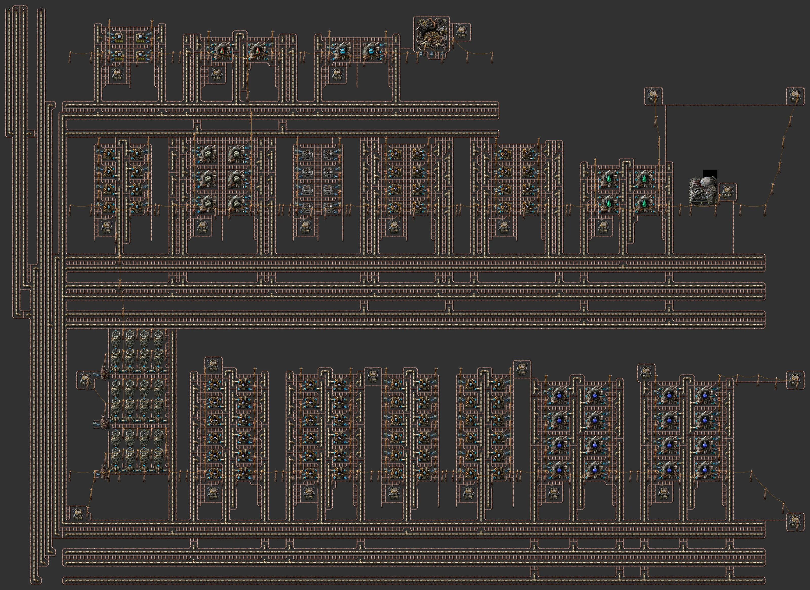
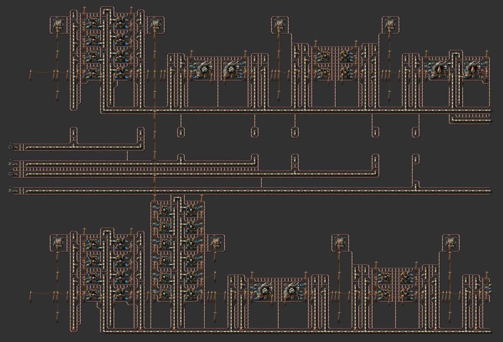
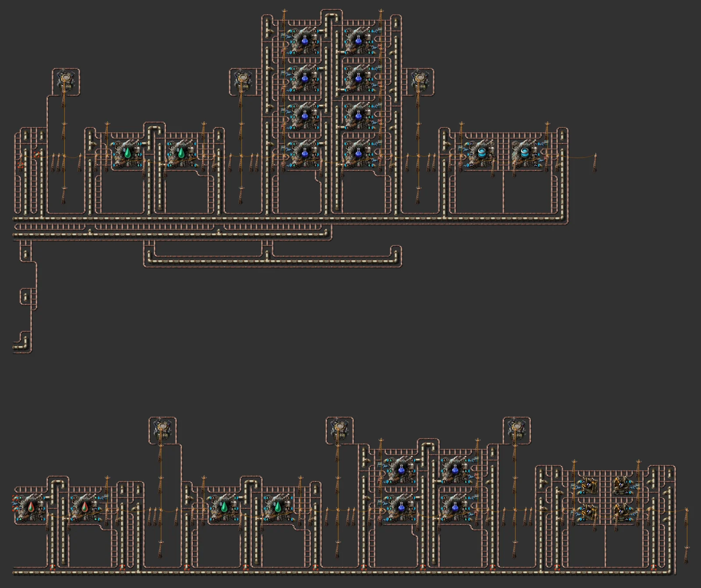

# 아킬로 올인원 기지

> 직사각형 하나로 지은 아킬로 기지, 열 배관이 모든 건물 사이를 지남: 암모니아 바다 → 암모니아·얼음·물, 리튬, 플루오로케톤 순환 → 극저온 과학 분당 약 96, 암모니아 로켓 연료, 얼음 플랫폼, 핵융합 전지, 가열탑 전력 겸 보온, 로켓·착륙장. 어는 건물마다 열 배관이 1칸 안에 있는지 생성할 때 검사합니다.

[English](README.en.md)

<!-- AUTO:START (tools/build.py가 생성하는 구역입니다. 직접 수정하지 마세요) -->



**구역별 확대 (북서 → 남동, 줄마다 서 → 동)**




<sub>이미지: [Factorio Blueprint Editor](https://fbe.factorygamefan.com)로 렌더링 (게임 그래픽 © Wube Software)</sub>

| 항목 | 값 |
|---|---|
| 게임 | Factorio 2.0 (base, space-age) |
| 크기 | 226×164 타일 |
| 엔티티 | 18831 |
| 주요 설비 | `requester-chest` ×84<br>`chemical-plant` ×72 (ice-melting 32, ammoniacal-solution-separation 24, solid-fuel-from-ammonia 8, ammonia-rocket-fuel 8)<br>`passive-provider-chest` ×68<br>`cryogenic-plant` ×30 (cryogenic-science-pack 16, lithium 6, fluoroketone-cooling 4, fluoroketone 2, fusion-power-cell 2)<br>`electric-furnace` ×8<br>`assembling-machine-3` ×4 (ice-platform 4)<br>`rocket-silo` ×1 |
| 검사 | 통과 |

### 입력

없음

### 출력

| 아이템 | 분당 | 위치 |
|---|---:|---|
| `cryogenic-science-pack` | ~96 | 로켓 화물 요청 / 공급 상자 |
| `fusion-power-cell` | ~24 | 공급 상자 |
| `ice-platform` | ~10 | 공급 상자 |

### 단지 구성

| 줄 | 셀 크기 | 셀 수 | 출력 (분당, 후반) | 입력 (분당, 후반) |
|---|---|---:|---|---|
| Ammonia + ice (separation) | 23×10 | 6 | `ice` 3,456, `ammonia` (fluid) 34,560 | `ammoniacal-solution` (fluid) 34,560 |
| Water (ice melting) | 17×10 | 8 | `water` (fluid) 38,400 | `ice` 1,920 |
| Lithium | 31×7 | 3 | `lithium` 180 | `holmium-plate` 36, `lithium-brine` (fluid) 1,800, `ammonia` (fluid) 1,800 |
| Lithium plate | 15×10 | 2 | `lithium-plate` 150 | `lithium` 150 |
| Solid fuel (ammonia + crude oil) | 27×10 | 2 | `solid-fuel` 576 | `ammonia` (fluid) 8,640, `crude-oil` (fluid) 3,456 |
| Fluoroketone (hot) | 33×7 | 1 | `fluoroketone-hot` (fluid) 1,200 | `fluorine` (fluid) 1,200, `ammonia` (fluid) 1,200, `solid-fuel` 24, `lithium` 24 |
| Fluoroketone cooling | 27×7 | 2 | `fluoroketone-cold` (fluid) 960 | `fluoroketone-hot` (fluid) 960 |
| Cryogenic science | 27×14 | 4 | `cryogenic-science-pack` 96, `fluoroketone-hot` (fluid) 288 | `ice` 288, `lithium-plate` 96, `fluoroketone-cold` (fluid) 576 |
| Rocket fuel (ammonia) | 27×10 | 2 | `rocket-fuel` 48 | `solid-fuel` 480, `water` (fluid) 2,400, `ammonia` (fluid) 24,000 |
| Ice platform | 21×10 | 1 | `ice-platform` 10 | `ammonia` (fluid) 4,000, `ice` 500 |
| Fusion power cell | 25×7 | 1 | `fusion-power-cell` 24 | `lithium-plate` 120, `holmium-plate` 24, `ammonia` (fluid) 2,400 |
| Power + heat | - | - | 가열탑 3기(암모니아 로켓 연료, 열 300 MW) → 열교환기 12 → 터빈 24; 같은 열 배관이 단지 전체를 데움 | |
| Rocket silo | - | - | 로봇이 재료를 넣는 사일로 | |
| Landing pad | - | - | 홀뮴 판·파랑 회로·LDS 수입 | |

선반 (아래 → 위; 줄이 길면 같은 높이의 스택 여러 개로 나뉨):

| 선반 | 블록 |
|---|---|
| 1 | Power + heat: 3 heating towers, Ammonia + ice (separation) x3, Ammonia + ice (separation) x3, Water (ice melting) x3, Water (ice melting) x3, Cryogenic science x2, Cryogenic science x2 |
| 2 | Water (ice melting) x2, Lithium x3, Lithium plate x2, Solid fuel (ammonia + crude oil) x2, Rocket fuel (ammonia) x2, Fluoroketone cooling x2, Landing pad (robot network) |
| 3 | Ice platform x1, Fluoroketone (hot) x1, Fusion power cell x1, Rocket silo (robot-fed) |

코어 214×159칸, 전체 226×164칸, 18,831개 엔티티. 최대 전력 72 MW / 터빈 140 MW, 보온 열 110.3 MW. 블록 사이 아이템은 로봇(요청 상자 → 블록 → 공급 상자), 유체는 서쪽 줄기 배관으로 모든 선반에 이어집니다.

### 로드맵

| 단계 | 시기 / 필요한 연구 | 할 일 |
|---|---|---|
| 0. 도착 | `planet-discovery-aquilo` (빨강·초록·파랑·보라·노랑·우주·불카누스·풀가오라·글레바), `heating-tower` (처음 캐면) | 얼음 플랫폼으로 암모니아 바다 위에 자리를 넓힙니다. 처음 건물은 열원이 없으면 얼어버리니, 로켓 연료와 열 배관·가열탑을 함께 가져옵니다. |
| 1. 전력·보온 | `heating-tower` (처음 캐면) | 전력 블록을 먼저 놓고 로켓 연료를 손으로 넣어 시동합니다. 같은 열 배관망이 모든 셀을 데웁니다(보온만 약 100 MW). 셀은 이 열망에 붙여야만 돌아갑니다. |
| 2. 암모니아 연료 자립 | `planet-discovery-aquilo` (빨강·초록·파랑·보라·노랑·우주·불카누스·풀가오라·글레바) | 암모니아 + 원유 → 고체 연료 → 암모니아 로켓 연료로 가열탑이 스스로 돌게 합니다. |
| 3. 리튬·플루오로케톤 | `lithium-processing` (처음 캐면), `cryogenic-plant` (아이템을 처음 만들면) | 리튬 염수 → 리튬 → 리튬 판, 불소 분출구 → 뜨거운 플루오로케톤 → 냉각. 과학 셀이 뜨거운 것을 돌려보내므로 순환이 닫힙니다. |
| 4. 극저온 과학 | `cryogenic-science-pack` (아이템을 처음 만들면) | 과학 셀 4개로 분당 약 96. 더 필요하면 과학 줄 위에 셀을 더 붙이고, 리튬 판·냉각 줄도 같이 늘립니다. |
| 5. 핵융합·수출 | `fusion-reactor` (빨강·초록·파랑·보라·노랑·우주·불카누스·풀가오라·글레바·아킬로), `rocket-silo` (빨강·초록·파랑·보라·노랑) | 핵융합 전지를 만들고 로켓으로 과학·전지를 내보냅니다. 착륙장이 홀뮴 판·파랑 회로·LDS를 받습니다. |

**다음에 지을 것**

- [글레바 올인원 기지](../planet-gleba/README.md) — 탄소 섬유(기초판)를 만드는 행성
- [불카누스 올인원 기지](../planet-vulcanus/README.md) — 텅스텐·주조

### 파일

| 파일 | 설명 |
|---|---|
| [`blueprint.txt`](blueprint.txt) | 기지 전체 (보온 코어 + 전력) |
| [`variants/ammonia.txt`](variants/ammonia.txt) | 암모니아 + 얼음 (분리) — 캡 + 셀 1개 |
| [`variants/water.txt`](variants/water.txt) | 물 (얼음 녹이기) — 캡 + 셀 1개 |
| [`variants/lithium.txt`](variants/lithium.txt) | 리튬 — 캡 + 셀 1개 |
| [`variants/lithium-plate.txt`](variants/lithium-plate.txt) | 리튬 판 — 캡 + 셀 1개 |
| [`variants/solid-fuel.txt`](variants/solid-fuel.txt) | 고체 연료 (암모니아 + 원유) — 캡 + 셀 1개 |
| [`variants/fluoroketone.txt`](variants/fluoroketone.txt) | 플루오로케톤 (뜨거움) — 캡 + 셀 1개 |
| [`variants/cooling.txt`](variants/cooling.txt) | 플루오로케톤 냉각 — 캡 + 셀 1개 |
| [`variants/science.txt`](variants/science.txt) | 극저온 과학 — 캡 + 셀 1개 |
| [`variants/rocket-fuel.txt`](variants/rocket-fuel.txt) | 로켓 연료 (암모니아) — 캡 + 셀 1개 |
| [`variants/ice-platform.txt`](variants/ice-platform.txt) | 얼음 플랫폼 — 캡 + 셀 1개 |
| [`variants/fusion-cell.txt`](variants/fusion-cell.txt) | 핵융합 전지 — 캡 + 셀 1개 |
| [`variants/power.txt`](variants/power.txt) | 전력 + 보온: 가열탑 3 → 열교환기 12 → 터빈 24 |
| [`variants/rocket-silo.txt`](variants/rocket-silo.txt) | 로켓 사일로 (로봇 공급) |
| [`variants/landing-pad.txt`](variants/landing-pad.txt) | 착륙장 (홀뮴 판·파랑 회로·LDS 수입) |

문자열을 클립보드에 복사한 뒤 게임에서 블루프린트 라이브러리 → 문자열 가져오기:

```sh
pbcopy < blueprints/planet-aquilo/blueprint.txt   # macOS
xclip -selection clipboard < blueprints/planet-aquilo/blueprint.txt   # Linux
```

### 다시 생성

```sh
python3 blueprints/planet-aquilo/generate.py
python3 tools/build.py planet-aquilo
```

<!-- AUTO:END -->

## 기지 모양

커뮤니티의 행성 기지는 행성 전체에 버스를 깔지 않습니다. 빽빽한 직사각형 하나에 생산을 모으고, 전력·방어를 가장자리에 두릅니다(아래 '참고한 커뮤니티 설계'). 이 기지도 그렇게 짓습니다(`lib/base.py`).

- **선반**: 생산 줄을 같은 높이의 블록(쌓는 셀 스택)으로 나눠 가로 선반에 빽빽하게 채웁니다. 선반을 위로 쌓으면 직사각형이 됩니다. 폭은 빈 칸이 가장 적게 남는 값을 찾아 정합니다.
- **블록 사이는 로봇**: 블록 입력마다 요청 상자 → 인서터 → 벨트, 출력마다 벨트 끝 → 인서터 → 공급 상자를 둡니다. 벨트는 블록 안에만 있고, 로봇 기지는 40칸 격자로 코어 전체를 덮습니다.
- **유체는 서쪽 줄기**: 선반마다 자기가 쓰는 유체만 선반 아래 짧은 거리에 깝니다. 서쪽 가장자리의 세로 줄기 배관이 같은 유체를 모든 선반에 잇습니다. 바깥에서 들어오는 유체는 줄기의 북쪽 끝 표시(상수 조합기)로 들어옵니다.

## 보온 (얼지 않게)

아킬로에서는 열원(30°C 이상)이 **1칸 안(대각선 포함)** 에 없는 건물은 얼어서 멈춥니다. 상자·전신주·포탑은 얼지 않습니다.

- 셀(`lib/hstack.py`)은 처음부터 열 배관 기둥과 가로줄을 품고 있습니다. 기계·인서터·파이프·지하 파이프 옆에는 모두 열 배관이 있습니다.
- 유체 본선은 셀마다 한 번 지하 파이프로 뛰어서 열 배관이 그 밑을 건너갑니다. 그래서 본선 양쪽의 열이 하나로 이어집니다.
- 단지를 합친 뒤 `lib/heat.py`가 남은 빈칸에 열 배관을 채우고, 전력 블록의 가열탑까지 잇습니다. 이어지지 않은 조각은 지웁니다. 끝으로 **어는 건물마다 따뜻한 열 배관이 1칸 안에 있는지** 검사합니다. 이 검사에 실패하면 생성이 멈추므로, 저장소의 문자열은 모두 검사를 통과한 것입니다.
- 선반 거리와 서쪽 줄기의 유체 배관은 지하 파이프 대신 일반 파이프입니다(지하 파이프는 하나에 150 kW씩 열을 먹습니다). 줄 사이에 빈 두 줄을 두어 열 배관이 지나갈 자리를 남깁니다.
- 보온에 드는 열은 위 표에 나옵니다(약 110 MW). 가열탑 3기는 열을 약 300 MW 냅니다(소비 40 MW × 효율 250%). 전기 약 72 MW를 만드는 증기까지 더해도 약 180 MW라 여유가 있습니다. 연료는 로켓 연료 분당 약 44개, 기지가 48개를 만듭니다.
- 터빈용 물(초당 약 700)은 얼음을 녹여 만듭니다. 그래서 물 셀이 8개, 암모니아 분리 셀이 6개입니다. 분리 셀의 암모니아는 줄들이 쓰는 양보다 조금 적게 나오게 맞췄습니다. 암모니아가 남아 막히면 얼음도 멈추기 때문입니다.

## 왜 로봇인가

벨트도 얼고(타일마다 10 kW), 긴 벨트를 데우려면 열 배관이 너무 많이 듭니다. 상자는 얼지 않습니다. 그래서 기계마다 **요청 상자 → 인서터 → 기계 → 인서터 → 공급 상자**로 두고, 로봇이 나릅니다. 줄마다 캡에 로봇 기지가 있습니다(로봇 기지도 데워짐).

## 입력

북서쪽 줄기 배관 끝 표시(상수 조합기, 분당 수량)에 연결합니다.

- **암모니아 용액**: 암모니아 바다 위 해양 펌프
- **원유 / 리튬 염수 / 불소**: 각 분출구의 펌프잭 (펌프잭도 얼므로 열 배관을 옆에)
- **수입**: 착륙장이 홀뮴 판·파랑 회로·LDS를 요청합니다

## 확장

각 줄은 쌓는 셀입니다. 과학을 늘리려면 과학 줄 맨 위에 `variants/science.txt`의 셀을 한 주기 위로 붙여 넣습니다. 셀의 열 배관 기둥이 아래 셀과 이어지고, 리튬 판·냉각 줄도 같은 방식으로 늘립니다. 선반 거리의 한 줄(파이프 1,200/s)을 넘으면 생성할 때 경고가 납니다.

## 알려진 한계

- 가열탑 연료는 로켓 연료입니다. 처음엔 손으로 넣어 시동해야 합니다.
- 아킬로에는 지상 적이 없습니다. 소행성은 우주에서만 옵니다.
- 펌프잭과 해양 펌프는 기지 밖에 있어서 따로 데워야 합니다.

## 참고한 커뮤니티 설계 (문자열은 저장소에 넣지 않음)

- "Aquilo full production" — 열 배관을 모든 건물 사이에 엮은 직사각형, 전력은 한쪽 구석 / heat pipe woven through one rectangle, power in a corner (https://factorioprints.com/view/-OC9hBfLsZy61BDATFg1)
