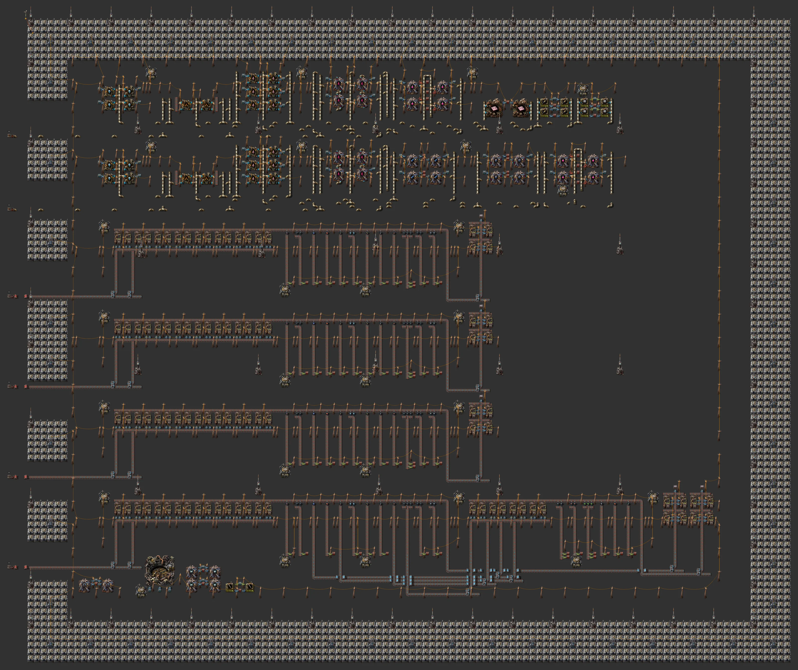
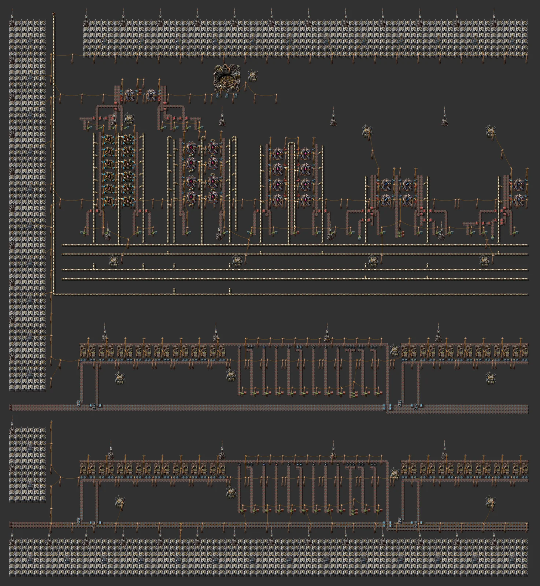
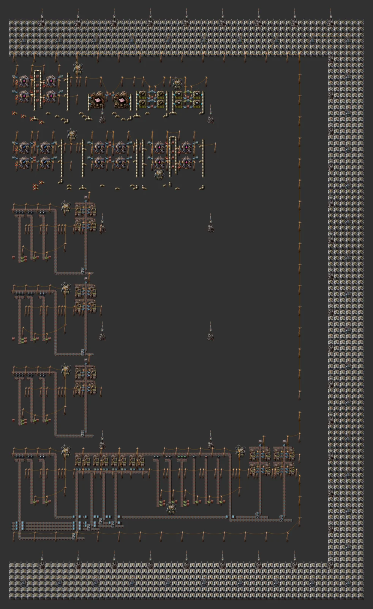

# 풀가오라 올인원 기지

> 번개 수집기·축전지 띠로 둘러싼 직사각형 풀가오라 기지: 고철 초당 160 → 고철 선반 2개(재활용·분류·넘침 처리) → 홀뮴·전해액·초전도체·슈퍼커패시터 → 전자기 과학 분당 약 100, 2차 재활용, 전자기 공장 몰, 로켓. 블록 사이는 로봇.

[English](README.en.md)

<!-- AUTO:START (tools/build.py가 생성하는 구역입니다. 직접 수정하지 마세요) -->



**구역별 확대 (북서 → 남동, 줄마다 서 → 동)**




<sub>이미지: [Factorio Blueprint Editor](https://fbe.factorygamefan.com)로 렌더링 (게임 그래픽 © Wube Software)</sub>

| 항목 | 값 |
|---|---|
| 게임 | Factorio 2.0 (base, space-age) |
| 크기 | 336×183 타일 |
| 엔티티 | 11687 |
| 주요 설비 | `recycler` ×104<br>`passive-provider-chest` ×75<br>`requester-chest` ×56<br>`electromagnetic-plant` ×30 (electrolyte 8, electromagnetic-science-pack 8, accumulator 4, superconductor 4, supercapacitor 4, electromagnetic-plant 2)<br>`chemical-plant` ×18 (holmium-solution 12, ice-melting 4, heavy-oil-cracking 2)<br>`assembling-machine-3` ×10 (rocket-fuel 4, refined-concrete 4, iron-stick 2)<br>`steel-chest` ×4<br>`foundry` ×2 (holmium-plate 2)<br>`rocket-silo` ×1 |
| 검사 | 통과 |

### 입력

없음

### 출력

| 아이템 | 분당 | 위치 |
|---|---:|---|
| `electromagnetic-science-pack` | ~100 | 로봇 네트워크 → 로켓 화물 요청 |

### 단지 구성

| 줄 | 셀 크기 | 셀 수 | 출력 (분당, 후반) | 입력 (분당, 후반) |
|---|---|---:|---|---|
| Water (ice melting) | 13×8 | 1 | `water` (fluid) 4,800 | `ice` 240 |
| Light oil (heavy oil cracking) | 21×4 | 1 | `light-oil` (fluid) 1,800 | `water` (fluid) 1,800, `heavy-oil` (fluid) 2,400 |
| Holmium solution | 17×12 | 2 | `holmium-solution` (fluid) 7,200 | `holmium-ore` 144, `stone` 72, `water` (fluid) 720 |
| Holmium plate | 21×6 | 1 | `holmium-plate` 720 | `holmium-solution` (fluid) 9,600 |
| Electrolyte | 23×11 | 2 | `electrolyte` (fluid) 2,880 | `stone` 192, `heavy-oil` (fluid) 1,920, `holmium-solution` (fluid) 1,920 |
| Rocket fuel | 17×8 | 1 | `rocket-fuel` 20 | `solid-fuel` 200, `light-oil` (fluid) 200 |
| Superconductor | 21×10 | 1 | `superconductor` 288 | `holmium-plate` 96, `copper-plate` 96, `plastic-bar` 96, `light-oil` (fluid) 480 |
| Accumulator | 15×10 | 1 | `accumulator` 72 | `iron-plate` 96, `battery` 240 |
| Supercapacitor | 21×10 | 1 | `supercapacitor` 72 | `holmium-plate` 96, `superconductor` 96, `electronic-circuit` 192, `battery` 48, `electrolyte` (fluid) 480 |
| Electromagnetic science | 21×10 | 2 | `electromagnetic-science-pack` 144 | `supercapacitor` 96, `accumulator` 96, `electrolyte` (fluid) 2,400, `holmium-solution` (fluid) 2,400 |
| Iron sticks | 13×4 | 1 | `iron-stick` 600 | `iron-plate` 300 |
| Refined concrete | 19×8 | 1 | `refined-concrete` 200 | `concrete` 400, `iron-stick` 160, `steel-plate` 20, `water` (fluid) 2,000 |
| Mall: electromagnetic plant | 17×5 | 1 | 상자 (몰) | `holmium-plate` 432, `steel-plate` 144, `processing-unit` 144, `refined-concrete` 144 |
| Scrap shelves ×2 | - | - | 재활용기 16대 + 12종 분류 블록 2개씩, 고철 초당 80 (서쪽 벨트로 입력) | |
| Secondary recycling | - | - | 톱니→철, 구리선→구리, 파랑 회로→초록 회로, LDS→플라스틱 | |
| Voids ×4 | - | - | 넘침 벨트의 모든 것을 재활용기로 없앰 | |
| Rocket silo | - | - | 로봇이 재료를 넣는 사일로; 수출은 화물 요청으로 | |
| Lightning band | - | - | 단지 둘레 12×12 타일마다 번개 수집기 + 변전소 + 축전지 34 (170 MJ) | |
| Lightning cover | - | - | 코어 안에도 번개 수집기를 36칸 간격으로 | |

선반 (아래 → 위; 줄이 길면 같은 높이의 스택 여러 개로 나뉨):

| 선반 | 블록 |
|---|---|
| 1 | Scrap recycling + sorting 1, Scrap recycling + sorting 2, Secondary recycling (iron, copper, green circuits, plastic), Void: overflow 1, Void: overflow 2 |
| 2 | Scrap recycling + sorting 3, Scrap recycling + sorting 4, Void: overflow 3, Void: overflow 4, Accumulator x1, Iron sticks x1 |
| 3 | Holmium solution x2, Electrolyte x2, Electromagnetic science x2, Superconductor x1, Supercapacitor x1, Water (ice melting) x1, Rocket fuel x1, Refined concrete x1, Holmium plate x1, Light oil (heavy oil cracking) x1 |
| 4 | Mall: electromagnetic plant x1, Rocket silo (robot-fed) |

코어 306×151칸, 전체 336×183칸, 11,687개 엔티티. 최대 전력 121 MW, 축전지 13,260 MJ (번개는 폭풍 때만 들어옴). 블록 사이 아이템은 로봇(요청 상자 → 블록 → 공급 상자), 유체는 서쪽 줄기 배관으로 모든 선반에 이어집니다.

### 로드맵

| 단계 | 시기 / 필요한 연구 | 할 일 |
|---|---|---|
| 0. 도착 | `planet-discovery-fulgora` (빨강·초록·파랑·우주) | 번개 보호가 먼저입니다. 보호받지 못한 건물은 번개에 맞습니다. 번개 막대/수집기를 깔고, 고철 섬 위에 대형 채굴기, 기름 바다에 해양 펌프(중유). |
| 1. 고철 재활용·분류 | - | 고철 줄 4개(재활용기 16대씩). 분류 안 된 것·남는 것은 넘침 줄로 가서 처리 줄에서 사라집니다. 쓰지 않는 제품 줄은 차면 필터 인서터가 멈추고 자동으로 넘침으로 갑니다. |
| 2. 홀뮴·유체 | `holmium-processing` (아이템을 처음 만들면), `electromagnetic-plant` (아이템을 처음 만들면), `advanced-oil-processing` (빨강·초록·파랑) | 얼음 → 물, 중유 분해 → 경유, 홀뮴 용액(채광 홀뮴 광석 + 돌 + 물), 홀뮴 판, 전해액. |
| 3. 전자기 과학 | `electromagnetic-plant` (아이템을 처음 만들면), `electromagnetic-science-pack` (아이템을 처음 만들면), `electric-energy-accumulators` (빨강·초록) | 2차 재활용으로 철·구리·초록 회로·플라스틱, 그리고 초전도체·축전지·슈퍼커패시터·과학. 고철 160/s 기준 분당 약 100(홀뮴이 한계). 늘리려면 고철 줄을 더 붙이고 과학 쪽 셀도 같은 비율로. |
| 4. 로켓·몰 | `rocket-fuel` (빨강·초록·파랑), `rocket-silo` (빨강·초록·파랑·보라·노랑), `concrete` (빨강·초록), `electromagnetic-plant` (아이템을 처음 만들면) | 고철의 파랑 회로·LDS와 로켓 연료로 로켓 부품을 만들고 전자기 과학·홀뮴 판·슈퍼커패시터·초전도체를 수출. 정제 콘크리트 → 전자기 공장 몰. |
| 5. 전력 늘리기 | `lightning-collector` (빨강·초록·파랑·우주·풀가오라) | 번개는 폭풍 때만 들어오므로 축전지 저장량이 중요합니다. 발전 줄(12 수집기, 2 GJ)이 모자라면 같은 타일을 더 붙이세요. |

**다음에 지을 것**

- [불카누스 올인원 기지](../planet-vulcanus/README.md) — 텅스텐·주조기 쪽 행성

### 파일

| 파일 | 설명 |
|---|---|
| [`blueprint.txt`](blueprint.txt) | 기지 전체 (코어 + 번개 띠) |
| [`variants/water.txt`](variants/water.txt) | 물 (얼음 녹이기) — 캡 + 셀 1개 |
| [`variants/light-oil.txt`](variants/light-oil.txt) | 경유 (중유 분해) — 캡 + 셀 1개 |
| [`variants/holmium-solution.txt`](variants/holmium-solution.txt) | 홀뮴 용액 — 캡 + 셀 1개 |
| [`variants/holmium-plate.txt`](variants/holmium-plate.txt) | 홀뮴 판 — 캡 + 셀 1개 |
| [`variants/electrolyte.txt`](variants/electrolyte.txt) | 전해액 — 캡 + 셀 1개 |
| [`variants/rocket-fuel.txt`](variants/rocket-fuel.txt) | 로켓 연료 — 캡 + 셀 1개 |
| [`variants/superconductor.txt`](variants/superconductor.txt) | 초전도체 — 캡 + 셀 1개 |
| [`variants/accumulator.txt`](variants/accumulator.txt) | 축전지 — 캡 + 셀 1개 |
| [`variants/supercapacitor.txt`](variants/supercapacitor.txt) | 슈퍼커패시터 — 캡 + 셀 1개 |
| [`variants/science.txt`](variants/science.txt) | 전자기 과학 — 캡 + 셀 1개 |
| [`variants/iron-stick.txt`](variants/iron-stick.txt) | 철 막대 — 캡 + 셀 1개 |
| [`variants/refined-concrete.txt`](variants/refined-concrete.txt) | 정제 콘크리트 — 캡 + 셀 1개 |
| [`variants/mall-em-plant.txt`](variants/mall-em-plant.txt) | 몰: 전자기 공장 — 캡 + 셀 1개 |
| [`variants/scrap-recycling.txt`](variants/scrap-recycling.txt) | 고철 재활용 + 분류 (재활용기 16) |
| [`variants/secondary-recycling.txt`](variants/secondary-recycling.txt) | 2차 재활용 (철·구리·초록 회로·플라스틱) |
| [`variants/rocket-silo.txt`](variants/rocket-silo.txt) | 로켓 사일로 (로봇 공급) |
| [`variants/void.txt`](variants/void.txt) | 넘침 처리 (재활용기) |
| [`variants/lightning-tile.txt`](variants/lightning-tile.txt) | 번개 띠 타일 12×12 (수집기 + 변전소 + 축전지 34) |

문자열을 클립보드에 복사한 뒤 게임에서 블루프린트 라이브러리 → 문자열 가져오기:

```sh
pbcopy < blueprints/planet-fulgora/blueprint.txt   # macOS
xclip -selection clipboard < blueprints/planet-fulgora/blueprint.txt   # Linux
```

### 다시 생성

```sh
python3 blueprints/planet-fulgora/generate.py
python3 tools/build.py planet-fulgora
```

<!-- AUTO:END -->

## 기지 모양

커뮤니티의 행성 기지는 행성 전체에 버스를 깔지 않습니다. 빽빽한 직사각형 하나에 생산을 모으고, 전력·방어를 가장자리에 두릅니다(아래 '참고한 커뮤니티 설계'). 이 기지도 그렇게 짓습니다(`lib/base.py`).

- **선반**: 생산 줄을 같은 높이의 블록(쌓는 셀 스택)으로 나눠 가로 선반에 빽빽하게 채웁니다. 선반을 위로 쌓으면 직사각형이 됩니다. 폭은 빈 칸이 가장 적게 남는 값을 찾아 정합니다.
- **블록 사이는 로봇**: 블록 입력마다 요청 상자 → 인서터 → 벨트, 출력마다 벨트 끝 → 인서터 → 공급 상자를 둡니다. 벨트는 블록 안에만 있고, 로봇 기지는 40칸 격자로 코어 전체를 덮습니다.
- **유체는 서쪽 줄기**: 선반마다 자기가 쓰는 유체만 선반 아래 짧은 거리에 깝니다. 서쪽 가장자리의 세로 줄기 배관이 같은 유체를 모든 선반에 잇습니다. 바깥에서 들어오는 유체는 줄기의 북쪽 끝 표시(상수 조합기)로 들어옵니다.
- **번개 띠**: 코어 둘레를 12×12 타일(번개 수집기 + 변전소 + 축전지 34개 = 170 MJ)로 한 겹 두릅니다. 코어 안에도 수집기를 36칸 간격으로 놓아 모든 건물을 보호합니다.
- **고철 선반 2개**(맨 아래): 고철 벨트가 서쪽에서 들어옵니다. 블록마다 재활용기 16대가 혼합 벨트에 결과를 떨어뜨리고, 동쪽 분류 구역의 필터 인서터가 12종을 나눠 공급 상자로 보냅니다. 남은 것은 넘침 벨트(가상 신호 T)로 같은 선반의 처리 블록에 가서 사라집니다.
- **스스로 조절**: 공급 상자가 차면 그 필터 인서터가 멈추고, 그 물건은 넘침으로 갑니다. 그래서 기지 전체가 막히지 않습니다.
- **2차 재활용**: 톱니 → 철, 구리선 → 구리, 파랑 회로 → 초록 회로(+빨강), LDS → 플라스틱(+강철·구리).
- **전자기 공장 셀**: 유체 입구가 서쪽·동쪽에 하나씩이라, 두 번째 유체(홀뮴 용액)는 가운데 파이프에서 받습니다.

## 숫자

전자기 과학 1개(전자기 공장·주조기 생산성 +50%)에 홀뮴 광석 약 0.93, 배터리 2.7, 초록 회로 1.8이 들어갑니다. 홀뮴은 고철의 1%라 과학 1개에 고철 약 93개가 듭니다. 고철 초당 160이면 분당 약 100개입니다. 아래 표의 셀 출력은 기계가 쉬지 않을 때 값이고, 실제로는 홀뮴이 한계입니다.

## 참고한 커뮤니티 설계 (문자열은 저장소에 넣지 않음)

- "Fulgora all production, no mods" — 섬 크기의 축전지·피뢰침 밭이 생산 코어를 감쌈 (https://factorioprints.com/view/-OBM1jc4Izxd8iAZrzKf)
- "Compact Fulgora Scrap Recycling" — 고밀도 재활용·분류 블록 (https://factorioprints.com/view/-OBdvHoEr2jlVweXSUKW)
- Space Ghost, "Fulgora blueprint book. All in" (https://factorioprints.com/view/-OUf5gju1G_1O_K38VLl)
