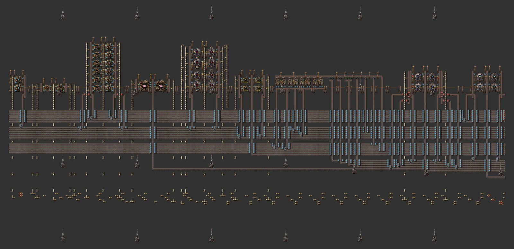
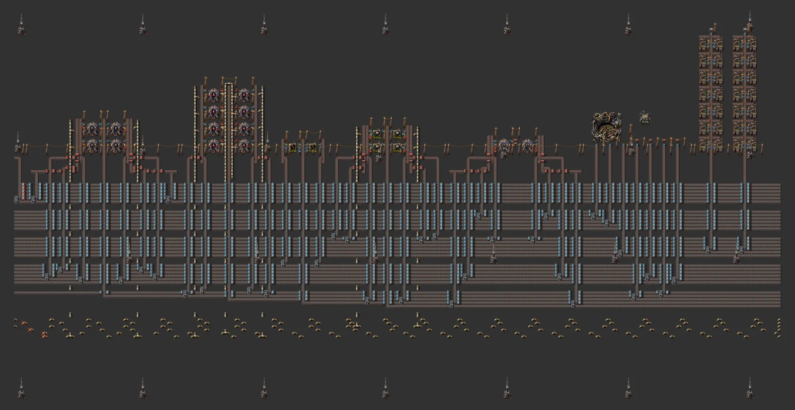

# 풀가오라 올인원 단지

> 고철 초당 160 → 재활용·분류 → 홀뮴·전해액·초전도체·슈퍼커패시터 → 전자기 과학 분당 약 100, 2차 재활용(철·구리·초록 회로·플라스틱), 로켓·수출, 전자기 공장 몰, 번개 발전·보호, 넘침 처리까지 버스 하나에.

[English](README.en.md)

<!-- AUTO:START (tools/build.py가 생성하는 구역입니다. 직접 수정하지 마세요) -->


**구간별 확대 (서쪽 → 동쪽)**






<sub>이미지: [Factorio Blueprint Editor](https://fbe.factorygamefan.com)로 렌더링 (게임 그래픽 © Wube Software)</sub>

| 항목 | 값 |
|---|---|
| 게임 | Factorio 2.0 (base, space-age) |
| 크기 | 975×112 타일 |
| 엔티티 | 24281 |
| 주요 설비 | `recycler` ×100<br>`electromagnetic-plant` ×30 (electrolyte 8, electromagnetic-science-pack 8, superconductor 4, accumulator 4, supercapacitor 4, electromagnetic-plant 2)<br>`chemical-plant` ×18 (holmium-solution 12, ice-melting 4, heavy-oil-cracking 2)<br>`assembling-machine-3` ×10 (rocket-fuel 4, refined-concrete 4, iron-stick 2)<br>`passive-provider-chest` ×6<br>`foundry` ×2 (holmium-plate 2)<br>`steel-chest` ×2<br>`rocket-silo` ×1 |
| 검사 | 통과 |

### 입력

없음

### 출력

| 아이템 | 분당 | 위치 |
|---|---:|---|
| `electromagnetic-science-pack` | ~100 | 로켓 수출 상자 |

### 단지 구성

| 줄 | 셀 크기 | 셀 수 | 출력 (분당, 후반) | 입력 (분당, 후반) |
|---|---|---:|---|---|
| Water (ice melting) | 13×8 | 1 | `water` (fluid) 4,800 | `ice` 240 |
| Light oil (heavy oil cracking) | 21×4 | 1 | `light-oil` (fluid) 1,800 | `water` (fluid) 1,800, `heavy-oil` (fluid) 2,400 |
| Holmium solution | 17×12 | 2 | `holmium-solution` (fluid) 7,200 | `holmium-ore` 144, `stone` 72, `water` (fluid) 720 |
| Holmium plate | 21×6 | 1 | `holmium-plate` 720 | `holmium-solution` (fluid) 9,600 |
| Electrolyte | 23×11 | 2 | `electrolyte` (fluid) 2,880 | `stone` 192, `heavy-oil` (fluid) 1,920, `holmium-solution` (fluid) 1,920 |
| Rocket fuel | 17×8 | 1 | `rocket-fuel` 20 | `solid-fuel` 200, `light-oil` (fluid) 200 |
| Superconductor | 21×10 | 1 | `superconductor` 288 | `holmium-plate` 96, `copper-plate` 96, `plastic-bar` 96, `light-oil` (fluid) 480 |
| Accumulator | 15×10 | 1 | `accumulator` 72 | `iron-plate` 96, `battery` 240 |
| Supercapacitor | 21×10 | 1 | `supercapacitor` 72 | `holmium-plate` 96, `superconductor` 96, `electronic-circuit` 192, `battery` 48, `electrolyte` (fluid) 480 |
| Electromagnetic science | 21×10 | 2 | `electromagnetic-science-pack` 144 | `supercapacitor` 96, `accumulator` 96, `electrolyte` (fluid) 2,400, `holmium-solution` (fluid) 2,400 |
| Iron sticks | 13×4 | 1 | `iron-stick` 600 | `iron-plate` 300 |
| Refined concrete | 19×8 | 1 | `refined-concrete` 200 | `concrete` 400, `iron-stick` 160, `steel-plate` 20, `water` (fluid) 2,000 |
| Mall: electromagnetic plant | 17×5 | 1 | 상자 (몰) | `holmium-plate` 432, `steel-plate` 144, `processing-unit` 144, `refined-concrete` 144 |
| Lightning power | - | - | 번개 수집기 12 + 축전지 408 (2 GJ) + 변전소 | |
| Scrap recycling + sorting ×4 | - | - | 재활용기 16대씩(고철 초당 40), 12종 분류 + 넘침 줄 | |
| Secondary recycling | - | - | 톱니→철, 구리선→구리, 파랑 회로→초록 회로, LDS→플라스틱 | |
| Rocket silo | - | - | 로켓 부품(고철의 파랑 회로·LDS + 로켓 연료) + 수출 상자 | |
| Void ×2 | - | - | 넘침 줄의 모든 것을 재활용기로 없앰 | |
| Lightning cover | - | - | 단지 전체에 번개 수집기를 36칸 간격으로 (보호 반경 25) | |

버스 (위 → 아래, 6줄 + 빈 2줄 묶음; 유체는 맨 아래):

| 묶음 | 줄 |
|---|---|
| 1 (solid) | `scrap`, `scrap`, `scrap`, `scrap`, `holmium-ore`, `battery` |
| 2 (solid) | `ice`, `stone`, `processing-unit`, `advanced-circuit`, `low-density-structure`, `solid-fuel` |
| 3 (solid) | `concrete`, `steel-plate`, `iron-gear-wheel`, `copper-cable`, `signal-T`, `rocket-fuel` |
| 4 (solid) | `iron-plate`, `copper-plate`, `electronic-circuit`, `plastic-bar`, `holmium-plate`, `superconductor` |
| 5 (solid) | `accumulator`, `supercapacitor`, `electromagnetic-science-pack`, `iron-stick`, `refined-concrete`, - |
| 6 (fluid) | `heavy-oil` (fluid), `heavy-oil` (fluid), `water` (fluid), `light-oil` (fluid), `holmium-solution` (fluid), `electrolyte` (fluid) |

전체 24,281개 엔티티, 폭 946칸. 최대 전력 109 MW, 축전지 2,040 MJ (번개는 폭풍 때만 들어옴). 버스 줄마다 수요가 한 줄 용량(파랑 벨트 45/s, 파이프 1,200/s)을 넘지 않는지 생성할 때 검사합니다.

### 로드맵

| 단계 | 시기 / 필요한 연구 | 할 일 |
|---|---|---|
| 0. 도착 | `planet-discovery-fulgora` (빨강·초록·파랑·우주) | 번개 보호가 먼저입니다. 보호받지 못한 건물은 번개에 맞습니다. 번개 막대/수집기를 깔고, 고철 섬 위에 대형 채굴기, 기름 바다에 해양 펌프(중유). |
| 1. 고철 재활용·분류 | - | 고철 줄 4개(재활용기 16대씩). 분류 안 된 것·남는 것은 넘침 줄로 가서 처리 줄에서 사라집니다. 쓰지 않는 제품 줄은 차면 필터 인서터가 멈추고 자동으로 넘침으로 갑니다. |
| 2. 홀뮴·유체 | `holmium-processing` (아이템을 처음 만들면), `electromagnetic-plant` (아이템을 처음 만들면), `advanced-oil-processing` (빨강·초록·파랑) | 얼음 → 물, 중유 분해 → 경유, 홀뮴 용액(채광 홀뮴 광석 + 돌 + 물), 홀뮴 판, 전해액. |
| 3. 전자기 과학 | `electromagnetic-plant` (아이템을 처음 만들면), `electromagnetic-science-pack` (아이템을 처음 만들면), `electric-energy-accumulators` (빨강·초록) | 2차 재활용으로 철·구리·초록 회로·플라스틱, 그리고 초전도체·축전지·슈퍼커패시터·과학. 고철 160/s 기준 분당 약 100(홀뮴이 한계). 늘리려면 고철 줄을 더 붙이고 과학 쪽 셀도 같은 비율로. |
| 4. 로켓·몰 | `rocket-fuel` (빨강·초록·파랑), `rocket-silo` (빨강·초록·파랑·보라·노랑), `concrete` (빨강·초록), `electromagnetic-plant` (아이템을 처음 만들면) | 고철의 파랑 회로·LDS와 로켓 연료로 로켓 부품을 만들고 전자기 과학·홀뮴 판·슈퍼커패시터·초전도체를 수출. 정제 콘크리트 → 전자기 공장 몰. |
| 5. 전력 늘리기 | `lightning-collector` (빨강·초록·파랑·우주·풀가오라) | 번개는 폭풍 때만 들어오므로 축전지 저장량이 중요합니다. 발전 줄(12 수집기, 2 GJ)이 모자라면 같은 타일을 더 붙이세요. |

**다음에 지을 것**

- [불카누스 올인원 단지](../planet-vulcanus/README.md) — 텅스텐·주조기 쪽 행성

### 파일

| 파일 | 설명 |
|---|---|
| [`blueprint.txt`](blueprint.txt) | 단지 전체 (버스 + 모든 줄) |
| [`variants/water.txt`](variants/water.txt) | 물 (얼음 녹이기) — 캡 + 셀 1개 |
| [`variants/light-oil.txt`](variants/light-oil.txt) | 경유 (중유 분해) — 캡 + 셀 1개 |
| [`variants/holmium-solution.txt`](variants/holmium-solution.txt) | 홀뮴 용액 — 캡 + 셀 1개 |
| [`variants/holmium-plate.txt`](variants/holmium-plate.txt) | 홀뮴 판 — 캡 + 셀 1개 |
| [`variants/electrolyte.txt`](variants/electrolyte.txt) | 전해액 — 캡 + 셀 1개 |
| [`variants/rocket-fuel.txt`](variants/rocket-fuel.txt) | 로켓 연료 — 캡 + 셀 1개 |
| [`variants/superconductor.txt`](variants/superconductor.txt) | 초전도체 — 캡 + 셀 1개 |
| [`variants/accumulator.txt`](variants/accumulator.txt) | 축전지 — 캡 + 셀 1개 |
| [`variants/supercapacitor.txt`](variants/supercapacitor.txt) | 슈퍼커패시터 — 캡 + 셀 1개 |
| [`variants/science.txt`](variants/science.txt) | 전자기 과학 — 캡 + 셀 1개 |
| [`variants/iron-stick.txt`](variants/iron-stick.txt) | 철 막대 — 캡 + 셀 1개 |
| [`variants/refined-concrete.txt`](variants/refined-concrete.txt) | 정제 콘크리트 — 캡 + 셀 1개 |
| [`variants/mall-em-plant.txt`](variants/mall-em-plant.txt) | 몰: 전자기 공장 — 캡 + 셀 1개 |
| [`variants/lightning-power.txt`](variants/lightning-power.txt) | 번개 발전 + 축전지 |
| [`variants/scrap-recycling.txt`](variants/scrap-recycling.txt) | 고철 재활용 + 분류 (재활용기 16) |
| [`variants/secondary-recycling.txt`](variants/secondary-recycling.txt) | 2차 재활용 (철·구리·초록 회로·플라스틱) |
| [`variants/rocket-silo.txt`](variants/rocket-silo.txt) | 로켓 사일로 + 수출 상자 |
| [`variants/void.txt`](variants/void.txt) | 넘침 처리 (재활용기) |

문자열을 클립보드에 복사한 뒤 게임에서 블루프린트 라이브러리 → 문자열 가져오기:

```sh
pbcopy < blueprints/planet-fulgora/blueprint.txt   # macOS
xclip -selection clipboard < blueprints/planet-fulgora/blueprint.txt   # Linux
```

### 다시 생성

```sh
python3 blueprints/planet-fulgora/generate.py
python3 tools/build.py planet-fulgora
```

<!-- AUTO:END -->

## 구조

- **고철 줄**: 입력 벨트 위로 재활용기 16대가 한 줄로 서고, 각 재활용기가 앞쪽(위)의 혼합 벨트에 결과를 떨어뜨립니다. 혼합 벨트는 동쪽 분류 구역에서 필터 인서터로 12종을 각자의 열에 나누고, 남은 것은 넘침 열로 내려갑니다(가상 신호 T로 표시).
- **스스로 조절**: 어떤 제품 줄이 차면 그 필터 인서터가 멈추고, 그 물건은 혼합 벨트를 따라 넘침으로 갑니다. 넘침 줄은 처리 줄(재활용기 고리)에서 사라지므로 단지 전체가 막히지 않습니다.
- **같은 줄 합치기**: 고철 줄 4개가 같은 제품을 만들므로, 첫 번째가 버스 줄을 시작하고 나머지는 그 줄에 옆에서 합류합니다.
- **2차 재활용**: 톱니 → 철, 구리선 → 구리, 파랑 회로 → 초록 회로(+빨강), LDS → 플라스틱(+강철·구리).
- **전자기 공장 셀**: 유체 입구가 서쪽·동쪽에 하나씩이라, 두 번째 유체(홀뮴 용액)는 가운데 파이프에서 받습니다. 전해액은 출구가 위아래(빈 줄)에 있어 빈 줄의 지하 파이프로 바깥 본관에 내보내고, 두 쪽 본관을 셀 위에서 지하 파이프 사슬로 잇습니다.
- **번개 보호**: 단지 전체에 번개 수집기(보호 반경 25)를 36칸 간격으로 생성 단계에서 흩어 놓습니다.

## 숫자

전자기 과학 1개(전자기 공장·주조기 생산성 +50%)에 홀뮴 광석 약 0.93, 배터리 2.7, 초록 회로 1.8이 들어갑니다. 홀뮴은 고철의 1%라 과학 1개에 고철 약 93개 → 고철 초당 160이면 분당 약 100. 아래 표의 셀 출력은 기계가 쉬지 않을 때 값이고, 실제로는 홀뮴이 한계입니다.

## 참고한 커뮤니티 설계 (문자열은 저장소에 넣지 않음)

- Space Ghost, "Fulgora blueprint book. All in" (https://factorioprints.com/view/-OUf5gju1G_1O_K38VLl)
