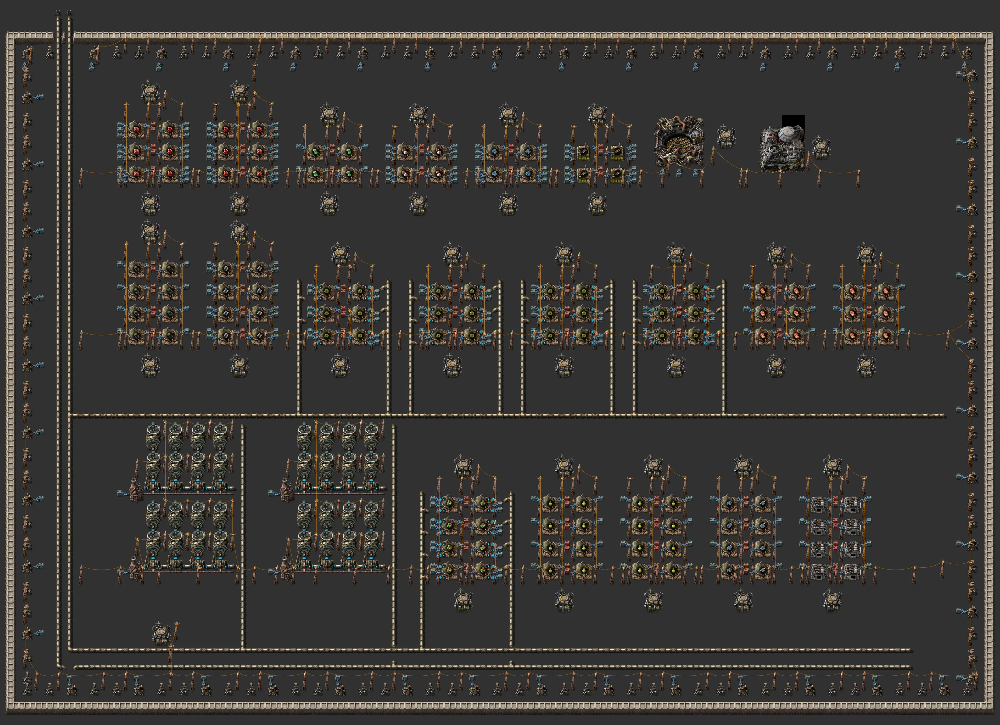
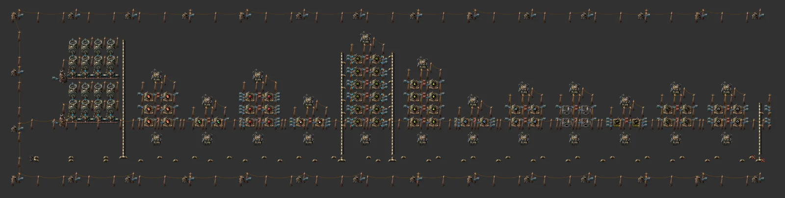
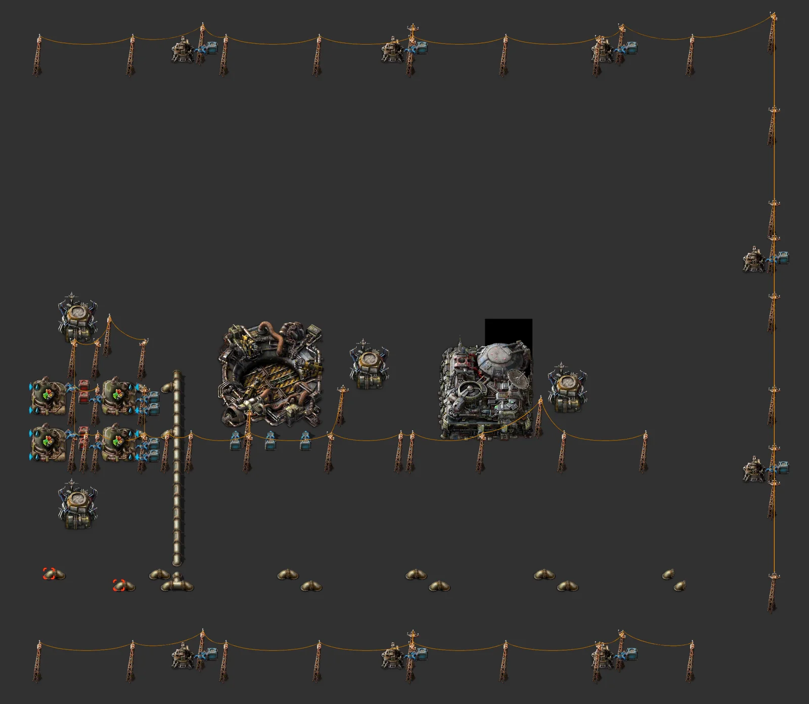

# Gleba all-in-one complex

> Robot-fed stackable cells: fruit processing → bioflux, nutrients, pentapod eggs → about 300 agricultural science/min, iron bacteria → magazines, carbon fiber, rocket fuel from jelly, heating-tower power burning spoilage, rocket and landing pad, and a turret ring.

[한국어](README.md)

<!-- AUTO:START (generated by tools/build.py, do not edit) -->



**Zoomed sections (west → east)**




<sub>Images rendered with [Factorio Blueprint Editor](https://fbe.factorygamefan.com) (game graphics © Wube Software)</sub>

| Item | Value |
|---|---|
| Game | Factorio 2.0 (base, space-age) |
| Size | 305×55 tiles |
| Entities | 1290 |
| Main machines | `requester-chest` ×147<br>`passive-provider-chest` ×60<br>`biochamber` ×54 (pentapod-egg 12, agricultural-science-pack 8, yumako-processing 6, bioflux 6, iron-bacteria-cultivation 4, burnt-spoilage 4, carbon-fiber 4, rocket-fuel-from-jelly 4, jellynut-processing 2, nutrients-from-bioflux 2, iron-bacteria 2)<br>`electric-furnace` ×4<br>`assembling-machine-3` ×2 (firearm-magazine 2)<br>`rocket-silo` ×1 |
| Validation | OK |

### Inputs

none

### Outputs

| Item | Per minute | Position |
|---|---:|---|
| `agricultural-science-pack` | ~300 | rocket cargo requests (spoils within an hour) |

### Complex

| Line | Cell | Cells | Output (/min, late) | Inputs (/min, late) |
|---|---|---:|---|---|
| Yumako processing | 13×12 | 1 | chests (mall) | `yumako` 143 |
| Jellynut processing | 13×4 | 1 | chests (mall) | `jellynut` 24 |
| Bioflux | 13×12 | 1 | chests (mall) | `yumako-mash` 1,080, `jelly` 864 |
| Nutrients | 13×4 | 1 | chests (mall) | `bioflux` 12 |
| Pentapod eggs | 17×12 | 2 | chests (mall) | `pentapod-egg` 96, `nutrients` 2,880, `water` (fluid) 5,760 |
| Agricultural science | 13×8 | 2 | chests (mall) | `bioflux` 240, `pentapod-egg` 240 |
| Iron bacteria | 13×4 | 1 | chests (mall) | `jelly` 140 |
| Iron bacteria cultivation | 13×8 | 1 | chests (mall) | `iron-bacteria` 48, `bioflux` 48 |
| Iron plates (bacteria ore) | 13×8 | 1 | chests (mall) | `iron-ore` 150 |
| Firearm magazines | 13×4 | 1 | chests (mall) | `iron-plate` 576 |
| Carbon (burnt spoilage) | 13×8 | 1 | chests (mall) | `spoilage` 240 |
| Carbon fiber | 13×8 | 1 | chests (mall) | `yumako-mash` 960, `carbon` 96 |
| Rocket fuel (jelly) | 17×8 | 1 | chests (mall) | `water` (fluid) 1,440, `jelly` 1,440, `bioflux` 96 |
| Power | - | - | 2 heating towers → 8 heat exchangers → 16 turbines (fuel: spoilage, jellynut) | |
| Rocket silo | - | - | robot-fed silo; exports via its cargo requests | |
| Landing pad | - | - | imports blue circuits and LDS | |
| Defence ring | - | - | gun turret + magazine requester every 18 tiles around the complex | |

Bus (top → bottom, 6 lanes + 2 empty rows per group; fluids at the bottom):

| Group | Lanes |
|---|---|
| 1 (fluid) | `water` (fluid), `water` (fluid), -, -, -, - |

1,049 entities, 289 tiles wide. Peak power 38 MW / turbines 93 MW (with enough heating-tower fuel). Every bus lane is checked at generation time against one lane's capacity (blue belt 45/s, pipe 1,200/s).

### Roadmap

| Stage | When / research needed | What to do |
|---|---|---|
| 0. Arrival | `yumako` (on first mining), `jellynut` (on first mining), `bioflux` (on first craft) | Hand-harvesting yumako and jellynut unlocks processing and bioflux. Settle near water, next to yumako and jellynut soil. |
| 1. Farms & power | `agriculture` (on first mining), `heating-tower` (on first mining) | Place farm tiles (tower + seed requester + harvest provider) on each soil every 22 tiles, and the heating-tower power line — it burns spoilage and jellynut, so spoilage becomes fuel. |
| 2. Nutrient bootstrap | `bioflux` (on first craft), `biochamber` (on first craft) | Biochambers burn nutrients to run: start by dropping a few stacks of nutrients into a provider chest. |
| 3. Eggs & science | `biochamber` (on first craft), `agricultural-science-pack` (on first craft) | Pentapod eggs need a first egg (from a nest). Egg machines only take inputs while the network holds fewer than 40 eggs, so eggs never pile up and hatch. Agricultural science spoils within an hour — ship it promptly. |
| 4. Iron & defence | `jellynut` (on first mining), `bacteria-cultivation` (on first craft) | Iron bacteria (from jelly) → cultivation → iron ore after a minute → electric furnaces → magazines for the turret ring (robot-fed). Upgrade to rocket or tesla turrets when available. |
| 5. Exports | `carbon-fiber` (red·green·blue·space·Gleba), `bioflux-processing` (on first craft), `rocket-silo` (red·green·blue·purple·yellow) | Carbon fiber (for Aquilo foundation), rocket fuel from jelly, and imported blue circuits / LDS for rocket parts. |

**Build next**

- [Fulgora all-in-one complex](../planet-fulgora/README.en.md) — the electromagnetic science planet

### Files

| File | Description |
|---|---|
| [`blueprint.txt`](blueprint.txt) | the whole complex (water bus + every line + defence ring) |
| [`variants/yumako-processing.txt`](variants/yumako-processing.txt) | Yumako processing — cap + 1 cell |
| [`variants/jellynut-processing.txt`](variants/jellynut-processing.txt) | Jellynut processing — cap + 1 cell |
| [`variants/bioflux.txt`](variants/bioflux.txt) | Bioflux — cap + 1 cell |
| [`variants/nutrients.txt`](variants/nutrients.txt) | Nutrients — cap + 1 cell |
| [`variants/eggs.txt`](variants/eggs.txt) | Pentapod eggs — cap + 1 cell |
| [`variants/science.txt`](variants/science.txt) | Agricultural science — cap + 1 cell |
| [`variants/iron-bacteria.txt`](variants/iron-bacteria.txt) | Iron bacteria — cap + 1 cell |
| [`variants/iron-cultivation.txt`](variants/iron-cultivation.txt) | Iron bacteria cultivation — cap + 1 cell |
| [`variants/iron-plate.txt`](variants/iron-plate.txt) | Iron plates (bacteria ore) — cap + 1 cell |
| [`variants/magazine.txt`](variants/magazine.txt) | Firearm magazines — cap + 1 cell |
| [`variants/carbon.txt`](variants/carbon.txt) | Carbon (burnt spoilage) — cap + 1 cell |
| [`variants/carbon-fiber.txt`](variants/carbon-fiber.txt) | Carbon fiber — cap + 1 cell |
| [`variants/rocket-fuel.txt`](variants/rocket-fuel.txt) | Rocket fuel (jelly) — cap + 1 cell |
| [`variants/power.txt`](variants/power.txt) | power: 2 heating towers → 8 exchangers → 16 turbines |
| [`variants/rocket-silo.txt`](variants/rocket-silo.txt) | rocket silo (robot-fed) |
| [`variants/landing-pad.txt`](variants/landing-pad.txt) | landing pad |
| [`variants/farm-yumako.txt`](variants/farm-yumako.txt) | farm tile: yumako (on its soil) |
| [`variants/farm-jellynut.txt`](variants/farm-jellynut.txt) | farm tile: jellynut (on its soil) |

Copy the string to the clipboard, then in game: Blueprint library → Import string:

```sh
pbcopy < blueprints/planet-gleba/blueprint.txt   # macOS
xclip -selection clipboard < blueprints/planet-gleba/blueprint.txt   # Linux
```

### Regenerate

```sh
python3 blueprints/planet-gleba/generate.py
python3 tools/build.py planet-gleba
```

<!-- AUTO:END -->

## Why robots instead of belts

On Gleba almost everything spoils (yumako mash 3 min, jelly 4 min, nutrients 5 min, eggs 15 min). A belt that stops once rots, jams its line, and **spoiled eggs hatch into enemies**. So this complex has no item bus; robots move everything.

- Every machine has a **requester chest** (ingredients + nutrients, which biochambers burn) and a **passive provider chest** (results, spoilage included). Output inserters are unfiltered, so they also pull spoilage out.
- **Spoilage is fuel** (250 kJ) and the heating towers burn it: the power plant is the spoilage sink.
- **Egg control**: the egg machines' input inserters only run while the robot network holds fewer than 40 eggs (logistic condition), so eggs never pile up and are used well within 15 minutes. If the condition does not survive the import, set it in game: connect the input inserter to the logistic network, pentapod egg < 40.
- The cells are still stackable (fixed width and period); only water comes up the pipes from the bus below. Each line has a roboport in its cap and at its top, so the network is continuous.

## Farms

Agricultural towers only grow on their soil (yumako / jellynut wetland, or artificial soil), so the farm tiles are separate: place `variants/farm-*.txt` on that soil every 22 tiles (tower radius 3 cells = 21×21). Anywhere inside the robot network, the harvest reaches the complex by itself. 300 science/min needs about 10 yumako/s and 4 jellynut/s.

## Defence

Pentapods attack polluted (spore-covered) areas. Every 18 tiles around the complex there is a gun turret with a magazine requester; magazines are made from bacteria iron. Swap in rocket or tesla turrets when available.

## Community design consulted (its strings are not in this repository)

- Nir Adar, "Gleba Book" (https://factorioprints.com/view/-OvbAwW4CJ0WvO5NsBBm)
