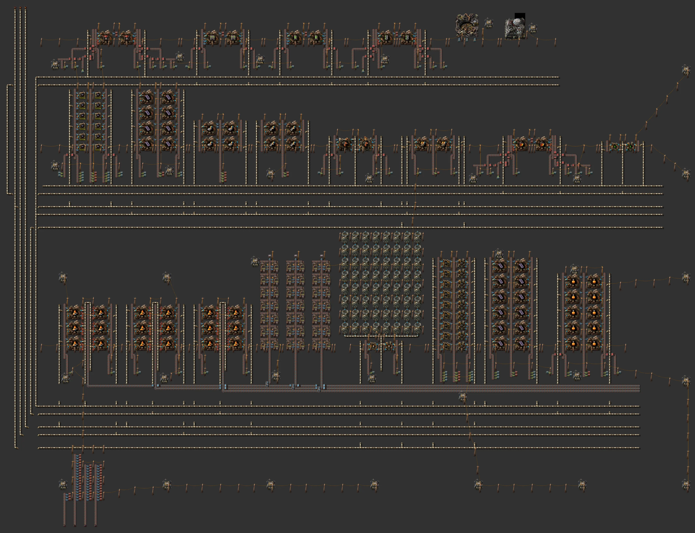
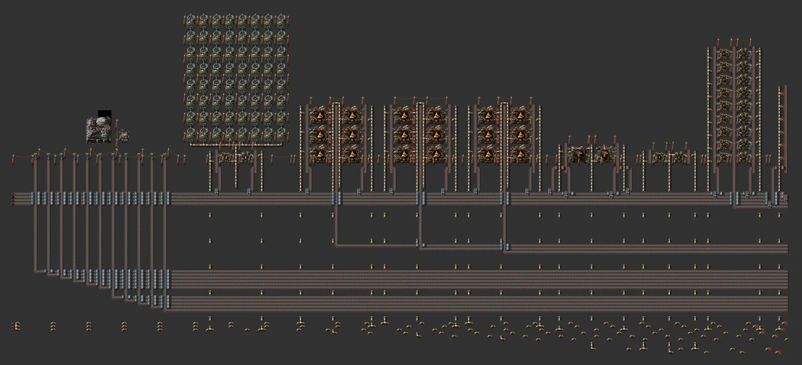
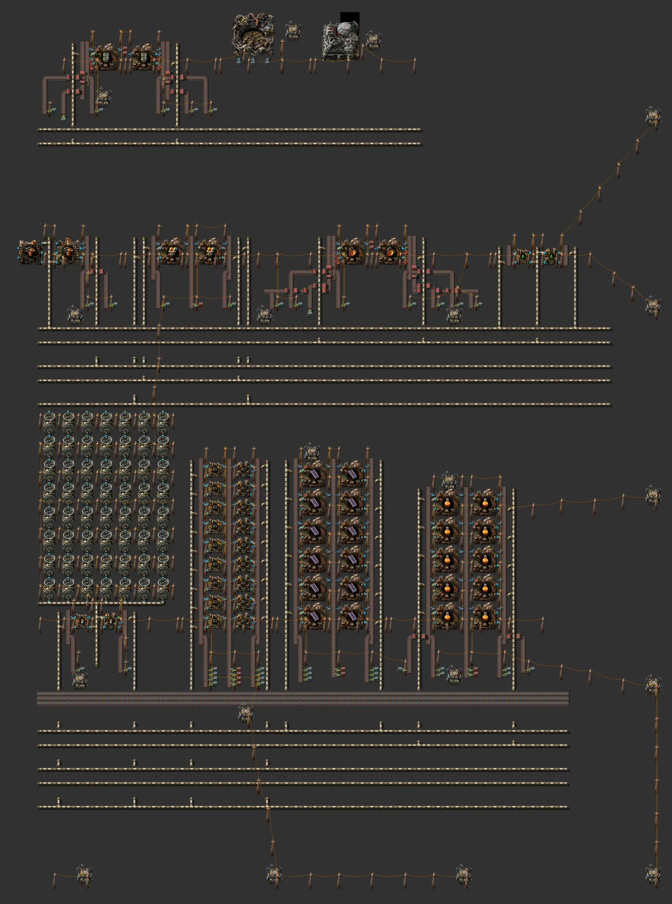

# Vulcanus all-in-one base

> Vulcanus base in one rectangle: a lava shelf (molten metals + stone disposal) → castings, tungsten and 360 metallurgic science/min, lubricant, a mall (foundries, big drills, turbo belts), 372 MW of power, a south ore gate, rocket and landing pad. Robots between blocks, fluids in trunks along the west edge.

[한국어](README.md)

<!-- AUTO:START (generated by tools/build.py, do not edit) -->



**Zoomed areas (north-west → south-east, row by row)**




<sub>Images rendered with [Factorio Blueprint Editor](https://fbe.factorygamefan.com) (game graphics © Wube Software)</sub>

| Item | Value |
|---|---|
| Game | Factorio 2.0 (base, space-age) |
| Size | 264×201 tiles |
| Entities | 9376 |
| Main machines | `requester-chest` ×83<br>`passive-provider-chest` ×80<br>`foundry` ×68 (tungsten-plate 20, molten-copper-from-lava 12, metallurgic-science-pack 10, molten-iron-from-lava 6, casting-iron 4, casting-steel 4, casting-low-density-structure 2, foundry 2, big-mining-drill 2, turbo-transport-belt 2, turbo-underground-belt 2, turbo-splitter 2)<br>`recycler` ×42<br>`chemical-plant` ×22 (carbon 18, acid-neutralisation 2, lubricant 2)<br>`assembling-machine-3` ×12 (tungsten-carbide 12)<br>`steel-chest` ×3<br>`oil-refinery` ×2 (simple-coal-liquefaction 2)<br>`rocket-silo` ×1 |
| Validation | OK |

### Inputs

_constant-combinator markers inside the blueprint (count = required per minute, position = tile offset from the blueprint's top-left)_

| Signal | Per minute | Position |
|---|---:|---|
| `calcite` | 412 | (22, 200) |
| `coal` | 2,400 | (26, 200) |
| `tungsten-ore` | 1,860 | (30, 200) |
| `tungsten-ore` | 1,860 | (34, 200) |

### Outputs

| Item | Per minute | Position |
|---|---:|---|
| `metallurgic-science-pack` | 360 | robot network → rocket cargo requests |

### Base layout

| Line | Cell | Cells | Output (/min, late) | Inputs (/min, late) |
|---|---|---:|---|---|
| Molten iron | 23×6 | 3 | `molten-iron` (fluid) 33,750, `stone` 1,350 | `lava` (fluid) 45,000, `calcite` 90 |
| Molten copper | 23×6 | 3 | `molten-copper` (fluid) 28,800, `stone` 1,728 | `lava` (fluid) 38,400, `calcite` 77 |
| Molten copper | 23×6 | 3 | `molten-copper` (fluid) 28,800, `stone` 1,728 | `lava` (fluid) 38,400, `calcite` 77 |
| Heavy oil (simple coal liquefaction) | 21×6 | 1 | `heavy-oil` (fluid) 1,200 | `coal` 240, `calcite` 48, `sulfuric-acid` (fluid) 600 |
| Lubricant | 17×4 | 1 | `lubricant` (fluid) 1,200 | `heavy-oil` (fluid) 1,200 |
| Carbon | 17×12 | 3 | `carbon` 1,080 | `coal` 2,160, `sulfuric-acid` (fluid) 21,600 |
| Tungsten carbide | 17×8 | 3 | `tungsten-carbide` 900 | `tungsten-ore` 1,800, `sulfuric-acid` (fluid) 9,000, `carbon` 900 |
| Tungsten plate | 21×12 | 5 | `tungsten-plate` 720 | `tungsten-ore` 1,920, `molten-iron` (fluid) 4,800 |
| Iron plates | 21×6 | 2 | `iron-plate` 900 | `molten-iron` (fluid) 6,000 |
| Steel | 21×6 | 2 | `steel-plate` 450 | `molten-iron` (fluid) 9,000 |
| Metallurgic science | 21×6 | 5 | `metallurgic-science-pack` 360 | `tungsten-carbide` 720, `tungsten-plate` 480, `molten-copper` (fluid) 48,000 |
| Low density structure | 25×6 | 1 | `low-density-structure` 48 | `molten-iron` (fluid) 2,560, `molten-copper` (fluid) 8,000, `plastic-bar` 160 |
| Mall: foundry | 23×6 | 1 | chests (mall) | `tungsten-carbide` 288, `steel-plate` 288, `electronic-circuit` 173, `refined-concrete` 115, `lubricant` (fluid) 115 |
| Mall: big mining drill | 23×6 | 1 | chests (mall) | `electric-mining-drill` 14, `molten-iron` (fluid) 2,880, `tungsten-carbide` 288, `electric-engine-unit` 144, `advanced-circuit` 144 |
| Mall: turbo belt | 21×6 | 1 | chests (mall) | `tungsten-plate` 480, `express-transport-belt` 96, `lubricant` (fluid) 1,920 |
| Mall: turbo underground | 21×6 | 1 | chests (mall) | `tungsten-plate` 1,829, `express-underground-belt` 91, `lubricant` (fluid) 1,829 |
| Mall: turbo splitter | 23×6 | 1 | chests (mall) | `express-splitter` 60, `tungsten-plate` 900, `processing-unit` 120, `lubricant` (fluid) 4,800 |
| Raw intake (south gate) | - | - | calcite, coal, tungsten ore belts → provider chests | |
| Power | - | - | 2 acid-neutralisation plants + 64 steam turbines (372 MW) | |
| Stone voids ×3 | - | - | on the lava shelf's stone belts, 14 recyclers each | |
| Landing pad | - | - | 11 imports → the robot network | |
| Rocket silo | - | - | robot-fed silo; exports via its cargo requests | |

Shelves (bottom → top; long lines are split into stacks of equal height):

| Shelf | Blocks |
|---|---|
| 1 | Molten iron x3, Molten copper x3, Molten copper x3, Stone void 1, Stone void 2, Stone void 3, Power: acid neutralisation + 64 turbines, Carbon x3, Tungsten plate x3, Metallurgic science x5 |
| 2 | Tungsten carbide x3, Tungsten plate x2, Iron plates x2, Steel x2, Heavy oil (simple coal liquefaction) x1, Low density structure x1, Mall: foundry x1, Lubricant x1 |
| 3 | Mall: big mining drill x1, Mall: turbo belt x1, Mall: turbo underground x1, Mall: turbo splitter x1, Rocket silo (robot-fed), Landing pad (imports into the robot network) |

Core 253×196 tiles, overall 264×201, 9,376 entities. Peak power 215 MW / generated 372 MW. Items move between blocks by robots (requester chest → block → provider chest); each fluid runs in a trunk along the west edge that joins it in every shelf.

### Roadmap

| Stage | When / research needed | What to do |
|---|---|---|
| 0. Arrival | `foundry` (on first craft), `rocket-silo` (red·green·blue·purple·yellow) | Before foundries: drop the landing pad, robots and basic buildings from the platform. Pick a spot next to a lava lake, near calcite, coal and tungsten ore, outside demolisher territory. |
| 1. Power | `calcite-processing` (on first mining), `nuclear-power` (red·green·blue) | Power first: calcite and sulfuric acid (pumpjacks on acid geysers) give 372 MW; a few turbines are enough to start. |
| 2. Molten metals & castings | `foundry` (on first craft) | Molten iron/copper lines plus iron and steel casting. Lava from offshore pumps at the trunk markers (north-west). They make stone, so place the stone voids on the same shelf too (chests until recycling is researched). |
| 3. Tungsten & science | `tungsten-carbide` (on first mining), `tungsten-steel` (on first craft), `metallurgic-science-pack` (on first craft) | Carbon → tungsten carbide, tungsten plate, metallurgic science (360/min); more cells scale it linearly. |
| 4. Mall & lubricant | `calcite-processing` (on first mining), `big-mining-drill` (on first craft), `turbo-transport-belt` (red·green·blue·purple·space·Vulcanus) | Simple coal liquefaction → lubricant, then the mall lines (foundries, big drills, turbo belts); circuits, engines and express belts are imported. |
| 5. Rocket & exports | `foundry` (on first craft), `rocket-silo` (red·green·blue·purple·yellow) | Cast low density structures (plastic imported) and build the silo; metallurgic science, carbide, tungsten plate and iron plate go from the export chests into rocket cargo. |

**Build next**

- [Refined concrete (stackable cell)](../refined-concrete/README.en.md) — foundry ingredient (refined concrete), if not imported

### Files

| File | Description |
|---|---|
| [`blueprint.txt`](blueprint.txt) | the whole base (rectangle core + south ore gate) |
| [`variants/molten-iron.txt`](variants/molten-iron.txt) | Molten iron — cap + 1 cell |
| [`variants/molten-copper.txt`](variants/molten-copper.txt) | Molten copper — cap + 1 cell |
| [`variants/heavy-oil.txt`](variants/heavy-oil.txt) | Heavy oil (simple coal liquefaction) — cap + 1 cell |
| [`variants/lubricant.txt`](variants/lubricant.txt) | Lubricant — cap + 1 cell |
| [`variants/carbon.txt`](variants/carbon.txt) | Carbon — cap + 1 cell |
| [`variants/tungsten-carbide.txt`](variants/tungsten-carbide.txt) | Tungsten carbide — cap + 1 cell |
| [`variants/tungsten-plate.txt`](variants/tungsten-plate.txt) | Tungsten plate — cap + 1 cell |
| [`variants/iron-plate.txt`](variants/iron-plate.txt) | Iron plates — cap + 1 cell |
| [`variants/steel-plate.txt`](variants/steel-plate.txt) | Steel — cap + 1 cell |
| [`variants/science.txt`](variants/science.txt) | Metallurgic science — cap + 1 cell |
| [`variants/low-density-structure.txt`](variants/low-density-structure.txt) | Low density structure — cap + 1 cell |
| [`variants/mall-foundry.txt`](variants/mall-foundry.txt) | Mall: foundry — cap + 1 cell |
| [`variants/mall-big-drill.txt`](variants/mall-big-drill.txt) | Mall: big mining drill — cap + 1 cell |
| [`variants/mall-turbo-belt.txt`](variants/mall-turbo-belt.txt) | Mall: turbo belt — cap + 1 cell |
| [`variants/mall-turbo-underground.txt`](variants/mall-turbo-underground.txt) | Mall: turbo underground — cap + 1 cell |
| [`variants/mall-turbo-splitter.txt`](variants/mall-turbo-splitter.txt) | Mall: turbo splitter — cap + 1 cell |
| [`variants/power.txt`](variants/power.txt) | power: acid neutralisation + 64 turbines (372 MW) |
| [`variants/rocket-silo.txt`](variants/rocket-silo.txt) | rocket silo (robot-fed) |
| [`variants/stone-void.txt`](variants/stone-void.txt) | stone void (recyclers) |
| [`variants/landing-pad.txt`](variants/landing-pad.txt) | landing pad (imports into the robot network) |
| [`variants/raw-intake.txt`](variants/raw-intake.txt) | south ore gate (belts → provider chests) |

Copy the string to the clipboard, then in game: Blueprint library → Import string:

```sh
pbcopy < blueprints/planet-vulcanus/blueprint.txt   # macOS
xclip -selection clipboard < blueprints/planet-vulcanus/blueprint.txt   # Linux
```

### Regenerate

```sh
python3 blueprints/planet-vulcanus/generate.py
python3 tools/build.py planet-vulcanus
```

<!-- AUTO:END -->

## Shape

Community planet bases don't run a bus across the planet. They pack production into one dense rectangle and put power and defence around its edge (see the community designs below). This base is built the same way (`lib/base.py`).

- **Shelves**: every line is split into blocks of equal height (stacks of stackable cells) packed side by side into horizontal shelves. The shelves stack up into the rectangle. The packer picks the width that leaves the fewest empty tiles.
- **Robots between blocks**: every block input gets requester chest → inserter → belt, and every output gets belt end → inserter → provider chest. Belts stay inside blocks, and roboports cover the core on a 40-tile grid.
- **Fluids in west trunks**: each shelf lays only the fluids it uses, on a short street under it. A vertical trunk per fluid along the west edge joins that fluid across all shelves. External fluids enter at the north end of their trunk (constant-combinator marker).
- **Lava shelf** (bottom): the molten iron/copper foundries and the stone voids share stone belts. That is about 80 stone/s, so it rides belts instead of robots. Piled-up stone stops molten metal, so the voids must sit on the same shelf. Stone recycles into itself 25 % of the time, so 75 % disappears. Before recycling (Fulgora) the stone collects in the chests above the voids.
- **South ore gate**: calcite, coal and tungsten ore belts come in from the south and are unloaded into provider chests.
- **Fluid cells**: foundries face their fluid inputs to the belts and their outputs to the centre, with one machine row per input fluid.
- **Checked at generation**: tile overlaps, street lane capacity (pipe 1,200/s) and the power network are checked when the base is generated. If anything fails, no string is written.

## Power & defence

- Power: acid neutralisation (calcite + sulfuric acid → 500 °C steam) in 2 chemical plants drives 64 steam turbines (372 MW). That block sits inside a shelf too.
- Defence: Vulcanus' enemies are demolishers. Turrets don't stop them, so the rule is to **build outside their territory**. That's why this base has no outer ring.

## Growing it

- To grow one block, paste more cells on top of it (stackable cells). To grow a whole line, change its number in `PLAN` in `lib/planets/vulcanus.py` and regenerate. The lines are split to equal heights and packed again.
- To use one line on its own, take `variants/<line>.txt` (cap + 1 cell, with markers on its inputs).

## Community designs consulted (their strings are not in this repository)

- "Vulcanus all production, no mods" — one rectangle, a turbine block along one edge (https://factorioprints.com/view/-OBM-LoRxzZKXi8dvphv)
- "Vulcanus Production" — dense production blocks (https://factorioprints.com/view/-OAjOz4bGjyJdIo5eMRl)
- Space Ghost, "Vulcanus MALL 108 items+ from ores" — mall item list (https://factorioprints.com/view/-OL_rvijZDQI7WVI8mxG)
- Nir Adar, "Vulcanus Starter Base" — arrival order, self-sufficient acid-neutralisation power (https://factorioprints.com/view/-OU4xpv_3uAJk-nIYB2y)
