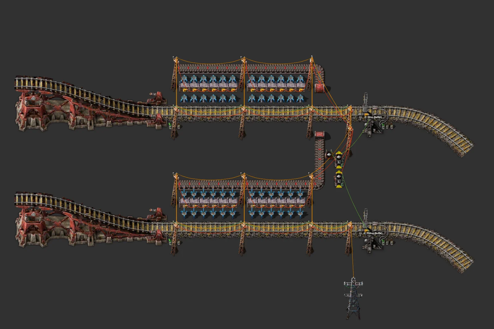

# 철도 버퍼 역 블럭

> 한 아이템을 위 역에서 하역해 상자 24개에 쌓고 아래 역에서 적재. 열차 제한은 재고로 자동 설정.

[English](README.en.md)

<!-- AUTO:START (tools/build.py가 생성하는 구역입니다. 직접 수정하지 마세요) -->


**상세 (레일 제외 설비 부분)**



<sub>이미지: [Factorio Blueprint Editor](https://fbe.factorygamefan.com)로 렌더링 (게임 그래픽 © Wube Software)</sub>

| 항목 | 값 |
|---|---|
| 게임 | Factorio 2.0 (base, space-age) |
| 크기 | 284×283 타일 |
| 엔티티 | 2095 |
| 주요 설비 | `steel-chest` ×24<br>`train-stop` ×2 |
| 검사 | 통과 |

### 입력

| 아이템 | 분당 | 위치 |
|---|---:|---|
| `iron-plate` | ≤900 | 열차 → 위 정거장 `Drop (buffer)` |

### 출력

| 아이템 | 분당 | 위치 |
|---|---:|---|
| `iron-plate` | ≤900 | 아래 정거장 `Pickup (buffer)` → 열차 |

### 파일

| 파일 | 설명 |
|---|---|
| [`blueprint.txt`](blueprint.txt) | 철판 (기본) |
| [`variants/copper-plate.txt`](variants/copper-plate.txt) | 구리판 |
| [`variants/steel-plate.txt`](variants/steel-plate.txt) | 강철판 |

문자열을 클립보드에 복사한 뒤 게임에서 블루프린트 라이브러리 → 문자열 가져오기:

```sh
pbcopy < blueprints/rail-buffer-station/blueprint.txt   # macOS
xclip -selection clipboard < blueprints/rail-buffer-station/blueprint.txt   # Linux
```

### 다시 생성

```sh
python3 blueprints/rail-buffer-station/generate.py
python3 tools/build.py rail-buffer-station
```

필요한 원본 (저장소에 포함되지 않음): `third_party/rail-book.txt`

<!-- AUTO:END -->

{'ko': "## 구조\n\n- 바탕: 철도 북 'Mixed Elev. Cityblock'의 **3 Car 2 Stations** (기관차 1 + 화물칸 2 열차).\n- 위 역: 화물칸 2량 × 6 로봇팔 → 상자 12 → 로봇팔 → 벨트 → 지하 벨트로 위 선로 아래를 지나 → 아래 역 벨트 → 상자 12 → 화물칸.\n- 정거장 기준 화물칸 위치: 기관차가 정거장부터 6칸, 그 뒤로 화물칸이 7칸 간격입니다(북의 연료 공급 블루프린트 두 개로 확인).\n\n## 열차 제한 회로\n\n- 상자 24개를 빨간 선으로 연결합니다.\n- 하역 정거장: (상자 용량 − 재고) ÷ 열차 1대 분량 → `L`. 상자가 차면 0이 되어 열차가 오지 않습니다.\n- 적재 정거장: 재고 ÷ 열차 1대 분량 → `L`.\n\n## 참고\n\n- 하역 벨트는 로봇팔이 한쪽에서만 내려놓아 한 레인(최대 약 15/초)만 씁니다.\n- 원본 역 블럭의 승강장 전봇대가 거리 전력망과 끊겨 있어서, 연결용 대형 전봇대를 하나 추가했습니다.\n- 처음 열차가 섰을 때 로봇팔 줄이 화물칸 옆에 맞는지 확인하세요(게임 내 검증 전).\n", 'en': "## Layout\n\n- Base: **3 Car 2 Stations** from the 'Mixed Elev. Cityblock' rail book (1 locomotive + 2 wagons).\n- North stop: 2 wagons × 6 inserters → 12 chests → inserters → belt → underground under the north track → south belt → 12 chests → wagons.\n- Wagon position relative to the stop: locomotive covers 6 tiles from the stop, then a wagon every 7 tiles (cross-checked on two fuel-supply blueprints in the book).\n\n## Train-limit circuit\n\n- All 24 chests are chained with red wire.\n- Unload stop: (capacity − stock) ÷ trainload → `L`; drops to 0 when full so no trains are sent.\n- Load stop: stock ÷ trainload → `L`.\n\n## Notes\n\n- Inserters drop onto the unload belt from one side, so it uses one lane (≈15/s max).\n- The base block's platform poles were not connected to the street grid; a bridging big pole was added.\n- Not yet tested in game: check that the inserter rows line up with the wagons when the first train stops.\n"}
## 출처

레일·정거장·신호 배치는 사용자가 제공한 철도 블루프린트 북('Rails' 북의 **Mixed Elev. Cityblock**, 원작자 미상)을 그대로 사용합니다. 이 저장소에는 원본 북이 들어 있지 않으며, 생성기를 돌리려면 `third_party/`에 원본을 두어야 합니다.
