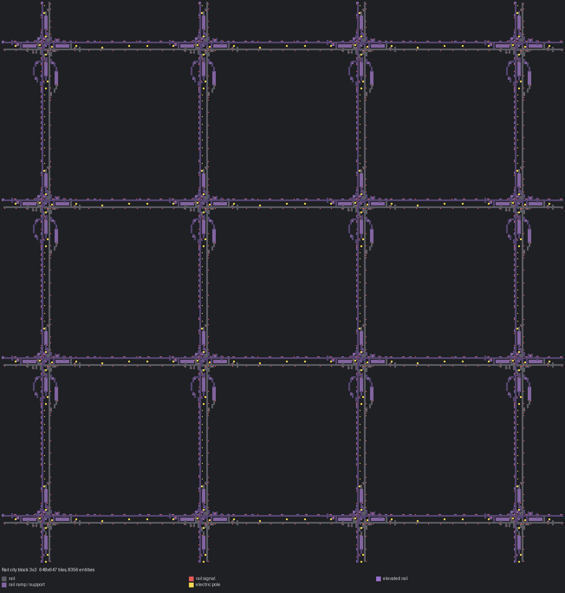

# 철도 시티블럭 3×3

> 182칸 빈 철도 블럭을 3×3으로 확장 (546칸 그리드).

[English](README.en.md)

<!-- AUTO:START (tools/build.py가 생성하는 구역입니다. 직접 수정하지 마세요) -->



| 항목 | 값 |
|---|---|
| 게임 | Factorio 2.0 (base, space-age) |
| 크기 | 648×647 타일 |
| 엔티티 | 8356 |
| 주요 설비 | - |
| 검사 | 통과 |

### 입력

없음

### 출력

없음

### 파일

| 파일 | 설명 |
|---|---|
| [`blueprint.txt`](blueprint.txt) | 기본 |

문자열을 클립보드에 복사한 뒤 게임에서 블루프린트 라이브러리 → 문자열 가져오기:

```sh
pbcopy < blueprints/rail-city-block-3x3/blueprint.txt   # macOS
xclip -selection clipboard < blueprints/rail-city-block-3x3/blueprint.txt   # Linux
```

### 다시 생성

```sh
python3 blueprints/rail-city-block-3x3/generate.py
python3 tools/build.py rail-city-block-3x3
```

필요한 원본 (저장소에 포함되지 않음): `third_party/empty-block.txt`

<!-- AUTO:END -->

{'ko': '## 구조\n\n2×2와 같은 방식으로 3×3 복제했습니다. 자세한 내용은 [2×2 문서](../rail-city-block-2x2/README.md)를 보세요.\n', 'en': '## Layout\n\nSame method as 2×2, tiled 3×3. See the [2×2 doc](../rail-city-block-2x2/README.en.md).\n'}
## 출처

레일·정거장·신호 배치는 사용자가 제공한 철도 블루프린트 북('Rails' 북의 **Mixed Elev. Cityblock**, 원작자 미상)을 그대로 사용합니다. 이 저장소에는 원본 북이 들어 있지 않으며, 생성기를 돌리려면 `third_party/`에 원본을 두어야 합니다.
