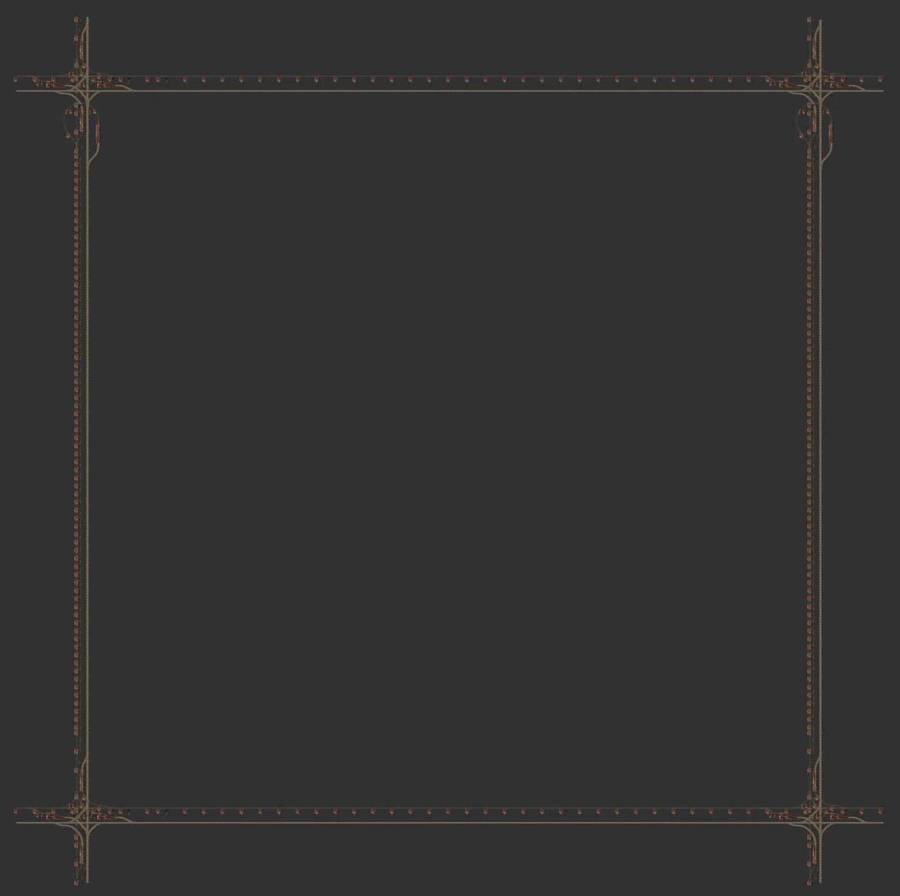

# 철도 큰 블럭 3×3 (가운데 빈 공간)

> 1×1 블럭 3×3개 크기의 한 블럭. 교차로는 네 모서리에만 있고 가장자리는 긴 직선이라 가운데 532칸 안팎의 큰 공간이 생깁니다.

[English](README.en.md)

<!-- AUTO:START (tools/build.py가 생성하는 구역입니다. 직접 수정하지 마세요) -->



<sub>이미지: [Factorio Blueprint Editor](https://fbe.factorygamefan.com)로 렌더링 (게임 그래픽 © Wube Software)</sub>

| 항목 | 값 |
|---|---|
| 게임 | Factorio 2.0 (base, space-age) |
| 크기 | 648×647 타일 |
| 엔티티 | 3797 |
| 주요 설비 | - |
| 검사 | 통과 |

### 입력

없음

### 출력

없음

### 로드맵

| 단계 | 시기 / 필요한 연구 | 할 일 |
|---|---|---|
| 0. 연구 | `railway` (빨강·초록), `automated-rail-transportation` (빨강·초록), `electric-energy-distribution-1` (빨강·초록), `elevated-rail` (빨강·초록·파랑·보라) | 기차·신호·큰 전봇대에 더해, 교차로가 2층(엘리베이티드)이라 엘리베이티드 레일 연구(Space Age)가 필요합니다. |
| 1. 자재 | - | 블럭 하나에 지지대 300+개, 경사로 18개, 레일 약 2,800개. 경사로·지지대 공장을 먼저 돌리세요. |
| 2. 깔기 | - | 모서리 교차로끼리 격자에 맞춰 이어 붙입니다. 가운데 빈 공간에 역·공장 블럭을 넣습니다. 큰 전봇대가 가장자리를 따라 이어져서 전력망도 같이 퍼집니다. |
| 3. 역 붙이기 | `circuit-network` (빨강·초록) | 버퍼·채굴·제련 역 블럭을 가운데 공간에 놓습니다. 기차 한도는 회로로 자동 조절됩니다. |

**다음에 지을 것**

- [레일 경사로·지지대 (쌓는 셀)](../rail-ramp-support/README.md) — 경사로·지지대 공급
- [철도 제련 공급 역 블럭](../rail-smelter-station/README.md) — 큰 공간에 맞는 역

### 파일

| 파일 | 설명 |
|---|---|
| [`blueprint.txt`](blueprint.txt) | 기본 |

문자열을 클립보드에 복사한 뒤 게임에서 블루프린트 라이브러리 → 문자열 가져오기:

```sh
pbcopy < blueprints/rail-city-block-3x3/blueprint.txt   # macOS
xclip -selection clipboard < blueprints/rail-city-block-3x3/blueprint.txt   # Linux
```

### 다시 생성

```sh
python3 blueprints/rail-city-block-3x3/generate.py
python3 tools/build.py rail-city-block-3x3
```

필요한 원본 (저장소에 포함되지 않음): `third_party/empty-block.txt`

<!-- AUTO:END -->

## 구조

- 1×1 블럭(182칸)을 3×3로 단순 복제하면 안쪽에 교차로가 4개 생기고 블럭이 9개로 나뉩니다. 이 블루프린트는 그 대신 **가장자리 거리만 있는 하나의 큰 블럭**입니다.
- 네 모서리: 1×1 블럭의 교차로 구역(교차점 기준 ±64칸: 교차로, 경사로, 합류 곡선)을 그대로 복사합니다.
- 가장자리: 모서리 사이를 긴 직선 거리로 채웁니다. 1×1 블럭의 직선 구간과 같은 규칙입니다.
  - 가로 거리: 신호 14칸, 고가 지지대 14칸, 대형 전봇대 ≤28칸 간격
  - 세로 거리: 고가 신호 12칸, 지상 신호 14칸, 지지대 6칸, 중형 전봇대 ≤9칸 간격
- 스냅 그리드 546, 기준점은 1×1과 같아서 1×1 블럭과 같은 격자에 맞물립니다. 전봇대는 구리선으로 모두 연결돼 있습니다.

## 참고

- 옆에 1×1 블럭이 붙는 변에서는 1×1 쪽 교차로(T자)가 이 블럭의 직선 거리 위에 겹쳐 지어집니다. 큰 블럭끼리만 붙이거나, 붙는 변을 확인해 주세요.

## 출처

레일·정거장·신호 배치는 사용자가 제공한 철도 블루프린트 북('Rails' 북의 **Mixed Elev. Cityblock**, 원작자 미상)을 그대로 사용합니다. 이 저장소에는 원본 북이 들어 있지 않으며, 생성기를 돌리려면 `third_party/`에 원본을 두어야 합니다.
