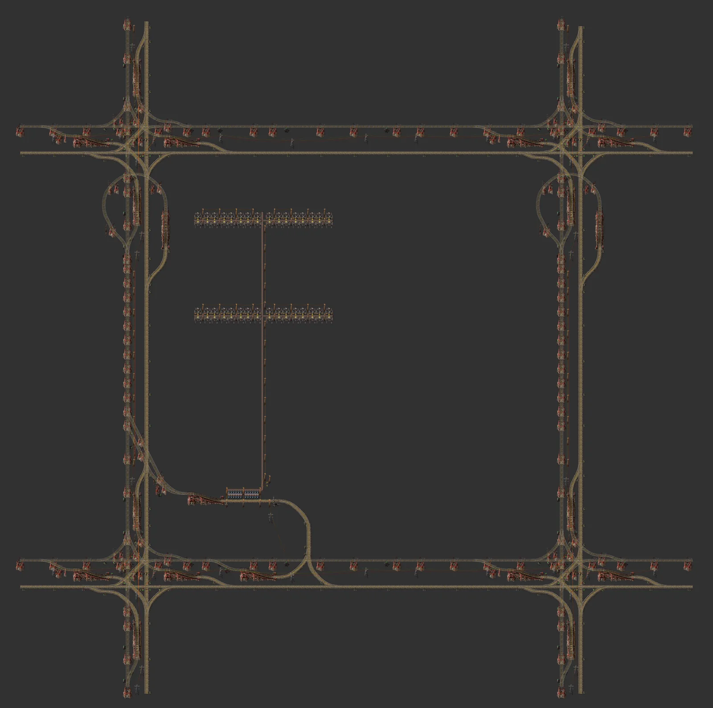
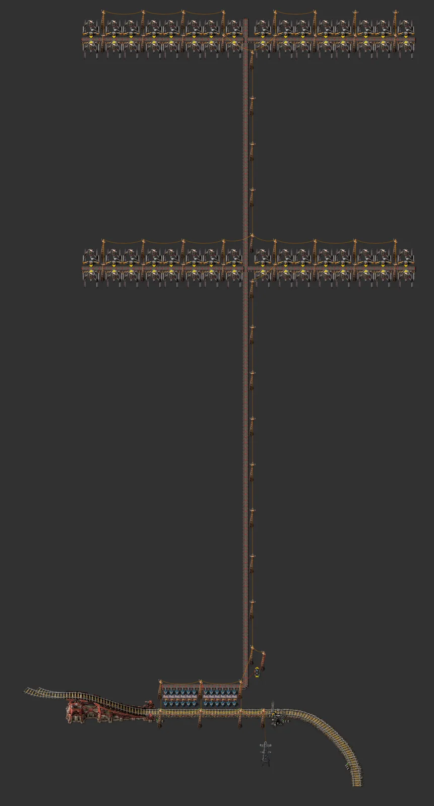

# 철도 채굴 공급 역 블럭

> 블럭 안을 채굴기 64대로 채우고 수집 벨트로 적재 역에 실어 보내는 공급 블럭.

[English](README.en.md)

<!-- AUTO:START (tools/build.py가 생성하는 구역입니다. 직접 수정하지 마세요) -->



**상세 (레일 제외 설비 부분)**



<sub>이미지: [Factorio Blueprint Editor](https://fbe.factorygamefan.com)로 렌더링 (게임 그래픽 © Wube Software)</sub>

| 항목 | 값 |
|---|---|
| 게임 | Factorio 2.0 (base, space-age) |
| 크기 | 284×283 타일 |
| 엔티티 | 2313 |
| 주요 설비 | `electric-mining-drill` ×64<br>`steel-chest` ×12<br>`train-stop` ×1 |
| 검사 | 통과 |

### 입력

없음

### 출력

| 아이템 | 분당 | 위치 |
|---|---:|---|
| `iron-ore` | ~1920 | 정거장 `Pickup` → 열차 |

### 로드맵

| 단계 | 시기 / 필요한 연구 | 할 일 |
|---|---|---|
| 0. 연구 | `automated-rail-transportation` (빨강·초록), `circuit-network` (빨강·초록), `electric-mining-drill` (빨강) | 기차 역, 신호, 회로(기차 한도 자동 조절)가 필요합니다. |
| 1. 놓기 | - | 철도 블럭(2x2) 가운데 칸에 그대로 겹쳐 놓습니다. 광물 밭 위에 놓아야 합니다. 드릴 64개가 블럭 안을 덮습니다. |
| 2. 역 이름·한도 | - | 역 이름을 아이템별로 맞추고(변형 파일이 아이템별로 있음), 열차 일정은 '공급역 → 수요역' 두 정거장. 기차 한도는 상자 재고에 따라 회로가 정합니다. |
| 3. 업그레이드 | `logistics-3` (빨강·초록·파랑·보라), `bulk-inserter` (빨강·초록) | 빨강 벨트·고속 인서터 기준. 파랑 벨트·벌크 인서터로 바꾸면 적재가 빨라집니다(같은 크기). |

**다음에 지을 것**

- [철도 제련 공급 역 블럭](../rail-smelter-station/README.md) — 광석을 받는 역
- [철도 버퍼 역 블럭](../rail-buffer-station/README.md) — 판을 쌓아 두는 역

### 파일

| 파일 | 설명 |
|---|---|
| [`blueprint.txt`](blueprint.txt) | 철광석 (기본) |
| [`variants/copper-ore.txt`](variants/copper-ore.txt) | 구리 광석 |
| [`variants/stone.txt`](variants/stone.txt) | 돌 |
| [`variants/coal.txt`](variants/coal.txt) | 석탄 |

문자열을 클립보드에 복사한 뒤 게임에서 블루프린트 라이브러리 → 문자열 가져오기:

```sh
pbcopy < blueprints/rail-mining-station/blueprint.txt   # macOS
xclip -selection clipboard < blueprints/rail-mining-station/blueprint.txt   # Linux
```

### 다시 생성

```sh
python3 blueprints/rail-mining-station/generate.py
python3 tools/build.py rail-mining-station
```

필요한 원본 (저장소에 포함되지 않음): `third_party/rail-book.txt`

<!-- AUTO:END -->

{'ko': '## 구조\n\n- 바탕: **3 Car 1 Station** (기관차 1 + 화물칸 2).\n- 채굴 띠 2줄 × (서쪽 16대 + 동쪽 16대). 가운데 x=53 수집 벨트로 서쪽 띠는 서쪽 레인, 동쪽 띠는 동쪽 레인에 합류합니다.\n- 수집 벨트 → 적재 상자 12 → 화물칸. 열차 제한 = 재고 ÷ 열차 1대 분량.\n\n## 참고\n\n- 광맥 위에 놓으세요. 광맥 밖에 걸린 채굴기만큼 생산량이 줄어듭니다.\n- 다른 광석은 `variants/`의 파일을 쓰거나 `generate.py`에서 추가하세요.\n', 'en': '## Layout\n\n- Base: **3 Car 1 Station** (1 locomotive + 2 wagons).\n- 2 drill bands × (16 west + 16 east drills). The collector at x=53 takes the west bands on its west lane and the east bands on its east lane.\n- Collector → 12 load chests → wagons. Train limit = stock ÷ trainload.\n\n## Notes\n\n- Place it on an ore patch; drills outside the patch reduce output.\n- Other ores: use `variants/` or add one in `generate.py`.\n'}
## 출처

레일·정거장·신호 배치는 사용자가 제공한 철도 블루프린트 북('Rails' 북의 **Mixed Elev. Cityblock**, 원작자 미상)을 그대로 사용합니다. 이 저장소에는 원본 북이 들어 있지 않으며, 생성기를 돌리려면 `third_party/`에 원본을 두어야 합니다.
