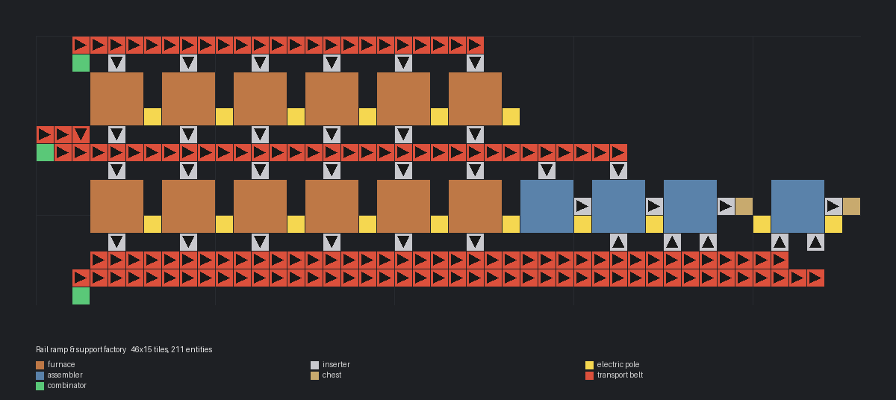

# Rail ramp & support factory

> Small factory making rail ramps and rail supports from iron ore, stone and refined concrete (steel-limited).

[한국어](README.md)

<!-- AUTO:START (generated by tools/build.py, do not edit) -->



| Item | Value |
|---|---|
| Game | Factorio 2.0 (base, space-age) |
| Size | 46×15 tiles |
| Entities | 211 |
| Main machines | `electric-furnace` ×12<br>`assembling-machine-2` ×4 (iron-stick 1, rail 1, rail-ramp 1, rail-support 1)<br>`steel-chest` ×2 |
| Validation | OK |

### Inputs

_constant-combinator markers inside the blueprint (count = required per minute, position = tile offset from the blueprint's top-left)_

| Signal | Per minute | Position |
|---|---:|---|
| `iron-ore` | 225 | (2, 1) |
| `stone` | 4 | (0, 6) |
| `refined-concrete` | 160 | (2, 14) |

### Outputs

| Item | Per minute | Position |
|---|---:|---|
| `rail-ramp` | ~1 | chest (2-slot limit) |
| `rail-support` | ~3 | chest (2-slot limit) |

### Files

| File | Description |
|---|---|
| [`blueprint.txt`](blueprint.txt) | default |

Copy the string to the clipboard, then in game: Blueprint library → Import string:

```sh
pbcopy < blueprints/rail-ramp-support/blueprint.txt   # macOS
xclip -selection clipboard < blueprints/rail-ramp-support/blueprint.txt   # Linux
```

### Regenerate

```sh
python3 blueprints/rail-ramp-support/generate.py
python3 tools/build.py rail-ramp-support
```

<!-- AUTO:END -->

{'ko': '## 구조\n\n- 철 용광로 6 → 철판 벨트(남쪽 레인, 돌은 북쪽 레인) → 강철 용광로 6 → 강철 벨트.\n- 철 막대 → 레일 → 경사로 조립기는 옆으로 바로 넣고, 지지대 조립기는 따로 있습니다.\n- 경사로 쪽이 강철을 먼저 가져가므로 두 상자를 2칸으로 제한해 강철이 지지대 쪽으로도 넘어가게 했습니다.\n\n## 참고\n\n- Space Age(고가 철도)가 필요합니다. 생산량을 늘리려면 `generate.py`의 `range(6)` 두 곳을 같이 늘리세요.\n', 'en': '## Layout\n\n- 6 iron furnaces → plate belt (south lane; stone on the north lane) → 6 steel furnaces → steel belt.\n- Stick → rail → ramp assemblers insert directly into each other; the support assembler is separate.\n- The ramp assembler takes steel first, so both chests are limited to 2 slots to let steel reach the supports.\n\n## Notes\n\n- Requires Space Age (elevated rails). Scale up by raising both `range(6)` in `generate.py`.\n'}