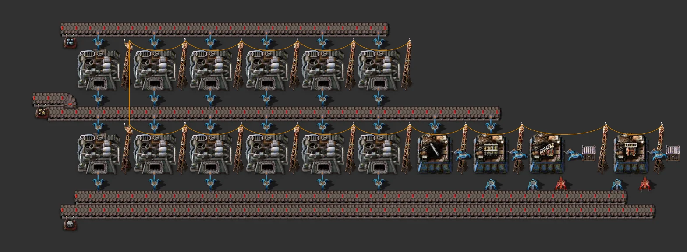

# Rail ramps & supports (stackable cell)

> 15×8 chest cell: supports and ramps on both sides into centre chests. Inputs refined concrete, steel and rails; each extra cell adds chests.

[한국어](README.md)

<!-- AUTO:START (generated by tools/build.py, do not edit) -->



<sub>Images rendered with [Factorio Blueprint Editor](https://fbe.factorygamefan.com) (game graphics © Wube Software)</sub>

| Item | Value |
|---|---|
| Game | Factorio 2.0 (base, space-age) |
| Size | 19×17 tiles |
| Entities | 127 |
| Main machines | `assembling-machine-1` ×4 (rail-support 2, rail-ramp 2)<br>`iron-chest` ×4 |
| Validation | OK |

### Inputs

_constant-combinator markers inside the blueprint (count = required per minute, position = tile offset from the blueprint's top-left)_

| Signal | Per minute | Position |
|---|---:|---|
| `refined-concrete` | 450 | (4, 16) |
| `steel-plate` | 450 | (0, 16) |
| `rail` | 450 | (1, 16) |
| `refined-concrete` | 450 | (14, 16) |
| `steel-plate` | 450 | (18, 16) |
| `rail` | 450 | (17, 16) |

### Outputs

| Item | Per minute | Position |
|---|---:|---|
| `(chests)` | - | centre chests (2 slots each) |

### Cell types

Every cell is **15** wide and uses the same lanes. The bottom cell makes the shared intermediates (e.g. gears) for the lanes, so it goes right above the cap; add any other cells northwards in any order. Products collect in the centre chests (limited to 2 slots).

| Cell | Size | West (south→north) | East (south→north) |
|---|---|---|---|
| Ramps & supports | 15×8 | `rail-support` → `rail-ramp` | `rail-ramp` → `rail-support` |

Lanes: `steel-plate` (inner), `refined-concrete` (inner), `rail` (outer)

### Roadmap

| Stage | When / research needed | What to do |
|---|---|---|
| 0. Research (Space Age) | `elevated-rail` (red·green·blue·purple) | Elevated rail unlocks ramps and supports (purple science). |
| 1. Inputs | - | Refined concrete from the refined-concrete cell's centre belt, rails from the rail cell or the bus, steel from the bus, into the cap's markers. |
| 2. Stock | - | One 2x2 big rail block uses 216 supports and 18 ramps; add another cell northwards for more chest space. |
| 3. Upgrade | `logistics-2` (red·green), `logistics-3` (red·green·blue·purple), `construction-robotics` (red·green·blue) | Red/blue belts, AM2/AM3, fast/bulk inserters; passive provider chests at the late tier so bots take straight from it. |

**Build next**

- [Refined concrete (stackable cell)](../refined-concrete/README.en.md) — refined-concrete supply
- [Rails (stackable cell)](../cell-rail/README.en.md) — rail supply
- [Big rail block 2×2 (empty interior)](../rail-city-block-2x2/README.en.md) — the rail block that uses them

### Files

| File | Description |
|---|---|
| [`blueprint.txt`](blueprint.txt) | cap + one cell, early (example / preview) |
| [`variants/ramps-supports-early.txt`](variants/ramps-supports-early.txt) | Ramps & supports — early (yellow, AM1, basic) |
| [`variants/ramps-supports-mid.txt`](variants/ramps-supports-mid.txt) | Ramps & supports — mid (red, AM2, fast) |
| [`variants/ramps-supports-late.txt`](variants/ramps-supports-late.txt) | Ramps & supports — late (blue, AM3, bulk) |
| [`variants/cap-early.txt`](variants/cap-early.txt) | cap — early (yellow, AM1, basic) |
| [`variants/cap-mid.txt`](variants/cap-mid.txt) | cap — mid (red, AM2, fast) |
| [`variants/cap-late.txt`](variants/cap-late.txt) | cap — late (blue, AM3, bulk) |

Copy the string to the clipboard, then in game: Blueprint library → Import string:

```sh
pbcopy < blueprints/rail-ramp-support/blueprint.txt   # macOS
xclip -selection clipboard < blueprints/rail-ramp-support/blueprint.txt   # Linux
```

### Regenerate

```sh
python3 blueprints/rail-ramp-support/generate.py
python3 tools/build.py rail-ramp-support
```

<!-- AUTO:END -->

## Layout

- A chest cell like the malls: input belts run through along both edges (inner: steel and refined concrete, outer: rails); west makes support → ramp, east ramp → support, each into a centre chest.
- A ramp eats 100 refined concrete, so the inserters limit it, which is fine for a cell that idles once its chests are full.

## Credits

The earlier ramp/support factory rebuilt as a stackable cell.
