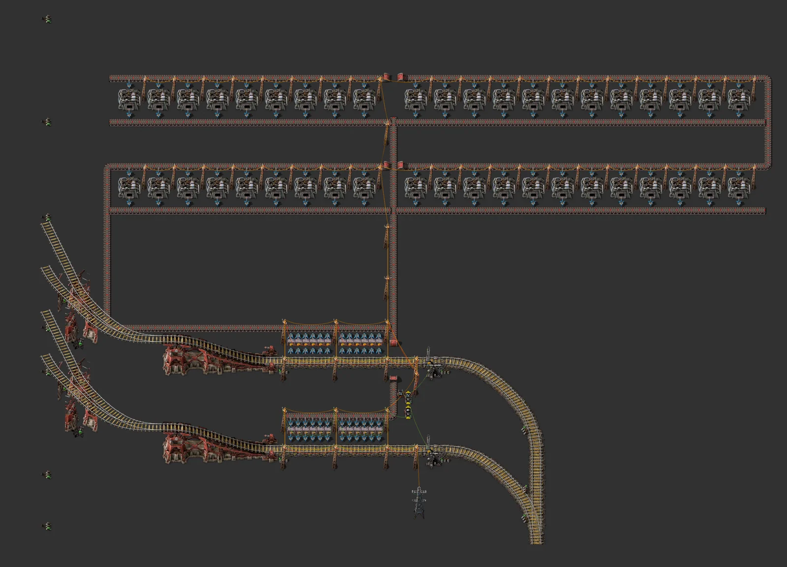

# Rail smelter provider block

> North stop unloads ore, 42 electric furnaces smelt it, south stop loads plates.

[한국어](README.md)

<!-- AUTO:START (generated by tools/build.py, do not edit) -->


**Detail (non-rail part)**



<sub>Images rendered with [Factorio Blueprint Editor](https://fbe.factorygamefan.com) (game graphics © Wube Software)</sub>

| Item | Value |
|---|---|
| Game | Factorio 2.0 (base, space-age) |
| Size | 284×283 tiles |
| Entities | 2706 |
| Main machines | `electric-furnace` ×42<br>`steel-chest` ×24<br>`train-stop` ×2 |
| Validation | OK |

### Inputs

| Item | Per minute | Position |
|---|---:|---|
| `iron-ore` | ~900 | trains → north stop `Drop (smelter)` |

### Outputs

| Item | Per minute | Position |
|---|---:|---|
| `iron-plate` | ~900 | south stop `Pickup` → trains |

### Files

| File | Description |
|---|---|
| [`blueprint.txt`](blueprint.txt) | iron ore → iron plate (default) |
| [`variants/copper-plate.txt`](variants/copper-plate.txt) | copper ore → copper plate |

Copy the string to the clipboard, then in game: Blueprint library → Import string:

```sh
pbcopy < blueprints/rail-smelter-station/blueprint.txt   # macOS
xclip -selection clipboard < blueprints/rail-smelter-station/blueprint.txt   # Linux
```

### Regenerate

```sh
python3 blueprints/rail-smelter-station/generate.py
python3 tools/build.py rail-smelter-station
```

Required source files (not in the repo): `third_party/rail-book.txt`

<!-- AUTO:END -->

{'ko': '## 구조\n\n- 바탕: **3 Car 2 Stations**.\n- 하역 광석 → 서쪽으로 돌아 북쪽 용광로 띠 2줄로 지그재그 공급(수집 벨트는 지하 벨트로 건넘).\n- 각 띠의 철판은 x=53 수집 벨트로 모여 위 선로 아래를 지하로 지나 적재 상자로 갑니다.\n- 회로: 광석 상자는 빨간 선(하역 제한 = 남은 공간 ÷ 열차 분량), 철판 상자는 초록 선(적재 제한 = 재고 ÷ 열차 분량).\n\n## 참고\n\n- 하역 벨트가 한 레인만 써서 실제 처리량은 약 15/초입니다. 용광로 42대는 여유분입니다.\n', 'en': '## Layout\n\n- Base: **3 Car 2 Stations**.\n- Unloaded ore loops west and snakes through two furnace bands to the north (crossing the collector underground).\n- Plates from each band join the x=53 collector, pass under the north track and fill the load chests.\n- Circuits: ore chests on red (unload limit = free space ÷ trainload), plate chests on green (load limit = stock ÷ trainload).\n\n## Notes\n\n- The unload belt uses one lane, so real throughput is ≈15/s; the 42 furnaces are headroom.\n'}
## Credits

Rail, stop and signal layout come unchanged from a user-supplied rail blueprint book (the **Mixed Elev. Cityblock** book inside a 'Rails' book; original author unknown). The original book is not in this repository; place it in `third_party/` to run the generator.
