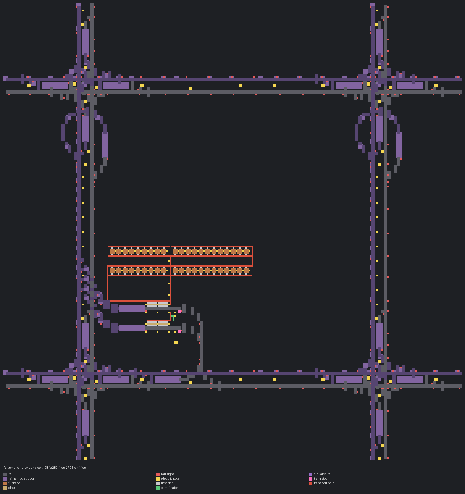
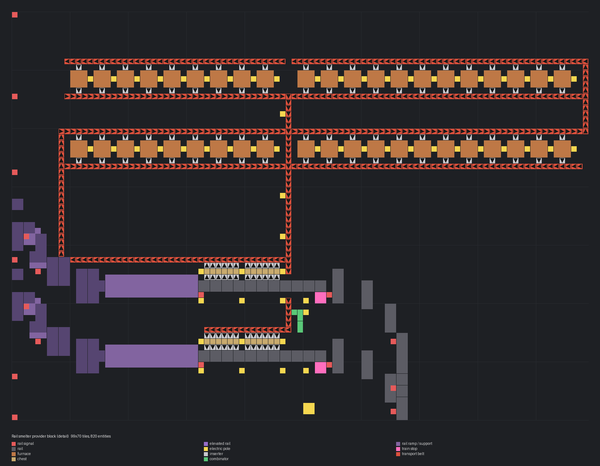

# 철도 제련 공급 역 블럭

> 위 역에서 광석을 하역해 전기 용광로 42대로 제련하고 아래 역에서 판을 적재.

[English](README.en.md)

<!-- AUTO:START (tools/build.py가 생성하는 구역입니다. 직접 수정하지 마세요) -->



**상세 (레일 제외 설비 부분)**



| 항목 | 값 |
|---|---|
| 게임 | Factorio 2.0 (base, space-age) |
| 크기 | 284×283 타일 |
| 엔티티 | 2706 |
| 주요 설비 | `electric-furnace` ×42<br>`steel-chest` ×24<br>`train-stop` ×2 |
| 검사 | 통과 |

### 입력

| 아이템 | 분당 | 위치 |
|---|---:|---|
| `iron-ore` | ~900 | 열차 → 위 정거장 `Drop (smelter)` |

### 출력

| 아이템 | 분당 | 위치 |
|---|---:|---|
| `iron-plate` | ~900 | 아래 정거장 `Pickup` → 열차 |

### 파일

| 파일 | 설명 |
|---|---|
| [`blueprint.txt`](blueprint.txt) | 철광석 → 철판 (기본) |
| [`variants/copper-plate.txt`](variants/copper-plate.txt) | 구리 광석 → 구리판 |

문자열을 클립보드에 복사한 뒤 게임에서 블루프린트 라이브러리 → 문자열 가져오기:

```sh
pbcopy < blueprints/rail-smelter-station/blueprint.txt   # macOS
xclip -selection clipboard < blueprints/rail-smelter-station/blueprint.txt   # Linux
```

### 다시 생성

```sh
python3 blueprints/rail-smelter-station/generate.py
python3 tools/build.py rail-smelter-station
```

필요한 원본 (저장소에 포함되지 않음): `third_party/rail-book.txt`

<!-- AUTO:END -->

{'ko': '## 구조\n\n- 바탕: **3 Car 2 Stations**.\n- 하역 광석 → 서쪽으로 돌아 북쪽 용광로 띠 2줄로 지그재그 공급(수집 벨트는 지하 벨트로 건넘).\n- 각 띠의 철판은 x=53 수집 벨트로 모여 위 선로 아래를 지하로 지나 적재 상자로 갑니다.\n- 회로: 광석 상자는 빨간 선(하역 제한 = 남은 공간 ÷ 열차 분량), 철판 상자는 초록 선(적재 제한 = 재고 ÷ 열차 분량).\n\n## 참고\n\n- 하역 벨트가 한 레인만 써서 실제 처리량은 약 15/초입니다. 용광로 42대는 여유분입니다.\n', 'en': '## Layout\n\n- Base: **3 Car 2 Stations**.\n- Unloaded ore loops west and snakes through two furnace bands to the north (crossing the collector underground).\n- Plates from each band join the x=53 collector, pass under the north track and fill the load chests.\n- Circuits: ore chests on red (unload limit = free space ÷ trainload), plate chests on green (load limit = stock ÷ trainload).\n\n## Notes\n\n- The unload belt uses one lane, so real throughput is ≈15/s; the 42 furnaces are headroom.\n'}
## 출처

레일·정거장·신호 배치는 사용자가 제공한 철도 블루프린트 북('Rails' 북의 **Mixed Elev. Cityblock**, 원작자 미상)을 그대로 사용합니다. 이 저장소에는 원본 북이 들어 있지 않으며, 생성기를 돌리려면 `third_party/`에 원본을 두어야 합니다.
