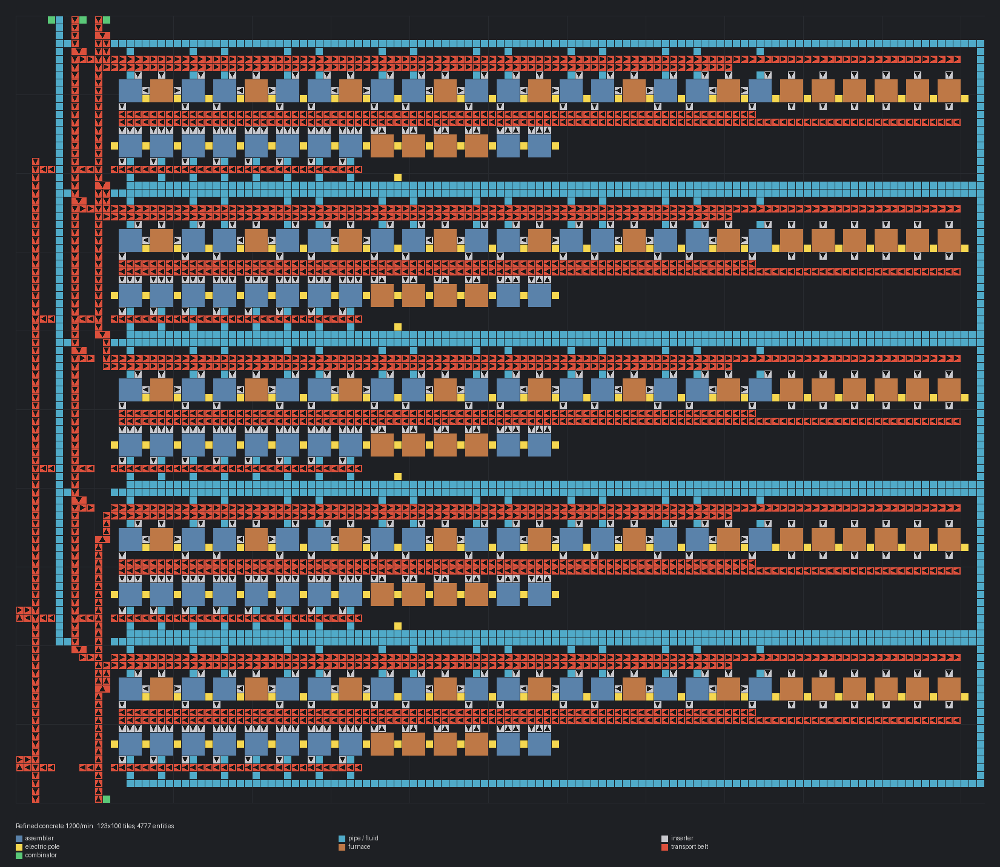

# 정제 콘크리트 1200/분

> 240/분 모듈 5개를 세로로 쌓고 서쪽에 분배·수집 구간을 붙인 대형 공장.

[English](README.en.md)

<!-- AUTO:START (tools/build.py가 생성하는 구역입니다. 직접 수정하지 마세요) -->



| 항목 | 값 |
|---|---|
| 게임 | Factorio 2.0 (base) |
| 크기 | 123×100 타일 |
| 엔티티 | 4777 |
| 주요 설비 | `assembling-machine-2` ×120 (concrete 70, refined-concrete 40, iron-stick 10)<br>`electric-furnace` ×85 |
| 검사 | 통과 |

### 입력

_블루프린트 안의 일정 신호 조합기 표시 (값 = 분당 필요량, 위치 = 블루프린트 왼쪽 위 기준 타일 좌표)_

| 신호 | 분당 | 위치 |
|---|---:|---|
| `stone` | 1,440 | (11, 0) |
| `iron-ore` | 1,320 | (8, 0) |
| `water` (fluid) | 43,500 | (4, 0) |
| `stone` | 960 | (11, 99) |

### 출력

| 아이템 | 분당 | 위치 |
|---|---:|---|
| `refined-concrete` | 1200 | 왼쪽 아래 x=-11 열 (남쪽으로 나감) |

### 파일

| 파일 | 설명 |
|---|---|
| [`blueprint.txt`](blueprint.txt) | 기본 |

문자열을 클립보드에 복사한 뒤 게임에서 블루프린트 라이브러리 → 문자열 가져오기:

```sh
pbcopy < blueprints/refined-concrete-1200/blueprint.txt   # macOS
xclip -selection clipboard < blueprints/refined-concrete-1200/blueprint.txt   # Linux
```

### 다시 생성

```sh
python3 blueprints/refined-concrete-1200/generate.py
python3 tools/build.py refined-concrete-1200
```

<!-- AUTO:END -->

{'ko': '## 구조\n\n- 모듈마다 돌·철광석을 스플리터로 한 줄씩 분기합니다. 앞 모듈이 차면 남는 양이 아래로 넘어갑니다.\n- 돌이 40/초로 고속 벨트 한 줄(30/초)을 넘기 때문에 **돌 입구가 두 곳**입니다: 위쪽(모듈 1~3), 아래쪽(모듈 4~5, 북쪽으로 흐름).\n- 출력은 지하 벨트로 세로 줄들을 건너 x=-11 열에 모입니다. 모듈 1~3은 동쪽 레인, 4~5는 서쪽 레인을 씁니다(레인당 15/초 이하).\n- 물은 서쪽 x=-8 세로 파이프에서 지하 파이프로 각 모듈에 들어갑니다.\n\n## 참고\n\n- 물이 약 725/초 필요합니다. 파이프 길이가 길어 아래쪽 모듈에 물이 부족하면 입구 쪽에 펌프를 하나 넣어 주세요.\n', 'en': "## Layout\n\n- Stone and iron ore are split off for each module by splitters; when an upstream module is full the rest flows on.\n- Stone (40/s) exceeds one fast belt (30/s), so there are **two stone inputs**: top (modules 1-3) and bottom (modules 4-5, flowing north).\n- Each module's output crosses the input columns underground and joins column x=-11; modules 1-3 use the east lane, 4-5 the west lane (≤15/s per lane).\n- Water comes down the x=-8 column and enters each module's main via pipe-to-ground.\n\n## Notes\n\n- ~725 water/s is needed; if the lower modules starve because of the long pipe, add a pump near the inlet.\n"}