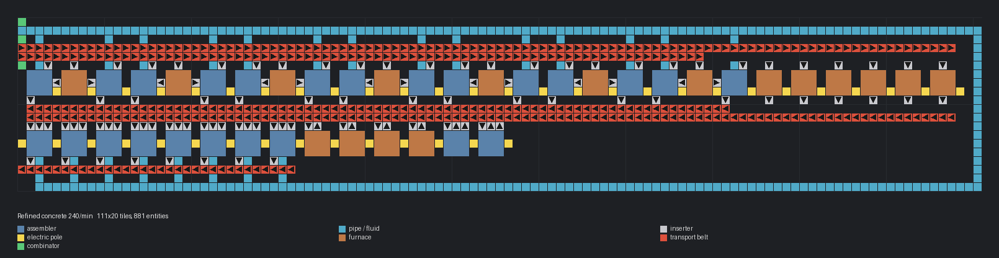

# 정제 콘크리트 240/분

> 60/분 설계를 길게 늘린 분당 240개 모듈 (조립기 24, 용광로 17).

[English](README.en.md)

<!-- AUTO:START (tools/build.py가 생성하는 구역입니다. 직접 수정하지 마세요) -->



| 항목 | 값 |
|---|---|
| 게임 | Factorio 2.0 (base) |
| 크기 | 111×20 타일 |
| 엔티티 | 881 |
| 주요 설비 | `assembling-machine-2` ×24 (concrete 14, refined-concrete 8, iron-stick 2)<br>`electric-furnace` ×17 |
| 검사 | 통과 |

### 입력

_블루프린트 안의 일정 신호 조합기 표시 (값 = 분당 필요량, 위치 = 블루프린트 왼쪽 위 기준 타일 좌표)_

| 신호 | 분당 | 위치 |
|---|---:|---|
| `water` (fluid) | 8,700 | (0, 0) |
| `iron-ore` | 264 | (0, 2) |
| `stone` | 480 | (0, 5) |

### 출력

| 아이템 | 분당 | 위치 |
|---|---:|---|
| `refined-concrete` | 240 | 서쪽 끝 아래쪽 벨트 |

### 파일

| 파일 | 설명 |
|---|---|
| [`blueprint.txt`](blueprint.txt) | 기본 |

문자열을 클립보드에 복사한 뒤 게임에서 블루프린트 라이브러리 → 문자열 가져오기:

```sh
pbcopy < blueprints/refined-concrete-240/blueprint.txt   # macOS
xclip -selection clipboard < blueprints/refined-concrete-240/blueprint.txt   # Linux
```

### 다시 생성

```sh
python3 blueprints/refined-concrete-240/generate.py
python3 tools/build.py refined-concrete-240
```

<!-- AUTO:END -->

{'ko': '## 구조\n\n- 위 줄: [콘크리트·벽돌로·콘크리트] 7묶음 + 철 용광로 6. 벽돌로 하나가 양옆 콘크리트 조립기를 먹입니다(조립기는 약 83% 가동).\n- 아래 줄: 정제 콘크리트 조립기 8 (서쪽) · 강철 용광로 4 · 철 막대 조립기 2.\n- 콘크리트·철판 벨트는 서쪽으로 흘러 정제 콘크리트 조립기 쪽으로 갑니다.\n- 공용 코드: `lib/refined_concrete.py` (1200/분 블루프린트와 공유).\n', 'en': '## Layout\n\n- Top row: 7 × [concrete · brick furnace · concrete] + 6 iron furnaces. Each brick furnace feeds both neighbours (assemblers run at ~83%).\n- Bottom row: 8 refined-concrete assemblers (west), 4 steel furnaces, 2 stick assemblers.\n- Concrete and plate belts flow west towards the refined-concrete assemblers.\n- Shared code: `lib/refined_concrete.py` (also used by the 1200/min blueprint).\n'}