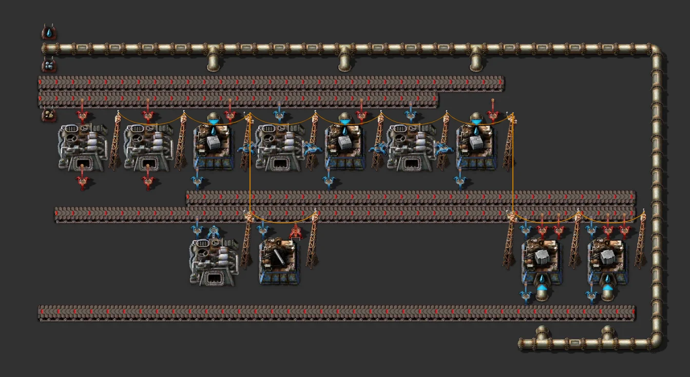

# Refined concrete 60/min

> Small factory turning stone, iron ore and water into 60 refined concrete/min. All I/O on the west edge.

[한국어](README.md)

<!-- AUTO:START (generated by tools/build.py, do not edit) -->



<sub>Images rendered with [Factorio Blueprint Editor](https://fbe.factorygamefan.com) (game graphics © Wube Software)</sub>

| Item | Value |
|---|---|
| Game | Factorio 2.0 (base) |
| Size | 38×20 tiles |
| Entities | 278 |
| Main machines | `assembling-machine-2` ×6 (concrete 3, refined-concrete 2, iron-stick 1)<br>`electric-furnace` ×5 |
| Validation | OK |

### Inputs

_constant-combinator markers inside the blueprint (count = required per minute, position = tile offset from the blueprint's top-left)_

| Signal | Per minute | Position |
|---|---:|---|
| `water` (fluid) | 1,800 | (0, 0) |
| `iron-ore` | 66 | (0, 2) |
| `stone` | 120 | (0, 5) |

### Outputs

| Item | Per minute | Position |
|---|---:|---|
| `refined-concrete` | 60 | bottom belt, leaves at the west edge |

### Files

| File | Description |
|---|---|
| [`blueprint.txt`](blueprint.txt) | default |

Copy the string to the clipboard, then in game: Blueprint library → Import string:

```sh
pbcopy < blueprints/refined-concrete-60/blueprint.txt   # macOS
xclip -selection clipboard < blueprints/refined-concrete-60/blueprint.txt   # Linux
```

### Regenerate

```sh
python3 blueprints/refined-concrete-60/generate.py
python3 tools/build.py refined-concrete-60
```

<!-- AUTO:END -->

{'ko': '## 구조\n\n- 위 줄: 철 용광로 2 · [콘크리트 조립기 · 벽돌 용광로] 교대 배치. 벽돌 용광로가 양옆 조립기에 벽돌을 바로 넣습니다.\n- 가운데 벨트 2줄: 콘크리트(남쪽 레인) + 철 막대(북쪽 레인), 철판(남쪽 레인) + 강철(북쪽 레인).\n- 아래 줄: 강철 용광로 · 철 막대 조립기 · 정제 콘크리트 조립기 2.\n- 물은 위쪽 파이프로 들어와 오른쪽 끝에서 아래 물 라인으로 내려갑니다. 조립기에는 지하 파이프로 연결됩니다.\n\n## 참고\n\n- 고속 벨트(빨강), 전기 용광로, 조립기 2, 고속 로봇팔. 2칸 떨어진 벨트를 집는 곳만 롱암입니다.\n- 외부 전력은 아무 전봇대에나 연결하세요.\n', 'en': '## Layout\n\n- Top row: 2 iron furnaces, then alternating [concrete assembler · brick furnace]; each brick furnace inserts directly into both neighbours.\n- Two middle belts: concrete (south lane) + iron sticks (north lane), iron plates (south lane) + steel (north lane).\n- Bottom row: steel furnace, stick assembler, 2 refined-concrete assemblers.\n- Water enters on the top pipe and returns along the east edge to the bottom main; machines connect via pipe-to-ground.\n\n## Notes\n\n- Fast belts, electric furnaces, assembling machine 2, fast inserters; long-handed only where a 2-tile reach is needed.\n- Connect external power to any pole.\n'}