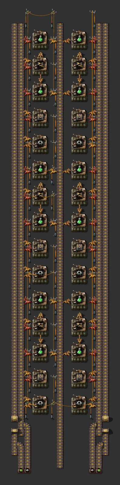

# Green science (upgradeable tile)

> 12 science + 4 intermediate assemblers; same layout 60 → 90 → 150/min; three bus taps (iron ×2, green circuits).

[한국어](README.md)

<!-- AUTO:START (generated by tools/build.py, do not edit) -->



<sub>Images rendered with [Factorio Blueprint Editor](https://fbe.factorygamefan.com) (game graphics © Wube Software)</sub>

| Item | Value |
|---|---|
| Game | Factorio 2.0 (base) |
| Size | 53×16 tiles |
| Entities | 195 |
| Main machines | `assembling-machine-1` ×16 (logistic-science-pack 12, iron-gear-wheel 2, transport-belt 1, inserter 1) |
| Validation | OK |

### Inputs

_constant-combinator markers inside the blueprint (count = required per minute, position = tile offset from the blueprint's top-left)_

| Signal | Per minute | Position |
|---|---:|---|
| `iron-plate` | 450 | (2, 15) |
| `electronic-circuit` | 150 | (0, 15) |
| `iron-plate` | 225 | (5, 15) |

### Outputs

| Item | Per minute | Position |
|---|---:|---|
| `logistic-science-pack` | 60 / 90 / 150 | science belt, east end (y=0) |

### Files

| File | Description |
|---|---|
| [`blueprint.txt`](blueprint.txt) | early (yellow, AM1, basic) |
| [`variants/mid.txt`](variants/mid.txt) | mid (red, AM2, fast) |
| [`variants/late.txt`](variants/late.txt) | late (blue, AM3, bulk) |

Copy the string to the clipboard, then in game: Blueprint library → Import string:

```sh
pbcopy < blueprints/science-green-upgradeable/blueprint.txt   # macOS
xclip -selection clipboard < blueprints/science-green-upgradeable/blueprint.txt   # Linux
```

### Regenerate

```sh
python3 blueprints/science-green-upgradeable/generate.py
python3 tools/build.py science-green-upgradeable
```

<!-- AUTO:END -->

## Layout

- Top: science belt (y=0) ← 12 green science assemblers ← feed belt (y=6).
- Feed belt: **north lane = inserters**, **south lane = transport belts** — the two west clusters insert from opposite sides, which splits the lanes by itself.
  - North cluster (y=2..4): gear B → (sideways) belt assembler → feed south lane; iron from the short y=0 belt.
  - South cluster (y=8..10): gear A → (sideways) inserter assembler → feed north lane; iron + circuits from the two-lane y=12 belt.
- Inputs: three columns at the bottom edge — green circuits (x=-15), iron A (x=-13), iron B (x=-12, crosses the y=12 belt with a 1-tile underground to reach the north cluster).
- Ratio: green 12 : inserter 1 : belt 1 : gears 2.

## Upgrading

| Stage | Belts | Assemblers | Inserters | Poles | Per tile |
|---|---|---|---|---|---|
| early (default file) | yellow | AM1 | basic | small | 60/min |
| mid (`variants/mid.txt`) | red | AM2 | fast | medium | 90/min |
| late (`variants/late.txt`) | blue | AM3 | bulk | medium | 150/min |

- 1-tile underground, no long-handed inserters, small-pole spacing.
- Marker counts (iron A 450, iron B 225, circuits 150/min) are **late-tier** demand.
- The inserter assembler has one output inserter: early (basic, 0.83/s) runs science at ~80%; fine from mid tier.

## Credits

Tileable-science idea from Christoffer Ramqvist's "Tileable Science Production", XtremeZion's Science Book and Nilaus' ratios; the layout itself is new.
