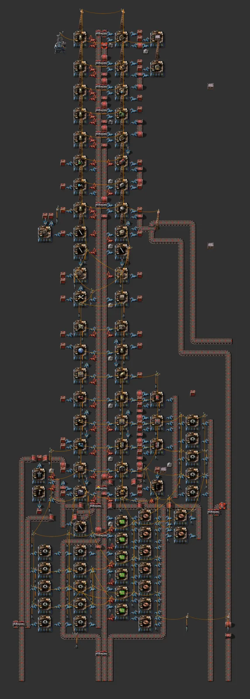

# 다이소 1 (세로형 몰, 빨강 벨트)

[English](02-daiso-1.en.md)

- 출처: 사용자 제작으로 보임 (모드 아이템 포함)
- 자동 분석 데이터: [data/02-daiso-1.md](data/02-daiso-1.md)

## 무엇인가

몰(쇼핑센터)입니다. 37×111, 엔티티 1,049, 조립기 2 80대, 빨강 벨트 590개.
가운데 공유 벨트 줄 양옆으로 조립기가 늘어서고, 완성품은 패시브 공급 상자(44개)와 강철 상자로 들어가 봇이 가져갑니다.
아래쪽에서 톱니바퀴(15)·전선(9)·회로(6)·파이프(7)·철 막대(4)를 직접 만들어 위로 올립니다.

- 만드는 것(약 30종): 벨트·인서터·조립기 2·전봇대·레일·신호·기관차·화물칸·정유소·화학 공장·펌프잭·강철로·연구소·레이더·증기 엔진·수리팩, 그리고 **모드 아이템**(Nanobots 탄약 2종, 갈고리총 탄약)
- 외부 입력: 철판, 구리판, 강철, 돌벽돌, 목재

## 규칙 대비

| 항목 | 평가 |
|---|---|
| 업그레이드 | ⚠ 지하 벨트 최대 간격 5(노랑 불가), 롱암 42개, 전봇대 소형·중형·변전소 혼합 |
| 6+2 버스 | ⚠ 아래에서 입력이 들어오는 세로 구조. 가로 버스에서는 분기 하나로 받는 입구 설계가 필요 |
| 물 | 해당 없음 |

## 재설계 방향

- 입력을 **버스 분기 2~3줄**(철·구리 / 강철·돌벽돌·회로)로 받는 가로형 몰로 바꾸고,
- 지하 벨트 간격 ≤4, 롱암을 고속 인서터 자리로 바꿔 **같은 배치로 노랑→빨강→파랑** 업그레이드되게 합니다.
- 다이소 2와 합쳐 한 설계로 정리합니다(→ 업그레이드형 몰).
