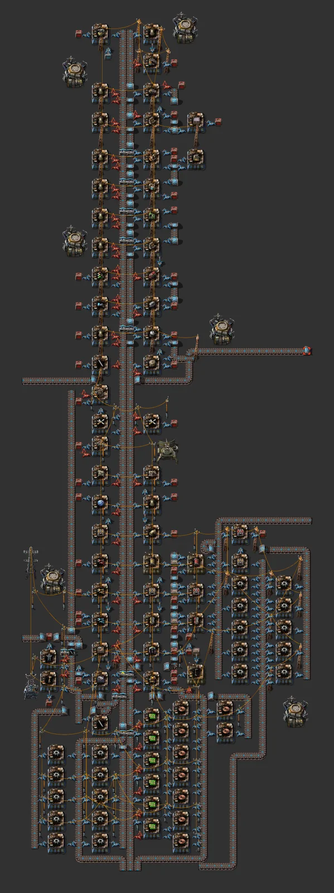

# Daiso 2 (vertical mall, blue belts)

[한국어](03-daiso-2.md)

- Source: apparently user-made (Space Age and mod items)
- Raw analysis: [data/03-daiso-2.md](data/03-daiso-2.md)

## What it is

Successor of Daiso 1. 39×116, 1,074 entities, 555 blue belts, 86 AM2 + 3 AM1. Same skeleton; the item list
changed (double fast belts and repair packs, artillery wagon, offshore pump, pump).

- External inputs: Daiso 1 + **processing units, refined concrete, tungsten plate** (Space Age)

## Against the rules

| Item | Verdict |
|---|---|
| upgrade | ⚠ longest underground gap 6, 52 long-handed, AM1/AM2 mix, pole mix |
| 6+2 bus | ⚠ same as Daiso 1 |

## What the difference tells us

The same skeleton was rebuilt with another belt tier and item list — exactly the case where an
**upgrade-in-place skeleton** would have let Daiso 1 simply be upgraded. The redesign repeats an item cell
(assembler + output chest) like a module so items change by recipe only.
