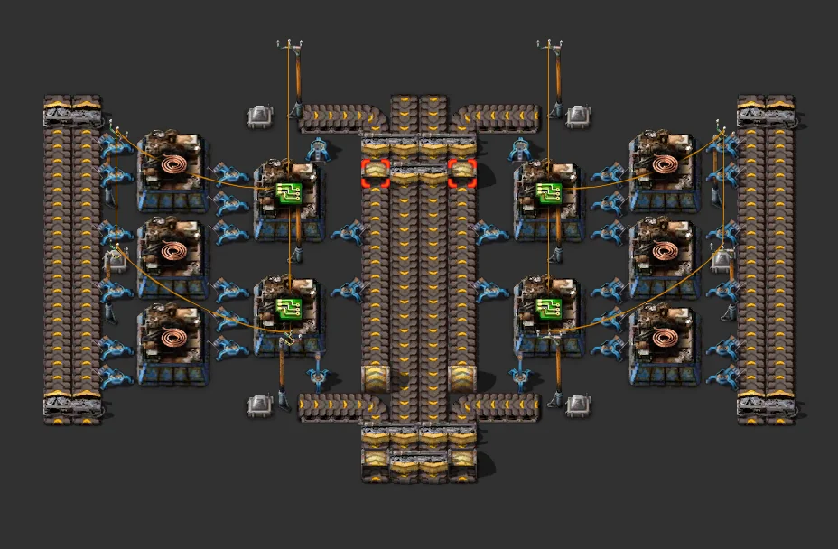

# Green circuits (Nilaus #6)

[한국어](04-green-circuits.md)

- Source: part of Nilaus' Base-In-A-Book
- Raw analysis: [data/04-green-circuits.md](data/04-green-circuits.md)

## What it is

26×13, 10 AM2 (cable 6 : circuit 4 = 3:2), 32 fast inserters, 10 small poles, yellow belts.
360/min with AM2; inputs are iron and copper belts.

## Against the rules

| Item | Verdict |
|---|---|
| upgrade | ✅ longest underground gap 2, no long-handed, small-pole spacing → medium poles fine; 600/min with AM3 |
| 6+2 bus | ✅ iron + copper: two taps from group 1 (iron 4, copper 2) |
| belt headroom | AM3 needs 15 copper/s = one full yellow belt: works, no headroom; fine from red |

## Verdict

The best fit for the rules — used as the reference module for the upgradeable lines.
