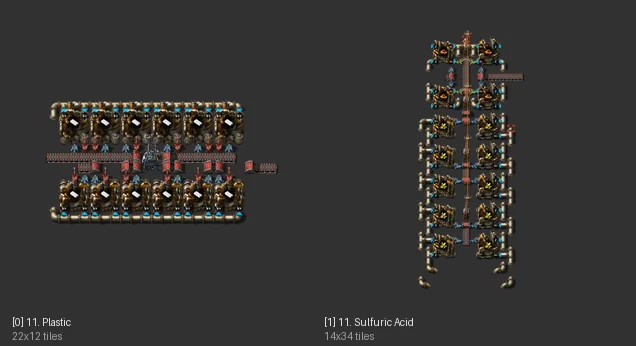

# 플라스틱 + 황산 (Nilaus #11)

[English](05-plastic-sulfuric.en.md)

- 출처: Nilaus Base-In-A-Book의 일부
- 자동 분석 데이터: [data/05-plastic-sulfuric.md](data/05-plastic-sulfuric.md)

## 무엇인가

북 2개짜리입니다.
- **플라스틱**: 화학 공장 12대, 22×12, 석탄 + 석유가스 → 플라스틱 (명목 분당 1,440). 롱암 12 + 일반 12, 변전소 1개.
- **황산**: 황 10 + 황산 4, 14×34, 철판·석유가스·물 → 황산.

## 규칙 대비

| 항목 | 평가 |
|---|---|
| 업그레이드 | 화학 공장은 티어가 없음 → 올릴 수 있는 것은 벨트·인서터·모듈. 플라스틱의 롱암 12개는 처리량 상한(1.2/s×12) / 황산 쪽 지하 최대 간격 5 ⚠ |
| 6+2 버스 | 석탄은 3묶음 한 줄, 유체는 파이프. 출력(플라스틱)은 3묶음으로 되돌려 넣음 |
| 물 | ✅ waterfill이면 황산 블럭 옆에 물을 만들어 파이프 길이를 없앨 수 있음 |

## 평가

석유 계열은 기계 티어가 없으니 **처음부터 최종 크기**로 지어 두고 모듈만 추가하는 편이 맞습니다.
