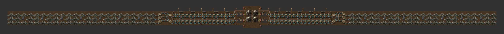

# 타일형 원자력 발전소

[English](06-nuclear.en.md)

- 출처: 출처 미상
- 자동 분석 데이터: [data/06-nuclear.md](data/06-nuclear.md)

## 무엇인가

380×15의 가로로 긴 타일형 원자력 발전소. 설명: **N세트 → 480 + 640×(N−1) MW**.
가운데 원자로 2×2(인접 보너스), 양옆으로 열 파이프·열교환기·터빈이 길게 뻗습니다.
연료는 빨강 벨트 + 벌크 인서터 8개, 전력은 중형 전봇대 42 + 변전소 16, 바닥 타일 4,230.

## 규칙 대비

| 항목 | 평가 |
|---|---|
| 업그레이드 | 원자로에는 티어가 없음 → "업그레이드" = 세트를 옆으로 이어 붙이기. 구조 변경 없이 확장 ✅ |
| 물 | ✅ **waterfill에 특히 잘 맞음**: 열교환기 줄 옆에 물을 깔고 해양 펌프를 두면 긴 물 파이프가 필요 없음 |
| 6+2 버스 | 연료(우라늄 연료봉)는 버스가 아니라 별도 벨트/기차 |

## 메모

- 640 MW/세트는 원자로 4기 블럭 기준 인접 보너스 계산과 일치합니다(가운데 세트 이후 증가분).
- 사용후 연료 회수 경로가 블루프린트에 있는지는 게임에서 확인이 필요합니다.
