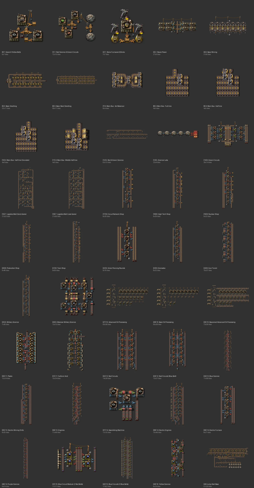

# Nilaus' Base-In-A-Book (45개)

[English](07-nilaus-base-in-a-book.en.md)

- 출처: Nilaus (커뮤니티 공개 북)
- 자동 분석 데이터: [data/07-nilaus-base-in-a-book.md](data/07-nilaus-base-in-a-book.md)

## 무엇인가

시작부터 로켓까지의 기반을 번호 순서로 정리한 유명 북입니다(2.0.77).

| 번호 | 내용 | 벨트 |
|---|---|---|
| 1–3 | 톱니·벨트, 빨강 과학, 용광로, 증기 발전, 채굴, 제련(돌 용광로 24/48) | 노랑 |
| 4 | **버스 조각**: 4×4 밸런서, Full line, Half line(양쪽/한쪽/가운데) — 4줄 묶음 | 노랑 |
| 5–6 | 빨강·초록 과학, 연구소, 녹색 회로 | 노랑 |
| 7–8 | 몰: 물류(초반/후반), 회로망, 하이테크, 원자력, 생산, 기차 상점 | 노랑 |
| 9 | 군사: 관통탄, 수류탄, 포탑, 군사 과학(모듈형 포함) | 노랑/빨강 |
| 10–11 | 석유(기본/고급/비콘), 플라스틱, 황산 | 파이프 |
| 12–16 | 적색 회로(빨강/파랑 벨트 판), 파랑 과학, 엔진, 전기 엔진, 보라 과학, 청색 회로, 노랑 과학 | 빨강/파랑 |
| – | Jump Start Base | 노랑 |

## 규칙 대비

| 항목 | 평가 |
|---|---|
| 업그레이드 | ⚠ 단계별로 **다른 블루프린트**를 씁니다(몰 초반/후반, 적색 회로 빨강/파랑 벨트판). 45개 중 6개는 지하 간격 >4. 파랑 과학 #13은 기계가 빠진 틀(인서터·벨트만, 롱암 56) |
| 6+2 버스 | 4줄 묶음 기준. 분기 조각 아이디어(줄 잠수 + Full/Half)를 6줄용으로 옮겨 [버스 키트](../../blueprints/main-bus-6x2-tap/README.md)를 만들었습니다 |
| 롱암 | 상점·과학 블럭에 롱암이 많음(최대 56) → 후반 처리량 한계 |

## 이 저장소에서 쓰는 방식

- 녹색 회로(#6), 플라스틱/황산(#11)은 개별 분석 참고([04](04-green-circuits.md), [05](05-plastic-sulfuric.md)).
- 업그레이드형 과학 라인은 Nilaus 블럭의 레시피 비율을 출발점으로 하되, 한 블루프린트로 초반→후반을 쓰게 다시 설계합니다.
