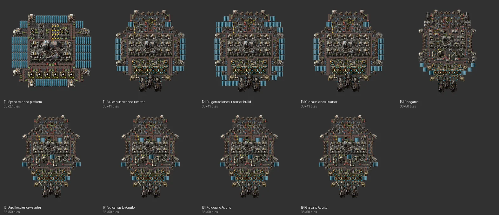

# Spaceships book (9 ships)

[한국어](08-spaceships.md)

- Source: unknown
- Raw analysis: [data/08-spaceships.md](data/08-spaceships.md)

## What it is

Nine Space Age platforms.

| Name | Size | Notes |
|---|---|---|
| Space science platform | 30×27 | stationary space science: 6 AM3, 8 collectors, 3 crushers, 26 solar panels, 4 cargo bays; 150/min nominal |
| Vulcanus / Fulgora / Gleba science+starter | 38×41 | one hull: 3 thrusters, 6 fuel/oxidizer chemical plants, 2 ice melters, 5 crushers, 30 gun turrets |
| Aquilo science+starter, planet → Aquilo | 38×50 | the hull extended with **4 rocket turrets** and heating (exchangers, turbines) |
| Endgame | 36×50 | 5 rocket turrets, railgun ammo production, 25 accumulators |

Common: red belts, fast/bulk inserters, efficiency modules to save power; inputs are iron plates (+ explosives, steel for ammo).

## Against the rules

| Item | Verdict |
|---|---|
| upgrade | ✅ **one hull extended planet → Aquilo → endgame** — a good example of growing within the same structure |
| bus / water | n/a (water from ice) |

## Notes

- 3 thrusters + efficiency modules: frugal but slow.
- For promethium-level trips see the inverted-wedge designs in the [references](../references/optimized-builds.en.md).
