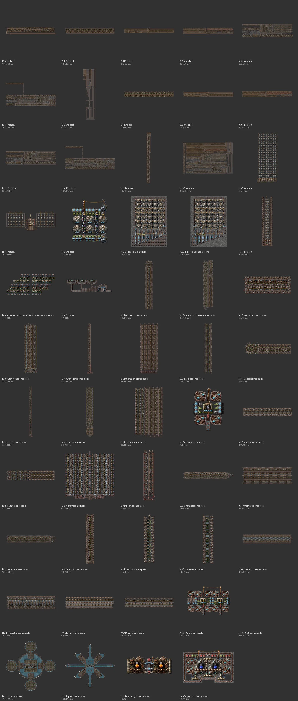

# Science Book (XtremeZion, megabase)

[한국어](09-science-book-xtremezion.md)

- Source: XtremeZion — 'By XtremeZion' in every description; megabase on [factorioprints](https://factorioprints.com/view/-NBq4n2SDhvxqWXyadBn)
- Raw analysis: [data/09-science-book-xtremezion.md](data/09-science-book-xtremezion.md)

## What it is

A megabase science book (~70 blueprints) at 450–5,400 SPM with beacons and modules (the analysed numbers
are nominal without modules/beacons, so they read lower than the labels).

| Group | Content |
|---|---|
| 0 | huge raw-to-science lines (up to 327×204, 35,361 entities), science belt/pipe entry, Fulgora lightning panels |
| 1 | labs: tileable science labs (brick tiles), an experimental car-based pack transport |
| 2 | 6 sciences → sushi belt, a small mixed build (75/min each) |
| 6–11 | per science: red 450–5,400 / green 270–2,100 / military / blue 1,800–2,700 / purple / yellow (blue/red/turbo-belt versions) |
| 12–16 | Science Sphere, space science, metallurgic, cryogenic — Space Age |

## Against the rules

| Item | Verdict |
|---|---|
| upgrade | ⚠ **late-game only** from the start (AM3, blue/turbo, beacons); some mix AM1/2/3 and yellow/red/blue in one print; many underground gaps >4 |
| 6+2 bus | ✗ raw-fed dedicated belts, not bus-based |

## Redesign (user decision: make it upgradeable)

Take XtremeZion's core ideas — **one independent tile per science, mostly direct insertion, repeat the same
block** — and rebuild them as science lines fed by 6+2 bus taps that run yellow→red→blue in the same layout.
✅ All six done: [red](../../blueprints/science-red-upgradeable/README.en.md), [green](../../blueprints/science-green-upgradeable/README.en.md), [military](../../blueprints/science-military-upgradeable/README.en.md), [blue](../../blueprints/science-blue-upgradeable/README.en.md), [purple](../../blueprints/science-purple-upgradeable/README.en.md), [yellow](../../blueprints/science-yellow-upgradeable/README.en.md). All are **stackable cells** built on the same width/period rules. Output per cell differs by science (early tier, per minute: red 24, green 20, military 36, blue 15, purple 25.7, yellow 25.7), so stack target ÷ per-cell output cells of each. Military, purple and yellow take their intermediates from separate cells.
